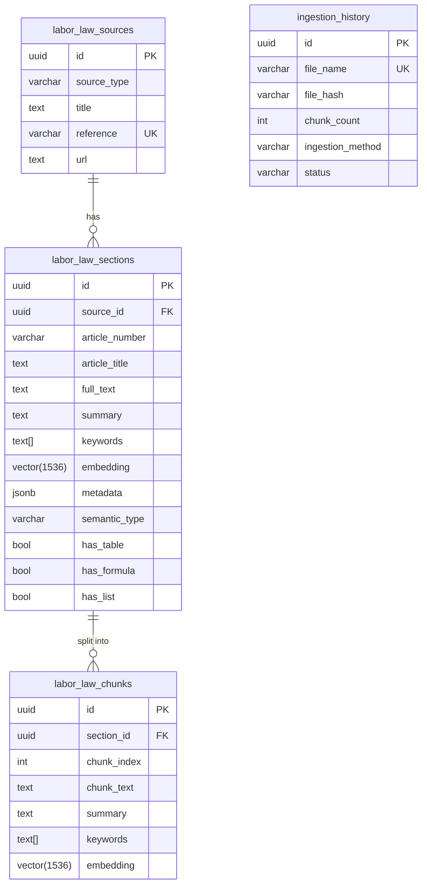
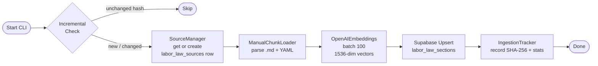

# Knowledge Base Construction: Technical Methodology

> **Audience:** AI assistant drafting the methodology section of the research paper.  
> **Scope:** Documents the complete implementation of LEO's knowledge base pipeline as of February 2026, reflecting the three-stage hybrid RAG architecture shown in the attached diagram.

---

## 1. Corpus Composition — Legal Source Documents

The knowledge base is grounded exclusively in **official Philippine labor law** texts. All source documents are stored as plain-text (`.txt`) files under `kb/docs/` and registered in a central metadata registry (`DOCUMENT_REGISTRY` in `kb/ingest/sync_to_vectorstore.py`). The registry stores each document's canonical URL, document type, year, and short reference name.

| # | File | Official Title | Type | Year | Source |
|---|------|----------------|------|------|--------|
| 1 | `PD-No-442.txt` | Presidential Decree No. 442 — *Labor Code of the Philippines* | Statute | 1974 | lawphil.net |
| 2 | `RA-No-11058.txt` | Republic Act No. 11058 — *Occupational Safety & Health Standards Law* | Statute | 2018 | lawphil.net |
| 3 | `RA-No-11199.txt` | Republic Act No. 11199 — *Social Security Act* | Statute | 2019 | lawphil.net |
| 4 | `RA-No-10361.txt` | Republic Act No. 10361 — *Domestic Workers Act (Kasambahay Law)* | Statute | 2013 | lawphil.net |
| 5 | `PD-No-851.txt` | Presidential Decree No. 851 — *13th-Month Pay Decree* | Statute | 1975 | lawphil.net |
| 6 | `DOLE-Dep-Order-147-15.txt` | DOLE Department Order No. 147-15 | Department Order | 2015 | Judiciary e-Library |
| 7 | `SEnA.txt` | Rules of the Single Entry Approach (SEnA) | Procedural Rules | 2011 | Judiciary e-Library |
| 8 | `NLRC-Rules.txt` | 2011 NLRC Rules of Procedure | Procedural Rules | 2011 | Judiciary e-Library |
| 9 | `DOLE-Handbook.txt` | DOLE Handbook on Workers' Statutory Monetary Benefits (2023 Edition) | Handbook | 2023 | library.laborlaw.ph |
| 10 | `DOLE-Covid-Protocols.txt` | DOLE COVID-19 Workplace Protocols | Guidelines | 2020 | dole.gov.ph |

**Planned but not yet acquired:** DOLE Department Order No. 174-17, DOLE Primer on Sexual Harassment in the Workplace, and SSS/PhilHealth Benefits FAQs. These are explicitly noted as "Not Yet Available" in `kb/docs/README.md`.

---

## 2. Knowledge Base Architecture — Database Schema

Documents are stored in a **cloud-hosted PostgreSQL instance via Supabase** with the `pgvector` extension enabled. The schema (`infra/supabase/schema.sql`) follows a three-table hierarchy designed for multi-strategy retrieval:



**Index strategy:**
- **HNSW vector index** on `labor_law_sections.embedding` and `labor_law_chunks.embedding` for approximate nearest-neighbor search (created separately from the main schema due to memory requirements).
- **GIN full-text index** on `to_tsvector('english', full_text || article_title)` for PostgreSQL FTS.
- **GIN array index** on the `keywords` column for efficient keyword-array queries.
- **B-tree index** on `article_number` and `source_id` for direct lookup.
- **Legacy table** `labor_law_embeddings` is retained for backward compatibility but deprecated.

---

## 3. Document Chunking — Manual Human-Curated Method

Documents are pre-split by a human curator into semantically coherent Markdown files stored in `kb/chunks/<DocumentFolder>/`. This approach was adopted to achieve **100% coverage** and preserve logical article boundaries that regex patterns would otherwise split incorrectly.

**Directory structure:**
```
kb/chunks/
├── PD-No-851/
│   ├── metadata.json          ← document-level metadata
│   ├── 01-decree-main.md      ← Sections 1–3 of the decree
│   ├── 02-rules-preamble-definitions.md
│   ├── 03-rules-coverage-eligibility.md
│   ├── 04-rules-benefits-compliance.md
│   └── 05-supplementary-rules.md
└── ... (one folder per source document)
```

Each `.md` file carries a **YAML frontmatter block** that the `ManualChunkLoader` (`kb/ingest/loaders/manual_chunk_loader.py`) parses at ingestion time:

```yaml
---
chunk_id: pd851_decree_main
title: Presidential Decree No. 851 - Main Decree (Sections 1-3)
article_number: pd851_decree_sec1_3
semantic_type: decree          # decree | article | section | rule | definition
hierarchy:
  part: Main Presidential Decree
  sections: Preamble and Sections 1-3
keywords:
  - 13th month pay
  - basic salary
  - December 24 deadline
has_table: false
has_formula: false
has_list: false
---
```

The `metadata.json` in each folder provides document-level provenance (`source`, `reference`, `doc_type`, `url`, `chunking_strategy`, `total_chunks`).

**Chunk granularity:** Chunks follow natural document divisions (decree preamble, rule sections, chapters) rather than a fixed word-count target. Typical chunk sizes range from ~100 to ~700 words depending on the legislative provision.

---

## 4. Embedding Generation

**Model:** `text-embedding-3-small` (OpenAI), producing **1,536-dimensional** dense vectors.

**Input to the embedding model:** The chunk's `full_text` (raw legislative text), preserving the original wording of each legal provision verbatim. Embedding the source text directly — rather than a derived summary — yields better retrieval precision, as authoritative legal language carries strong and unambiguous semantic signal.

**Implementation:** `OpenAIEmbeddings` adapter (`adapters/embeddings/openai_embed.py`):
- Async batch API calls with `batch_size=100`.
- LRU in-memory cache (configurable size, default 1,000 entries) keyed on input text.
- Token usage tracked per batch for cost monitoring.

---

## 5. Ingestion Pipeline — End-to-End Flow

`KnowledgeBaseIngester` (`kb/ingest/sync_to_vectorstore.py`) coordinates the full pipeline via the CLI (`python -m kb.ingest.sync_to_vectorstore --manual`).



### 5.1 Incremental Detection

`IngestionTracker` (`kb/ingest/incremental_tracker.py`) prevents redundant re-ingestion:

1. Computes **SHA-256** of the source file (read in 4 KB blocks).
2. Compares against the `ingestion_history` table (keyed on `file_name`).
3. Re-ingestion is triggered if: **(a)** file not previously ingested, **(b)** hash changed, **(c)** previous ingestion status is `failed`, or **(d)** no corresponding rows found in `labor_law_sections` (guards against manual DB cleanup).
4. The `--force` flag bypasses all checks unconditionally.

When re-ingestion occurs for a changed file, old chunks are deleted before the new ones are upserted (avoiding stale data accumulation).

### 5.2 Source Management

`SourceManager` (`kb/ingest/source_manager.py`) maintains the `labor_law_sources` table using **upsert-on-conflict** semantics (`ON CONFLICT (reference) DO UPDATE`), ensuring each source document has exactly one authoritative parent row that all section records reference via `source_id`.

---

## 6. Retrieval Architecture — Three-Stage Hybrid RAG

`RetrievalPipeline` (`services/pipeline/retrieval.py`) calls `SupabaseVectorStore.smart_retrieve()`, executing three parallel strategies as Stage 2 of the pipeline:

| Strategy | Implementation | Query type |
|----------|---------------|------------|
| **Semantic search** | `match_sections()` PostgreSQL function, cosine similarity via `<=>` operator | Dense vector over `embedding` column |
| **Keyword / Full-Text search** | `plainto_tsquery` + `ts_rank` on GIN-indexed `full_text` | Keyword tokens extracted upstream |
| **Direct article lookup** | SQL `ILIKE` + `article_number` B-tree index | Explicit article references |

Results from all three strategies are merged, deduplicated, and ranked by `retrieval/ranking.py` before being passed to Stage 3.

The complete pipeline implements the three-stage architecture: **Stage 1** (`services/pipeline/query_analysis.py`) uses GPT-4o-mini to analyze the query, consolidate multi-turn context, translate non-English input when needed, determine whether clarification is required, and extract legal concepts, article references, and keywords. **Stage 2** (`services/pipeline/retrieval.py`) runs the three retrieval strategies in parallel and merges and ranks results. **Stage 3** (`services/pipeline/generation.py`) passes the ranked context to GPT-4.1 for grounded generation with streaming, producing a final response with inline citations and suggested actions.

---

## 7. Key Design Decisions (for Paper Framing)

| Decision | Rationale |
|----------|-----------|
| Manual human-curated chunking | Legal provisions rarely align with fixed word windows; human curation preserves legislative intent, guarantees semantic coherence per chunk, and ensures every stored unit has been reviewed for accuracy and completeness |
| Full-text embeddings over summarized proxies | Embedding the original legislative text verbatim yields better retrieval precision; authoritative legal language carries unambiguous semantic signal that summarization can distort |
| `text-embedding-3-small` (1,536-dim) over larger variants | Adequate precision for retrieval at significantly lower cost; dimensions match the configured pgvector HNSW index |
| Two-level table hierarchy (sections + chunks) | Allows storing full articles for context while enabling fine-grained retrieval on long provisions — both resolution levels are independently searchable |
| SHA-256 hash-based incremental tracking | Avoids expensive re-embedding unchanged documents when the corpus is updated; supports reproducible ingestion audits |
| Supabase + pgvector over a dedicated vector DB | Co-locates structured metadata (sources, sessions, conversations) with vector data, enabling JOIN-based hybrid retrieval without a separate data tier |
