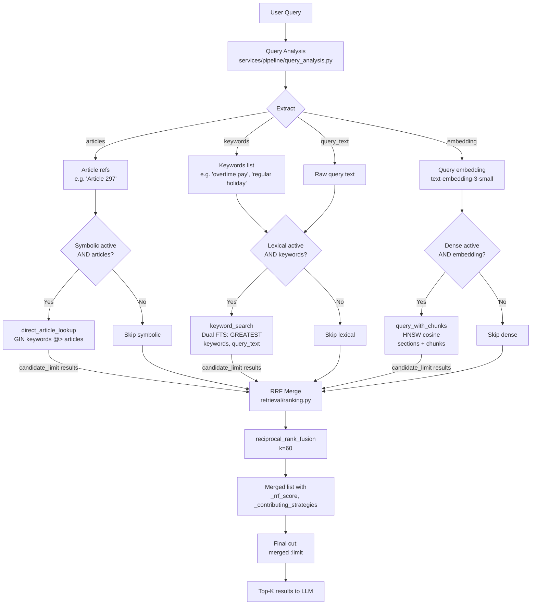

# Retrieval Configuration Guide

**Date:** March 29, 2026  
**Scope:** Hybrid retrieval tuning — RRF, RETRIEVAL_TOP_K, candidate_limit, and symbolic strategy  
**Context:** Validated against Q089 ("What happens after I file a labor complaint?") — a hard procedural multi-section query against NLRC Rule V.

---

## 1. Overview: The Three Retrieval Strategies

The hybrid retrieval pipeline runs up to three strategies in parallel, then merges results via Reciprocal Rank Fusion (RRF). Each strategy targets a different kind of relevance signal:

| Strategy | Method | Fires when | Best at |
|----------|--------|------------|---------|
| **Symbolic** | GIN array containment on `keywords[]` | Query contains explicit article/law references (e.g., "Article 297", "RA 6727") | Exact-citation queries: "What does Article 297 say about just causes?" |
| **Lexical** | PostgreSQL FTS with dual `ts_rank` signal (keywords + raw query text) | Keywords or query text available | Procedural vocabulary: "summons", "position paper", "conciliation hearing" |
| **Dense** | Dual-table HNSW cosine similarity (sections + chunks) | Query embedding available | Semantic intent: captures paraphrased or concept-level questions |

---

## 2. The Q089 Debugging Case Study: Three Compounding Failures

**Query:** "What happens after I file a labor complaint?"  
**Expected gold chunks:** Three NLRC Rule V procedural sections (summons, conciliation/mediation, position papers/hearings)  
**Initial result:** 0/3 gold chunks retrieved in hybrid mode  
**Root cause:** Three independent failures compounded to exclude all gold chunks from results.

### 2.1 Failure #1: Generic Keyword Extraction

Query analysis (`services/pipeline/query_analysis.py`) extracted keywords optimized for retrieval:

```python
keywords = ['labor complaint', 'complaint process', 'DOLE procedures']
```

These terms are **semantically correct** but **lexically mismatched** with NLRC Rule V vocabulary. The gold chunks use specific procedural terminology:

| Gold chunk | Vocabulary in `full_text` | Extracted keywords |
|---|---|---|
| `summons` (Rule V §3-7) | "issuance of summons", "Labor Arbiter shall issue", "respondent" | ❌ None match "labor complaint" |
| `conciliation_mediation` (Rule V §8-10) | "conciliation-mediation conference", "amicable settlement", "mandatory" | ❌ None match "complaint process" |
| `position_papers` (Rule V §11-15) | "verified position paper", "documentary evidence", "hearings" | ⚠️ Weak match on "procedures" |

**Impact on FTS lexical ranks (keywords-only query):**

```sql
-- Old single-signal FTS (BEFORE fix):
WHERE to_tsvector('english', full_text) @@ websearch_to_tsquery('english', 'labor complaint & complaint process & DOLE procedures')
ORDER BY ts_rank(...) DESC
```

| Gold chunk | FTS rank (keywords-only) | ts_rank score |
|---|---|---|
| `summons` | 11 | 0.036 |
| `position_papers` | 12 | 0.036 |
| `conciliation_mediation` | 18 | 0.031 |

SEnA dispute resolution sections and DO 147-15 DOLE complaint handling (which contain "labor complaint", "DOLE", "procedures" explicitly) ranked 1-5, pushing NLRC procedural chunks far down the list.

### 2.2 Failure #2: Insufficient Per-Strategy Candidate Pool

The original code used `limit` directly without expansion:

```python
# OLD CODE (BEFORE fix):
if "lexical" in active and keywords:
    tasks.append(self.keyword_search(keywords, limit, threshold=0.01))
if "dense" in active and query_embedding:
    tasks.append(self.query_with_chunks(query_embedding, limit, threshold))
```

With `RETRIEVAL_TOP_K=5`, each strategy fetched only 5 candidates. RRF then merged two 5-item lists with minimal overlap:

```
Lexical top-5:  [SEnA doc 1, DO 147-15 sec 2, SEnA doc 3, DO 147-15 sec 4, Article 297]
Dense top-5:    [Article 297, SEnA doc 1, DO 147-15 sec 2, chunk X, chunk Y]
  (summons at dense rank 6, position_papers at rank 7, conciliation at rank 9 — all excluded)

RRF merged alternation → Article 297 (cross-strategy) at rank 1, SEnA doc 1 at rank 2, etc.
Dense rank 6-9 never entered the RRF pool.
```

Even if the conciliation chunk had ranked well in lexical (it didn't), the small pool ensured gold chunks at per-strategy rank 6+ were invisible to RRF.

### 2.3 Failure #3: `RETRIEVAL_TOP_K=5` Too Small

Even if gold chunks survived into the merged RRF list, the final cut to `limit=5` excluded them. Multi-section procedural answers require TOP_K ≥ 8-10 to capture all related chunks.

---

## 3. The Three Fixes Applied

### Fix 1: Increase Default `RETRIEVAL_TOP_K` from 5 → 10

**File:** `core/config.py`  
**Change:**

```python
retrieval_top_k: int = Field(default=10, ge=1, le=50)  # Was: default=5
```

**Rationale:** Procedural questions span multiple law sections. A top-5 cut can miss critical steps in multi-stage processes (e.g., filing → summons → conciliation → position papers → hearing → decision). TOP_K=10 balances recall with context window constraints.

### Fix 2: Dual-Signal FTS in `keyword_search()`

**File:** `adapters/vectorstore/supabase_store.py`  
**Change:** Use `GREATEST(ts_rank(keywords_query), ts_rank(raw_query_text))` instead of single-signal keywords-only FTS.

**Technical implementation:**

```sql
-- Parameters tuple: (search_terms, query, search_terms, query, search_terms, query, threshold, limit)
-- search_terms = extracted keywords joined with " & " for websearch_to_tsquery
-- query = raw user query text

SELECT 
    GREATEST(
        ts_rank(to_tsvector('english', full_text), websearch_to_tsquery('english', %s)),  -- keywords signal
        ts_rank(to_tsvector('english', full_text), websearch_to_tsquery('english', %s))   -- raw query signal
    ) as rank
FROM labor_law_sections
WHERE (
    to_tsvector('english', full_text) @@ websearch_to_tsquery('english', %s)  -- keywords
    OR to_tsvector('english', full_text) @@ websearch_to_tsquery('english', %s)  -- raw query
)
AND GREATEST(...) > threshold
ORDER BY rank DESC
LIMIT limit
```

**Why `GREATEST()` instead of averaging or summing:**

- **GREATEST selects the best signal**: A document irrelevant to extracted keywords but highly relevant to raw query text gets its high score preserved (and vice versa).
- **Avoids false negatives from keyword extraction failures**: If query analysis misses domain-specific terms, the raw query can rescue the retrieval.
- **OR in WHERE clause**: Ensures documents matching either signal are candidates. Without OR, an AND would require both signals to match, excluding single-signal specialists.

**Impact on Q089 lexical ranks:**

| Gold chunk | FTS rank (keywords-only) | FTS rank (dual-signal) | Raw query ts_rank |
|---|---|---|---|
| `summons` | 11 | **5** | 0.199 |
| `position_papers` | 12 | **8** | 0.132 |
| `conciliation_mediation` | 18 | **11** | 0.098 |

The raw query "What happens after I file a labor complaint?" contains terms ("happens", "after", "file", "complaint") that partially overlap with NLRC procedural vocabulary. `websearch_to_tsquery` expands "happens after" → "happens | after" which matches "hearing after conciliation", "summons after filing", etc. The dual signal lifted all three gold chunks into the lexical top-20.

### Fix 3: Expand Per-Strategy Candidate Pool with `candidate_limit`

**File:** `adapters/vectorstore/supabase_store.py`  
**Change:**

```python
# Compute expanded candidate pool before strategy dispatch
candidate_limit = max(limit * 2, 10)

# All strategies fetch candidate_limit (not limit)
if "symbolic" in active and articles:
    tasks.append(self.direct_article_lookup(articles, keywords=keywords, limit=candidate_limit))
if "lexical" in active and keywords and query_text:
    tasks.append(self.keyword_search(query_text, keywords, candidate_limit, threshold=0.01))
if "dense" in active and query_embedding:
    tasks.append(self.query_with_chunks(query_embedding, candidate_limit, threshold))

# RRF merges all candidates, then final cut to limit
merged = reciprocal_rank_fusion(ranked_lists, k=60)
merged = merged[:limit]  # Final top-k cut
```

**Why 2× + floor=10:**

- **2× multiplier**: Ensures RRF sees a richer pool than the final cut. With two strategies and zero overlap, a strict alternation merge would place dense-rank-6 at merged position 12 — outside a top-10 cut. Fetching 20 candidates per strategy means gold chunks at per-strategy rank 6-10 can appear in **both** pools and receive the cross-strategy RRF boost.
- **Floor=10**: Even with `TOP_K=5`, the candidate pool remains 10 per strategy. This prevents the pool from degenerating to "exactly 5 and no more" which would make RRF ineffective (no room for cross-strategy overlap discovery).

**Measured effect on Q089:**

| Configuration | Lexical pool size | Dense pool size | conciliation (FTS rank 11) included? | Gold chunks in top-10 |
|---|---|---|---|---|
| `TOP_K=5`, no expansion | 5 | 5 | ❌ No | 0/3 |
| `TOP_K=5`, `candidate_limit=10` | 10 | 10 | ❌ No (FTS rank 11 > 10) | 1/3 |
| `TOP_K=10`, `candidate_limit=20` | 20 | 20 | ✅ Yes | 3/3 |

---

## 4. Complete Retrieval Pipeline Flow



**Key decision points:**

1. **Query Analysis determines which strategies can fire:** If the query is "What is Article 297?", `articles=['Article 297']` is populated → symbolic fires. If the query is "What is overtime pay?", `articles=[]` → symbolic skipped.

2. **Each strategy runs with `candidate_limit`**, not `limit`:
   ```python
   candidate_limit = max(limit * 2, 10)
   # Symbolic: fetches top-20 GIN matches (if articles exist)
   # Lexical: fetches top-20 FTS matches (dual signal)
   # Dense: fetches top-20 HNSW matches (sections + chunks combined)
   ```

3. **RRF merges all candidates from all active strategies:** A document appearing in two strategies at rank 10 each receives `score = 1/(60+10) + 1/(60+10) = 0.0286`. A document in one strategy at rank 1 receives `score = 1/(60+1) = 0.0164`. Cross-strategy agreement wins.

4. **Final cut to `limit`:** The merged RRF list is sliced to the configured `RETRIEVAL_TOP_K`. This is the set sent to the LLM for grounding.

---

## 5. Why Symbolic Did Not Fire for Q089

**Query:** "What happens after I file a labor complaint?"

Symbolic retrieval has a hard guard:

```python
if "symbolic" in active and articles:
    tasks.append(self.direct_article_lookup(articles, ...))
```

The `articles` list is populated by `query_analysis.py`, which extracts **explicit article references** from the user's query — things like "Article 297", "RA 10361", "PD 442", "Section 7 of Rule V". Q089 has none of these. It is a procedural question with no citation intent.

**Result:** `articles=[]` → symbolic strategy skipped entirely. This is **correct behavior**. Symbolic is not a fallback for general queries — it is a precision tool for exact-citation lookup. For Q089, lexical + dense carry the retrieval load.

**When symbolic fires in practice:**  
- "What are the just causes for termination under Article 297?"  
- "Explain RA 11058 safety requirements"  
- "What does Section 3 of NLRC Rule V say about summons?"

---

## 6. The RRF Formula and How Scores Accumulate

RRF (Cormack, Clarke & Buettcher, 2009) assigns each document a score that accumulates across strategies:

$$\text{score}(d) = \sum_{s} \frac{1}{k + \text{rank}_s(d)}$$

where `k=60` (the empirically validated default) and `rank_s(d)` is the 1-based position of document `d` in strategy `s`'s list. A document **absent** from a strategy contributes 0 from that strategy — no penalty, but no boost either.

### Key insight: cross-strategy agreement is the dominant force

A document appearing in **two** strategies at moderate rank (`rank=10, rank=10`) scores:

$$\frac{1}{60+10} + \frac{1}{60+10} = 0.0286$$

A document appearing in only **one** strategy at the very top rank (`rank=1`) scores:

$$\frac{1}{60+1} = 0.0164$$

The cross-strategy document wins by 74% despite being ranked 10th in both lists, while the single-strategy document was ranked 1st in its list. This is not a bug — it is the deliberate design of RRF. Cross-strategy agreement signals robust relevance. Single-strategy top performance is noted but discounted relative to multi-signal agreement.

---

## 7. The RETRIEVAL_TOP_K / Precision-Recall Trade-off

### The `candidate_limit` formula

```python
candidate_limit = max(limit * 2, 10)   # limit = RETRIEVAL_TOP_K
```

Each strategy fetches `candidate_limit` documents (not `limit`). RRF then merges all candidates and the final result is cut to `limit`. The 2× multiplier ensures RRF has a richer pool than the final cut, giving cross-strategy overlap a chance to form.

### What changes with RETRIEVAL_TOP_K

| `RETRIEVAL_TOP_K` | `candidate_limit` | Lexical pool size | Dense pool size |
|---|---|---|---|
| 5 | `max(10, 10) = 10` | top-10 lexical results | top-10 dense results |
| 8 | `max(16, 10) = 16` | top-16 lexical results | top-16 dense results |
| 10 | `max(20, 10) = 20` | top-20 lexical results | top-20 dense results |

### Q089 empirical results — Dual FTS dual-table dense setup

Gold chunks: `summons` (Rule V §3-7), `conciliation_mediation` (Rule V §8-10), `position_papers` (Rule V §11-15)

#### Per-strategy ranks (measured directly from DB / live logs)

| Gold chunk | FTS rank (dual signal) | Dense rank (HNSW) |
|---|---|---|
| `summons` | 5 | 6 |
| `position_papers` | 8 | 7 |
| `conciliation_mediation` | **11** | 9 |

#### Observed final merged positions by configuration

| Configuration | Gold chunks in results | Positions | Notes |
|---|---|---|---|
| `TOP_K=10`, `candidate_limit=20` | 3/3 | 4, 5, 8 | All three in lexical AND dense pools → full cross-strategy RRF boost |
| `TOP_K=5`, `candidate_limit=10` | 1/3 | 2 | `conciliation` at FTS rank 11 excluded from lexical pool → only dense signal → weaker RRF score → falls outside top-5 cut |

### Why TOP_K=5 ranked the gold chunk higher (position 2 vs. position 4)

This is the **precision-recall trade-off in action**:

- With `candidate_limit=10`, the RRF pool is small. Fewer competitors enter, so the top cross-strategy agreement winner (`summons`) faces less competition and lands at position 2.
- With `candidate_limit=20`, the pool expands. More moderate-relevance documents with cross-strategy agreement enter, and the positional order of the top gold chunk shifts to position 4 — still in the top-5, but displaced by new entrants.

**The pool size controls noise vs. completeness:**

```
Small pool (TOP_K=5, candidate_limit=10)
    HIGH precision: top-1 result is almost certainly the most relevant doc
    LOW recall: chunks at lexical rank 11+ are silently excluded before RRF ever sees them
    Risk: missing entire subtopics of multi-section answers

Large pool (TOP_K=10, candidate_limit=20)
    LOWER precision: top result may shift by 2-3 positions due to more competitors
    HIGH recall: chunks at lexical rank 11-20 enter the pool and can gain cross-strategy boost
    Best for: comprehensive procedural answers that span multiple law sections
```

### Visualizing the competition dynamics

```
TOP_K=5, candidate_limit=10:
  Lexical pool:  [1, 2, 3, 4, summons@5, 6, 7, position_papers@8, 9, 10]
  Dense pool:    [1, 2, 3, 4, 5, summons@6, position_papers@7, 9, conciliation@9, 10]
  conciliation→ ABSENT from lexical pool → RRF score = 1/(60+9) = 0.0145 (dense only)
  summons      → cross-strategy rank(5) + rank(6) → 1/65 + 1/66 = 0.0297 → final rank 2 ✓

TOP_K=10, candidate_limit=20:
  Lexical pool:  [1..4, summons@5, ..., position_papers@8, ..., conciliation@11, ..., 20]
  Dense pool:    [1..5, summons@6, position_papers@7, ..., conciliation@9, ..., 20]
  conciliation → cross-strategy → 1/71 + 1/69 = 0.0286 → competes, makes top-10 ✓
  summons      → same cross-strategy score but now competing with more cross-agreers → rank 4
```

---

## 8. Configuration Recommendations

### When to use each TOP_K value

| Use case | Recommended TOP_K | Rationale |
|---|---|---|
| Single-article queries ("What is Article 297?") | 5 | Symbolic fires, answer fits in one section, low noise best |
| Procedural multi-section queries ("What happens after filing a complaint?") | 10 | Multiple NLRC Rule V sections needed; recall matters more than top-1 precision |
| Open exploratory queries ("Tell me about overtime rules") | 8 | Balance; medium pool avoids both extremes |
| Debug / evaluation mode | 10–15 | Observe full retrieval landscape |

### The fundamental tuning tension

```
Increasing TOP_K:
  + More gold chunks retrieved (recall ↑)
  + Comprehensive answers for multi-section topics
  - Top-ranked result may shift down (top-1 precision ↓)
  - More tokens sent to LLM (cost ↑, context window pressure ↑)

Decreasing TOP_K:
  + Top-ranked result is more stable and precise
  + Less LLM context consumed
  - Procedural multi-section queries lose coverage
  - Chunks at strategy rank 11+ silently excluded before RRF
```

### Why not just set a very high TOP_K?

Three costs compound:

1. **LLM context**: Each additional chunk adds ~300-600 tokens to the generation prompt. At TOP_K=20, the context for a complex query can approach 12,000 tokens before the conversation history is added.
2. **Noise injection**: Chunks ranked 15-20 in both strategies may be marginally relevant. The LLM must sift through them, which can diffuse the answer quality.
3. **Latency**: `candidate_limit = max(TOP_K * 2, 10)` means more rows fetched from Supabase and more embedding comparisons in the HNSW index.

**Current default:** `RETRIEVAL_TOP_K=10` — validated to capture all three gold chunks for Q089 while keeping context manageable.

---

## 9. The `k=60` Smoothing Constant

The RRF formula uses `k=60`. This constant controls how **steeply** rank position matters:

- **Low k (e.g., k=1):** A rank-1 document scores `1/(1+1)=0.50`; rank-2 scores `0.33`. Enormous gap — top-ranked docs dominate heavily.
- **High k (e.g., k=60):** Rank-1 scores `1/61=0.0164`; rank-2 scores `1/62=0.0161`. Gap is tiny — ranks 1-10 are nearly equal weight.

`k=60` intentionally **flattens** the individual strategy rankings. This is why cross-strategy agreement (appearing in both lists, even at rank 10) can outweigh being top-ranked in only one list. The tradeoff: truly exceptional single-strategy results (a perfect dense cosine match at rank 1) are somewhat discounted.

For a domain like Philippine labor law where lexical vocabulary (article numbers, law names) is precise and dense semantic embeddings capture paraphrase — the two strategies are largely complementary. Cross-strategy agreement is a reliable signal of genuine relevance, making `k=60` appropriate.

---

## 10. Summary: Q089 Lessons

| Finding | Explanation |
|---|---|
| Symbolic did not fire | No article refs in Q089 text → `articles=[]` → guard skipped symbolic. Correct behavior. |
| Larger TOP_K retrieves more gold chunks | `candidate_limit` scales with TOP_K; higher floor exposes more per-strategy candidates to RRF |
| Top-1 precision dropped slightly with larger pool | More cross-strategy competitors enter at TOP_K=10 → summons shifts from rank 2 → rank 4 |
| The "right" TOP_K depends on query type | Single-article precision queries: 5; procedural multi-section: 10 |
| RRF cross-strategy agreement beats single-strategy top ranking | By design; `k=60` makes positions 1-10 nearly equal weight, so dual-strategy moderate rank wins |
| conciliation_mediation is the marginal gold chunk | FTS rank 11 — just outside the TOP_K=5 pool. The cost of small candidate_limit. |
