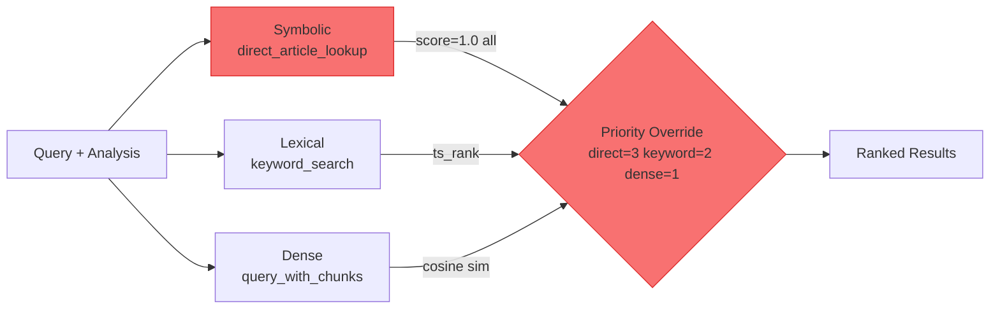
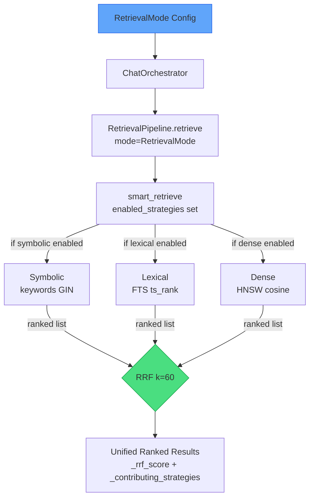

# Phase 2: Stage 2 Hybrid Retrieval — Implementation Checklist

**Date:** March 23, 2026
**Spec:** Thesis §4.2 Stage 2 — three parallel strategies + RRF fusion
**Depends on:** `SYMBOLIC_RETRIEVAL_EVALUATION.md` findings

---

## Design Decision: Keywords GIN Search over `article_label` Column

The initial plan proposed adding an `article_label` column for exact symbolic matching. This was **revised** for the following reasons:

| Consideration | `article_label` Column | `keywords` GIN Search |
|---|---|---|
| Schema migration required | Yes — ALTER TABLE + re-ingest | No — column already exists and is populated |
| Same label across multiple laws | "Article 12" exists in PD 442, RA 11058, RA 11199 — ambiguous without source context | Keywords include source-specific terms (e.g., `"Labor Code"`, `"Republic Act No. 10361"`) for implicit disambiguation |
| Noise vs. `full_text ILIKE` | N/A | LLM-curated by ChunkSummarizer — cross-reference mentions excluded; only primary article refs captured |
| Index availability | Requires new B-tree index | GIN index (`idx_sections_keywords`) already exists |

The `keywords text[]` column already contains human-readable article refs (`"Article 297"`, `"Article 156"`) and source-law terms. GIN array containment (`&&` / `@>`) is the correct symbolic lookup mechanism.

**One requirement remains:** article ref format normalization. `query_analysis.py` extracts refs as `"RA 10361"` or `"PD 442"`, but the DB keywords store canonical forms like `"Republic Act No. 10361"` and `"Presidential Decree No. 442"`. Expansion must happen before the GIN query.

---

## Current State Snapshot



| Component | Status | Root Issue |
|-----------|--------|------------|
| Dense HNSW | Working | `_query_sections_table` + `_query_chunks_table` via cosine similarity |
| Lexical FTS | Working | `keyword_search()` via `plainto_tsquery` + `ts_rank` |
| Symbolic (direct) | Broken | Falls back to `full_text ILIKE` — false positives from cross-references |
| RRF Fusion | Missing | Priority-override merge; cross-strategy agreement discarded |
| `retrieval/ranking.py` | Missing | Merge logic embedded in `supabase_store.py`; no clean RRF entry point |
| Pipeline Variant Config | Missing | `smart_retrieve()` runs all available strategies unconditionally |

---

## Target Architecture



---

## Pipeline Variant Matrix

The thesis evaluation (§4.5.3) requires 8 pipeline variants. Each is expressed as a combination of existing and new config flags.

| Variant | `enable_query_analysis` | `enable_smart_clarification` | `enable_translation` | `retrieval_mode` | Notes |
|---------|------------------------|------------------------------|----------------------|-----------------|-------|
| **Full Pipeline** | `true` | `true` | `true` | `hybrid` | Proposed system |
| **Stage 2 Only** | `false` | `false` | `false` | `hybrid` | No Stage 1 |
| **Dense-only** | `true` | `true` | `true` | `dense` | Retriever baseline |
| **Lexical-only** | `true` | `true` | `true` | `lexical` | Retriever baseline |
| **Symbolic-only** | `true` | `true` | `true` | `symbolic` | Retriever baseline |
| **Hybrid – no translation** | `true` | `true` | `false` | `hybrid` | Translation ablation |
| **Hybrid – no clarification** | `true` | `false` | `true` | `hybrid` | Clarification ablation |
| **LLM-only (no RAG)** | `false` | `false` | `false` | `none` | Hallucination baseline |

`enable_query_analysis=false` gates the orchestrator's `analyze()` call — skips Stage 1 entirely (analysis=None, raw query retrieval). ✅ Fixed.
`enable_smart_clarification=false` skips only the clarification early-exit gate; Stage 1 keyword/article enrichment still runs. ✅ Fixed.
`enable_translation=false` uses `user_message` (original language) as retrieval query for non-English queries. ✅ Fixed.
**`retrieval_mode` does not exist yet** — this is the key gap to close.

---

## Implementation Tasks

### Task 1 — Add `RetrievalMode` + Config Flag

**Files:** `core/config.py`, `adapters/vectorstore/base.py`

- [ ] Define `RetrievalMode` as a `Literal` type (or `enum.Enum`) with values:
  - `"hybrid"` — all three strategies + RRF (default)
  - `"dense"` — dense HNSW only
  - `"lexical"` — FTS keyword search only
  - `"symbolic"` — keywords GIN lookup only
  - `"none"` — skip Stage 2 entirely (LLM-only baseline)
- [ ] Add to `core/config.py` `Settings`:
  ```python
  retrieval_mode: Literal["hybrid", "dense", "lexical", "symbolic", "none"] = Field(
      default="hybrid",
      description="Retrieval strategy for pipeline variant testing"
  )
  ```
- [ ] Add to `.env.example`:
  ```
  RETRIEVAL_MODE=hybrid
  ```
- [ ] `RetrievalMode` maps to `enabled_strategies` set used by `smart_retrieve()`:
  - `"hybrid"` → `{"symbolic", "lexical", "dense"}`
  - `"dense"` → `{"dense"}`
  - `"lexical"` → `{"lexical"}`
  - `"symbolic"` → `{"symbolic"}`
  - `"none"` → `set()` (empty — no retrieval)

---

### Task 2 — Rewrite `direct_article_lookup()`: Keywords GIN Symbolic Search

**File:** `adapters/vectorstore/supabase_store.py`

- [ ] Replace `full_text ILIKE` + `article_number ILIKE` with GIN array containment on `keywords`:
  ```sql
  WHERE s.keywords @> ARRAY[%s]::text[]
  ```
- [ ] Add article ref normalization before query — expand short forms to canonical forms stored in DB keywords:
  - `"Article N"` / `"Art. N"` → canonical: `"Article N"`
  - `"RA N"` → also try `"Republic Act No. N"`, `"Republic Act N"`
  - `"PD N"` → also try `"Presidential Decree No. N"`, `"Presidential Decree N"`
  - `"Section N"` → try as-is
- [ ] When source law is derivable from query (e.g., `"Labor Code"` appears in extracted keywords), add a second containment filter for disambiguation:
  ```sql
  AND s.keywords && ARRAY['Labor Code', 'Presidential Decree No. 442']::text[]
  ```
- [ ] Order results by number of matching keyword terms (most overlap first) — this becomes the rank input for RRF
- [ ] Remove `score=1.0` — let RRF use list rank position instead
- [ ] Tag: `metadata['_strategy'] = 'symbolic'`
- [ ] Deduplicate by section `id`; return at most `limit` results

---

### Task 3 — Create `retrieval/ranking.py`: RRF Module ✅

**File:** `retrieval/ranking.py` *(created)*

- [x] Implemented `reciprocal_rank_fusion(ranked_lists, k=60) -> List[QueryResult]`
- [x] Input: `Dict[str, List[QueryResult]]` — each list is best-first from one strategy
- [x] Output: single `List[QueryResult]`, `score` = RRF score, sorted descending
- [x] Accumulates contributions; empty strategy lists silently skipped (no penalty for absence)
- [x] Attaches `_rrf_score`, `_contributing_strategies`, `_strategy_ranks` to each result's metadata
- [x] Exported from `retrieval/__init__.py` alongside `LegalDocumentChunker`

**Architecture note — `retrieve_with_reranking()` vs RRF:**
`RetrievalPipeline.retrieve_with_reranking()` in `services/pipeline/retrieval.py` is a **separate, unreferenced stub** for a future *cross-encoder* reranker (post-retrieval rescoring by a heavier model). It is conceptually distinct from RRF and was intentionally left untouched. RRF merges parallel strategy outputs purely from list rank position, with no additional model call.

---

### Task 4 — Refactor `smart_retrieve()`: Strategy Selection + RRF ✅

**File:** `adapters/vectorstore/supabase_store.py`

- [x] Added `enabled_strategies: Optional[set] = None` parameter — `None` = all applicable, `set()` = LLM-only, named set = explicit gating
- [x] Strategy gating: `symbolic`/`lexical`/`dense` only run when both in `active` set AND required inputs are present
- [x] `set()` guard: returns `[]` immediately before launching any tasks
- [x] `asyncio.gather()` parallel execution preserved
- [x] Each result tagged with `metadata["_strategy"]` before building `rrf_input` dict
- [x] `reciprocal_rank_fusion(rrf_input, k=60)` replaces `strategy_priority` dict and priority-override merge block (removed entirely)
- [x] INFO log: `smart_retrieve: active=[...] symbolic=N, lexical=N, dense=N -> rrf_merged=N`
- [x] Import of `reciprocal_rank_fusion` is local (inside method) to avoid circular import risk

---

### Task 5 — Propagate `retrieval_mode` Through the Pipeline

**Files:** `services/pipeline/retrieval.py`, `services/chat_orchestrator.py`

- [x] In `RetrievalPipeline.retrieve()`, add `enabled_strategies` parameter derived from `settings.retrieval_mode`:
  ```python
  from core.config import settings

  _MODE_TO_STRATEGIES = {
      "hybrid":   {"symbolic", "lexical", "dense"},
      "dense":    {"dense"},
      "lexical":  {"lexical"},
      "symbolic": {"symbolic"},
      "none":     set(),
  }

  async def retrieve(self, ...) -> List[QueryResult]:
      enabled = _MODE_TO_STRATEGIES[settings.retrieval_mode]
      if not enabled:
          return []  # LLM-only mode — skip retrieval
      results = await self.vectorstore.smart_retrieve(
          ...,
          enabled_strategies=enabled
      )
  ```
- [x] In `ChatOrchestrator.process_message_stream()`, guard the retrieval block with the `none` mode check so the "Searching labor laws..." status event is also suppressed for LLM-only runs
- [x] Log the active mode at pipeline startup: `retrieval_mode={settings.retrieval_mode}`

---

### Task 6 — Strategy Metadata Tags (Observability)

**Files:** `adapters/vectorstore/supabase_store.py`, `retrieval/ranking.py`

- [ ] Each strategy tags its results with `metadata['_strategy']` before RRF:
  - `keyword_search()` output → `'lexical'`
  - `direct_article_lookup()` output → `'symbolic'`
  - `_merge_and_rank_dual_table()` output → `'dense'`
- [ ] `RetrievalPipeline.retrieve()` logs strategy breakdown from `_contributing_strategies` on final merged results
- [ ] For experiment tracing: log full per-result strategy attribution at `DEBUG` to support the §4.5.5 trace logging requirement

---

### Task 7 — Validation & Testing

**Files:** `tests/unit/`, `tests/integration/`

- [ ] Unit test `reciprocal_rank_fusion()`:
  - Single-strategy input → output order unchanged
  - Same doc in two strategies → RRF score = sum of both contributions
  - Three-way agreement → that doc ranks #1
  - Doc absent from one strategy → contributes 0 from that strategy (no penalty)

- [ ] Unit test `direct_article_lookup()` after fix:
  - `"Article 297"` → returns only sections with `"Article 297"` in keywords (not cross-references)
  - `"RA 10361"` → matches sections with `"Republic Act No. 10361"` in keywords (normalization verified)
  - `"Article 297"` + `"Labor Code"` source hint → does not return Article 297 from other statutes

- [ ] Unit test `smart_retrieve()` strategy gating:
  - `enabled_strategies={"dense"}` → only dense results returned even when `articles` and `keywords` are provided
  - `enabled_strategies=set()` → returns `[]` immediately (LLM-only mode)
  - `enabled_strategies=None` → all applicable strategies run (default behavior)

- [ ] Integration test per pipeline variant (maps to thesis §4.5.3):
  - `retrieval_mode=hybrid` — all 3 strategies fire; RRF merges
  - `retrieval_mode=dense` — only semantic results returned
  - `retrieval_mode=lexical` — only FTS results returned
  - `retrieval_mode=symbolic` — only GIN keyword results returned
  - `retrieval_mode=none` — `retrieve()` returns `[]`; generation proceeds with empty context

---

## Implementation Sequence

```
Task 1  RetrievalMode config flag               (core/config.py + .env.example)
Task 2  direct_article_lookup() rewrite         (keywords GIN, ref normalization)
Task 3  retrieval/ranking.py                    (RRF — can run parallel with Task 2)
Task 4  smart_retrieve() refactor               (strategy gating + RRF; depends on 2 & 3)
Task 5  Pipeline propagation                    (retrieval.py + orchestrator; depends on 1 & 4)
Task 6  Metadata tagging                        (part of Tasks 2–4)
Task 7  Tests
```

**No schema changes. No re-ingestion required.**

---

## Expected Outcomes

| Query Type | Before | After |
|------------|--------|-------|
| Citation query (`"Article 297?"`) | Target + 3-5 false positives from cross-refs, all at score=1.0 | Target at rank #1 via RRF; cross-refs absent from keywords → not returned |
| General query (`"overtime pay?"`) | Dense + lexical only (works) | Unchanged — symbolic skipped when no article refs |
| Cross-strategy agreement | Discarded by priority-override | Amplified by RRF |
| Multi-law disambiguation (`"Article 12"`) | Returns all laws' Article 12 indiscriminately | Source-law keywords filter narrows to correct statute when law is specified |
| Pipeline variant isolation (e.g., dense-only) | Not possible — all strategies always run | `retrieval_mode=dense` enforces single-strategy execution |

---

## References

- `docs/Thesis-Methodology-Results.md` — Thesis §4.2 Stage 2: Hybrid Retrieval
- `docs/Thesis-Methodology-Results.md` — Thesis §4.5.3 Pipeline Variants (8-variant experiment matrix)
- `docs/SYMBOLIC_RETRIEVAL_EVALUATION.md` — original root cause analysis
- `adapters/vectorstore/supabase_store.py` — `smart_retrieve()`, `direct_article_lookup()`, `keyword_search()`
- `services/pipeline/retrieval.py` — `RetrievalPipeline.retrieve()`
- `services/chat_orchestrator.py` — variant config flag consumption
- `core/config.py` — `enable_query_analysis`, `enable_smart_clarification`, `enable_translation`
- Cormack, Clarke & Buettcher (2009) — RRF, k=60 standard
