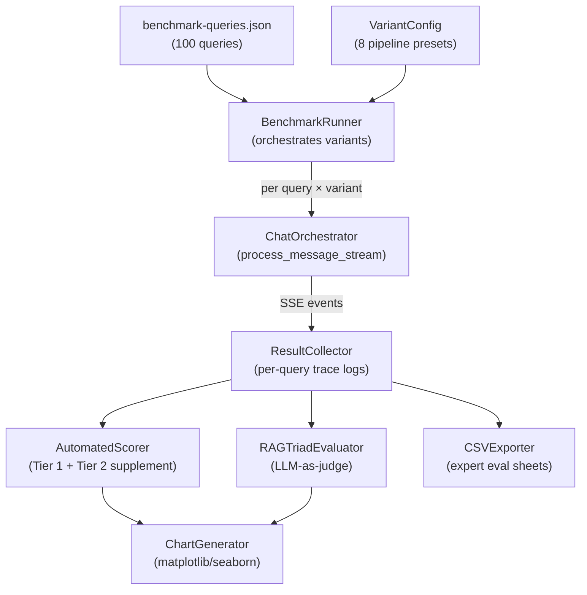
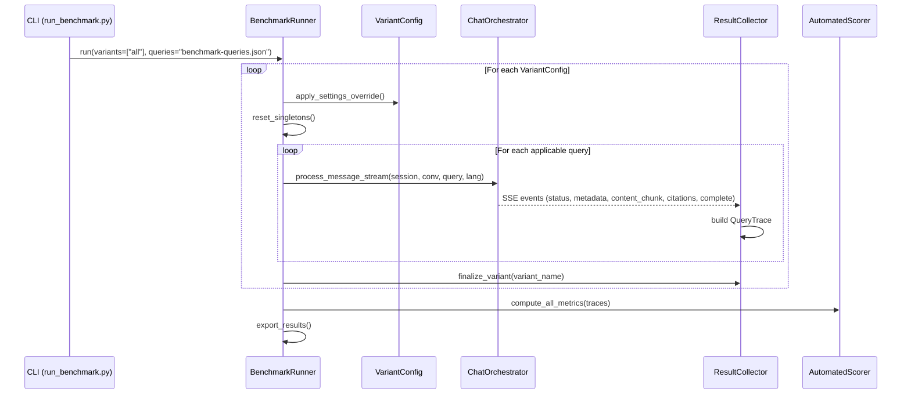

# Automated Testing Specification

Specification for the benchmark evaluation framework described in §4.5 of the thesis methodology. Covers all 8 pipeline variants, automated + manual metrics, and export formats for thesis-quality results.

---

## 1. Architecture Overview



### File Structure

```
tests/
└── benchmark/
    ├── __init__.py
    ├── runner.py              # BenchmarkRunner — main entry point
    ├── config.py              # VariantConfig — 8 pipeline variant definitions
    ├── collector.py           # ResultCollector — captures full pipeline trace
    ├── scorers/
    │   ├── __init__.py
    │   ├── retrieval.py       # Recall@K, Hit Rate@K, MRR
    │   ├── answer_quality.py  # Token F1, ROUGE-L, Exact Match
    │   ├── citation.py        # Citation precision / recall
    │   ├── clarification.py   # Clarification detection P/R
    │   └── rag_triad.py       # LLM-as-judge (Context Relevance, Groundedness, Answer Relevance)
    ├── exporters/
    │   ├── __init__.py
    │   ├── csv_exporter.py    # CSV export for expert evaluation + raw data
    │   └── chart_generator.py # matplotlib/seaborn charts for thesis figures
    └── results/               # gitignored output directory
        ├── raw/               # JSON trace logs per run
        ├── csv/               # exported CSV files
        └── figures/           # generated charts (PNG/PDF)
```

---

## 2. Pipeline Variant Configuration

Each variant maps directly to the 4 runtime switches already in `core/config.py`. The runner overrides `settings` attributes per variant before each batch.

| # | Variant Name | `RETRIEVAL_MODE` | `ENABLE_QUERY_ANALYSIS` | `ENABLE_TRANSLATION` | `ENABLE_SMART_CLARIFICATION` | Query Scope | n |
|---|---|---|---|---|---|---|---|
| 1 | **Full Pipeline** | `hybrid` | `true` | `true` | `true` | All | 100 |
| 2 | **Stage 2 Only** | `hybrid` | `false` | `false` | `false` | All | 100 |
| 3 | **Dense-only** | `dense` | `true` | `true` | `true` | All | 100 |
| 4 | **Lexical-only** | `lexical` | `true` | `true` | `true` | All | 100 |
| 5 | **Symbolic-only** | `symbolic` | `true` | `true` | `true` | All | 100 |
| 6 | **Hybrid – no translation** | `hybrid` | `true` | `false` | `true` | Non-English only | 65 |
| 7 | **Hybrid – no clarification** | `hybrid` | `true` | `true` | `false` | Ambiguous only | 30 |
| 8 | **LLM-only (no RAG)** | `none` | `false` | `false` | `false` | All | 100 |

**Total runs**: 100 + 100 + 100 + 100 + 100 + 65 + 30 + 100 = **695**

### Variant Config Data Structure

```python
@dataclass
class VariantConfig:
    name: str
    retrieval_mode: str          # hybrid | dense | lexical | symbolic | none
    enable_query_analysis: bool
    enable_translation: bool
    enable_smart_clarification: bool
    query_filter: str            # "all" | "non_english" | "ambiguous"

VARIANTS = [
    VariantConfig("full_pipeline",             "hybrid",   True,  True,  True,  "all"),
    VariantConfig("stage2_only",               "hybrid",   False, False, False, "all"),
    VariantConfig("dense_only",                "dense",    True,  True,  True,  "all"),
    VariantConfig("lexical_only",              "lexical",  True,  True,  True,  "all"),
    VariantConfig("symbolic_only",             "symbolic", True,  True,  True,  "all"),
    VariantConfig("hybrid_no_translation",     "hybrid",   True,  False, True,  "non_english"),
    VariantConfig("hybrid_no_clarification",   "hybrid",   True,  True,  False, "ambiguous"),
    VariantConfig("llm_only",                  "none",     False, False, False, "all"),
]
```

### How Switches Map to `process_message_stream`

| Switch | Effect in Orchestrator |
|---|---|
| `enable_query_analysis=false` | Skips Stage 1 entirely — `analysis = None`, raw `user_message` sent to retrieval with no keywords/articles |
| `enable_translation=false` | Stage 1 still runs but retrieval uses original-language query instead of `normalized_query_en` (line ~340) |
| `enable_smart_clarification=false` | Stage 1 still runs (extracts keywords/articles) but never returns a clarification early-exit (line ~268) |
| `retrieval_mode=none` | Skips retrieval — `retrieval_results = []`, LLM generates from conversation history only |
| `retrieval_mode=dense\|lexical\|symbolic` | `_MODE_TO_STRATEGIES` in `retrieval.py` restricts `smart_retrieve` to the single strategy |

---

## 3. Benchmark Runner Design

### 3.1 Execution Flow



### 3.2 Query Trace Capture

For each query–variant pair, the collector captures the full pipeline trace from SSE events:

```python
@dataclass
class QueryTrace:
    query_id: str
    variant: str
    query_text: str
    language: str
    query_type: str          # single_turn | multi_turn
    is_ambiguous: bool
    topic: str
    retrieval_target: str    # symbolic | lexical | dense | hybrid
    
    # Stage 1 outputs (None if query_analysis disabled)
    analysis_normalized_query: Optional[str]
    analysis_keywords: Optional[List[str]]
    analysis_articles: Optional[List[str]]
    analysis_needs_clarification: Optional[bool]
    analysis_original_language: Optional[str]
    
    # Stage 2 outputs
    retrieved_chunk_ids: List[str]       # ordered by rank
    retrieved_scores: List[float]
    retrieval_strategy_breakdown: Dict[str, int]
    retrieval_time_ms: float
    
    # Stage 3 outputs
    generated_answer: str
    extracted_citations: List[str]       # article refs parsed from answer
    generation_time_ms: float
    total_time_ms: float
    
    # Flags
    was_clarification: bool              # true if pipeline returned clarification
    was_out_of_scope: bool
    is_meta_conversational: bool
    
    # Gold standard (from benchmark-queries.json)
    gold_chunks: List[str]
    gold_article_refs: List[str]
    reference_answer: str
    expected_clarification: Optional[str]
    
    # Phase 2 fields — multi-turn only (Table 8: Turn 6 evaluation)
    turn5_query: Optional[str]                      # Phase 2 user query (non-ambiguous follow-up)
    turn6_generated_answer: Optional[str]           # Pipeline answer to turn5_query
    turn6_extracted_citations: Optional[List[str]]  # Citations parsed from turn6 answer
    gold_chunks_turn6: Optional[List[str]]          # Gold chunks for turn5_query
    gold_article_refs_turn6: Optional[List[str]]    # Gold article refs for turn5_query
    turn6_reference_answer: Optional[str]           # Canonical expected answer for turn5_query
```

### 3.3 Multi-Turn Query Handling

Multi-turn queries follow a **two-phase structure** (Decisions 3 & 6): 30 queries total (24 original + 6 promoted from single-turn ambiguous). Each query has a Phase 1 clarification exchange (Turns 1–3 stored in `conversation_history`) and a Phase 2 follow-up (Turn 5 stored in `turn5_query`). Turn 4 is the rated answer for Tables 2, 3, 6, and 7; Turn 6 is the rated answer for Table 8.

#### Phase 1 Execution (Turn 4 — evaluated in Tables 2, 3, 6, 7)

1. Create a fresh `conversation_id` per query–variant pair.
2. Inject all turns in `conversation_history` except the final user turn via `conversation.add_user_message()` / `conversation.add_assistant_message()`.
3. Send the final user turn (Turn 3) through `process_message_stream` → captures the Turn 4 answer.

#### Phase 2 Execution (Turn 6 — evaluated in Table 8, `full` mode only)

After Phase 1 completes, the runner continues in the same conversation:

4. Inject the Turn 4 assistant response into the conversation via `conversation.add_assistant_message()`.
5. Send `turn5_query` (a specific, non-ambiguous follow-up grounded in Phase 1 context) through `process_message_stream` → captures the Turn 6 answer.
6. Store Turn 6 outputs in the Phase 2 fields of `QueryTrace` (`turn6_generated_answer`, `turn6_extracted_citations`).

**Phase 2 is skipped in `retrieval_only` mode** — Table 8 reports answer quality metrics only (no retrieval metrics; see Decision 2), so no Phase 2 retrieval pass is needed.

**All three Table 8 configurations (Config A/B/C) receive full conversation history (Turns 1–5) before generating Turn 6.** Conversation history is a general input available to all dialogue systems — withholding it from Config A or B would create an unfair comparison. What distinguishes the three configs is the retrieval query: Config A uses none, Config B uses raw Turn 5 text, Config C uses Stage 1's consolidated query across all prior turns.

This ensures Stage 1 receives realistic multi-turn context for summarization evaluation and that all configurations are compared fairly on the same inputs.

### 3.4 Settings Override Mechanism

The runner must override `settings` attributes between variants without restarting the process. Implementation approach:

```python
def apply_variant(variant: VariantConfig):
    """Override settings for the current variant run."""
    settings.retrieval_mode = variant.retrieval_mode
    settings.enable_query_analysis = variant.enable_query_analysis
    settings.enable_translation = variant.enable_translation
    settings.enable_smart_clarification = variant.enable_smart_clarification
```

**Important**: After each variant, `lru_cache`-decorated singletons in `containers.py` must be cleared and rebuilt so that pipeline objects pick up the new settings:

```python
def reset_singletons():
    """Clear cached singletons to force re-initialization with new settings."""
    import app.containers as c
    for fn in [c.get_retrieval_pipeline, c.get_chat_orchestrator, ...]:
        fn.cache_clear()
    c._vectorstore_adapter = None  # reset global singletons too
    # ... etc
```

### 3.5 CLI Interface

**Core arguments:**

| Argument | Description | Default |
|---|---|---|
| `--mode` | Execution mode: `analysis_only`, `retrieval_only`, `full` | `full` |
| `--variant` | One or more variant names to run | (required) |
| `--top-k` | One or more K values for retrieval (retrieval_only mode) | `5` |
| `--query-ids` | Run only specific query IDs (e.g., `Q007 Q015`) | all |
| `--output-dir` | Output directory for results | `results/run_<timestamp>` |
| `--resume` | Skip completed query–variant pairs from a previous run | off |

**Validation & debugging:**

| Argument | Description |
|---|---|
| `--smoke` | Run 5 representative queries through full pipeline as sanity check |
| `--validate` | Run pre-flight checks: `clarification`, `multiturn`, or `all` |
| `--log-level` | Logging verbosity: `DEBUG`, `INFO`, `WARNING` |
| `--log-file` | Path to write log output alongside console |
| `--log-per-variant` | Split logs into per-variant files |
| `--quiet` | Suppress console output, log to file only |
| `--api-delay-ms` | Delay between OpenAI API calls (rate limiting) | `200` |

**Example commands:**

```bash
# Validate before running (cheap, GPT-4o-mini only)
python -m tests.benchmark.runner --validate all
python -m tests.benchmark.runner --smoke

# Retrieval-only evaluation at multiple K values
python -m tests.benchmark.runner --mode retrieval_only --top-k 3 5 10 \
  --variant full_pipeline dense_only lexical_only symbolic_only

# Full pipeline for expert evaluation configs
python -m tests.benchmark.runner --mode full \
  --variant llm_only stage2_only full_pipeline

# Debug a specific failing query
python -m tests.benchmark.runner --mode full --variant full_pipeline \
  --query-ids Q007 --log-level DEBUG --log-file debug_Q007.log

# Resume an interrupted run
python -m tests.benchmark.runner --mode full --variant full_pipeline \
  --resume --output-dir results/run_001
```

---

### 3.6 Execution Modes

Three execution modes minimize API cost by running only the pipeline stages needed for each thesis table:

| Mode | Stages Run | Use For | Token Cost |
|---|---|---|---|
| `analysis_only` | Stage 1 only | Pre-flight validation | GPT-4o-mini only |
| `retrieval_only` | Stage 1 + Stage 2 | Tables 2, 3, 4 (retrieval metrics at flexible K) | GPT-4o-mini + embeddings |
| `full` | Stage 1 + Stage 2 + Stage 3 | Tables 6–10 (answer quality, hallucination, citations, RAG Triad) | GPT-4o-mini + embeddings + GPT-4.1 |

**Table-to-Mode-to-Variant mapping:**

| Thesis Table | Mode | top_k | Variants Run | Queries / Runs |
|---|---|---|---|---|
| Table 2 (Retrieval comparison) | `retrieval_only` | 3, 5, 10 | dense_only, lexical_only, symbolic_only, full_pipeline | 4 variants × 100 queries × 3 K-values = **1,200** |
| Table 3 (By target subset) | `retrieval_only` | 5 | same as Table 2 | K=5 slice of Table 2 runs, each $n=25$ per strategy subset |
| Table 4 (Translation pivot) | `retrieval_only` | 5 | full_pipeline + hybrid_no_translation | 100 + 65 = 165 |
| Tables 6, 7, 9, 10 (Answer quality — **Turn 4**) | `full` | 5 | llm_only, stage2_only, full_pipeline | 3 × 100 = 300 |
| Table 8 (Multi-turn summarization — **Turn 6**) | `full` | 5 | llm_only, stage2_only, full_pipeline | 3 × 30 = 90 (Turn 6 answers; subset of the 300 runs above) |

**`retrieval_only` mode behavior:**

1. Runs Stage 1 (if `enable_query_analysis=true`) to get `normalized_query_en`, keywords, articles
2. Runs Stage 2 retrieval at each requested K value (e.g., `--top-k 3 5 10`)
3. **Skips Stage 3** (LLM generation) entirely — zero GPT-4.1 tokens spent
4. Stores retrieved chunk IDs + scores for offline metric computation
5. Each K value is a **separate retrieval run** — with RRF, scores are computed over exactly the top-K candidates so sub-selecting from a larger K result does not reproduce the smaller-K rankings

**`analysis_only` mode behavior:**

1. Runs Stage 1 only to get the `QueryAnalysis` result
2. Records `needs_clarification`, `out_of_scope`, `is_meta_conversational`, `normalized_query_en`
3. Skips both retrieval and generation
4. Used for pre-flight validation only (clarification and multi-turn checks)

**Note on Table 3:** Table 3 slices the K=5 retrieval results from Table 2 by `retrieval_target` (each $n=25$, balanced across all four strategies). No additional API calls required — it reuses the K=5 pass from the Table 2 runs and reports MRR and Recall@5 per subset.

**CLI mode selection:**

```bash
# Retrieval-only at multiple K values (Tables 2–4)
python -m tests.benchmark.runner --mode retrieval_only --top-k 3 5 10 \
  --variant full_pipeline dense_only lexical_only symbolic_only

# Full pipeline for answer quality (Tables 6–10)
python -m tests.benchmark.runner --mode full --variant llm_only stage2_only full_pipeline
```

### 3.7 Pre-flight Validation & Smoke Tests

Before committing to the full benchmark (~$15–22 in API fees), run cheap validation checks to catch configuration issues early.

**Smoke test** (`--smoke`):
Runs 5 representative queries (1 English single-turn clear, 1 Filipino, 1 Cebuano, 1 multi-turn, 1 ambiguous) through the full pipeline on the `full_pipeline` variant. Prints a diagnostic summary confirming all stages execute correctly.

```bash
python -m tests.benchmark.runner --smoke
```

**Clarification validation** (`--validate clarification`):
Runs all 30 ambiguous queries + 20 non-ambiguous queries through `analysis_only` mode. Reports clarification detection precision/recall **before** any generation tokens are spent. Catches false negatives (ambiguous query not flagged) and false positives (clear query flagged incorrectly).

```bash
python -m tests.benchmark.runner --validate clarification
```

Expected output:
```
Clarification Validation Report
═══════════════════════════════
  Ambiguous queries (n=30):
    ✓ Q003: flagged correctly (expected: ambiguous)
    ✗ Q015: NOT flagged (expected: ambiguous) ← FALSE NEGATIVE
    ...
  Non-ambiguous queries (n=20 sample):
    ✓ Q001: not flagged (expected: clear)
    ✗ Q042: flagged incorrectly ← FALSE POSITIVE
    ...
  Precision: 0.93  |  Recall: 0.87
```

**Multi-turn validation** (`--validate multiturn`):
Runs all 30 multi-turn queries through `analysis_only` mode with conversation history injection. Verifies:
- Conversation history was injected correctly (non-empty context)
- Stage 1 produced a consolidated `normalized_query_en` (not just the raw last turn)
- Clarification was NOT re-triggered on the final turn (prior clarification is already in history)
- `is_meta_conversational` was not incorrectly flagged

This validates Phase 1 execution only (Turn 4 generation path). Phase 2 (Turn 5/6) is exercised by the `--smoke` test.

```bash
python -m tests.benchmark.runner --validate multiturn
```

Expected output:
```
Multi-Turn Validation Report
════════════════════════════
  Q007 (fil, ambiguous, multi-turn):
    History injected: 3 turns ✓
    Normalized query: "Factory worker minimum wage Calabarzon comparison" ✓
    Re-clarification: false ✓
    Meta-conversational: false ✓

  Q015 (...):
    ...

  Pass: 30/30  |  Fail: 0/30
  Failures require investigation before full benchmark.
```

**Combined validation** (`--validate all`):
Runs both clarification and multi-turn validation in sequence.

```bash
python -m tests.benchmark.runner --validate all
```

Total validation cost: < $0.10 (GPT-4o-mini only, ~70 queries).

### 3.8 In-Process Execution & Logging

**No uvicorn server required.** The benchmark runner imports pipeline components directly via `app.containers` and calls `process_message_stream()` as an async generator. This eliminates HTTP overhead, SSE serialization, and rate-limiter interference.

```python
# Runner directly imports and calls the orchestrator
from app.containers import get_chat_orchestrator

orchestrator = get_chat_orchestrator()
async for event in orchestrator.process_message_stream(
    session_id=session, conversation_id=conv_id,
    user_message=query, language=lang
):
    collector.process_event(event)
```

**Logging configuration:**

The runner reuses `core.logging` for structured log output. All `logger.info()` / `logger.debug()` calls in the pipeline code fire normally during benchmark execution — identical to the logs you see when running uvicorn.

| Flag | Effect |
|---|---|
| `--log-level DEBUG` | Full pipeline trace (query analysis prompts, retrieval scores, grounding context) |
| `--log-level INFO` (default) | Summary per query (variant, query_id, retrieval count, timing) |
| `--log-file results/run_001/benchmark.log` | Tee all logs to a file alongside console output |
| `--quiet` | Suppress console output; logs to file only |

**Per-query log context:** The runner injects `query_id` and `variant` into each log record for easy filtering:

```
[INFO] [full_pipeline/Q007] Analyzing query with conversation context
[INFO] [full_pipeline/Q007] Query analysis complete: needs_clarification=false, concepts=[...], time=0.42s
[INFO] [full_pipeline/Q007] Retrieved 5 results (retrieval_time=0.31s, avg_score=0.72)
```

**Per-variant log files (optional):** With `--log-per-variant`, logs are split into separate files:

```
results/run_001/logs/full_pipeline.log
results/run_001/logs/dense_only.log
results/run_001/logs/llm_only.log
```

**OpenAI rate limiting:** The runner adds a configurable delay between API calls (default: 200ms) to avoid OpenAI rate limit errors. Adjustable via `--api-delay-ms 500`.

**Debugging a single query:** To investigate a specific failure, run a single query with DEBUG logging:

```bash
python -m tests.benchmark.runner --mode full --variant full_pipeline \
  --query-ids Q007 Q015 --log-level DEBUG
```

---

## 4. Automated Metrics (Tier 1 + Tier 2 Supplement)

### 4.1 Retrieval Metrics

Computed by comparing `retrieved_chunk_ids` against `gold_chunks` for each query–variant pair.

| Metric | Formula | Purpose |
|---|---|---|
| **Recall@K** | $\frac{\|\text{gold} \cap \text{retrieved}_{@K}\|}{\|\text{gold}\|}$ | Proportion of gold chunks found in top-K |
| **Hit Rate@K** | $\mathbb{1}[\text{gold} \cap \text{retrieved}_{@K} \neq \emptyset]$ | At least one gold chunk in top-K |
| **MRR** | $\frac{1}{\text{rank of first gold chunk}}$ | Reciprocal rank of first relevant result |

K values: **3, 5** for standard evaluation; **K = 10** added in `retrieval_only` mode for Table 2 diagnostic depth.

Each K value requires a **separate retrieval call**. With RRF (Reciprocal Rank Fusion), the fusion scores are computed over precisely the top-K candidates — sub-selecting the top-3 or top-5 results from a K=10 retrieval does not reproduce the K=3 or K=5 RRF rankings. When running `--top-k 3 5 10`, the runner issues three independent Stage 2 calls per query–variant pair.

**Chunk ID matching**: Gold chunks in `benchmark-queries.json` are stored as the actual Supabase `chunk_id` UUIDs. The scorer performs direct UUID equality matching between `gold_chunks` and `retrieved_chunk_ids` — no path normalization required.

### 4.2 Answer Quality Metrics

Computed by comparing `generated_answer` against `reference_answer`.

| Metric | Library | Notes |
|---|---|---|
| **Token F1** | Custom | Precision/recall of word-level token overlap after normalization (lowercase, strip punctuation) |
| **ROUGE-L** | `rouge-score` | Longest common subsequence F-measure |
| **Exact Match** | Custom | Binary match after whitespace/case normalization |

### 4.3 Citation Metrics

Computed by comparing `extracted_citations` against `gold_article_refs`.

| Metric | Formula |
|---|---|
| **Citation Precision** | $\frac{\|\text{gold\_refs} \cap \text{extracted\_refs}\|}{\|\text{extracted\_refs}\|}$ |
| **Citation Recall** | $\frac{\|\text{gold\_refs} \cap \text{extracted\_refs}\|}{\|\text{gold\_refs}\|}$ |

Citation extraction uses regex patterns to parse references like "Article 297", "Art. 99", "RA 6727", "PD 442" from the generated text. Matching is normalized (e.g., "Art. 297" == "Article 297").

### 4.4 RAG Triad Metrics (LLM-as-Judge)

An LLM evaluator (GPT-4.1 via a rubric prompt) scores each query–variant answer on three dimensions (0.0–1.0):

| Dimension | Evaluates |
|---|---|
| **Context Relevance** | Are the retrieved passages relevant to the query? |
| **Groundedness** | Is every claim in the answer supported by retrieved context? |
| **Answer Relevance** | Does the answer address the user's question? |

**Implementation**: For each query–variant pair, the evaluator receives `(query, retrieved_chunks, generated_answer)` and produces three float scores. Applied to variants that have retrieval (excludes LLM-only for Context Relevance and Groundedness).

---

## 5. Expert Evaluation Export (Tier 2 — Manual)

### 5.1 Expert Evaluation CSV

Three pipeline configurations require expert human scoring: **Config A** (LLM-only), **Config B** (Stage 2 Only), **Config C** (Full Pipeline).

The CSV exporter produces a **blinded, randomized** spreadsheet for each expert:

| Column | Description |
|---|---|
| `eval_id` | Unique evaluation row ID |
| `query_id` | Q001–Q100 |
| `query_text` | Original user query |
| `language` | en / fil / ceb |
| `query_type` | single_turn / multi_turn |
| `is_ambiguous` | true / false |
| `topic` | Topic category |
| `conversation_history` | JSON string of prior turns (multi-turn only) |
| `config_label` | Blinded label: randomized "X", "Y", "Z" (mapping hidden from expert) |
| `system_answer` | Generated answer text (Turn 4 for all queries) |
| `system_answer_turn6` | Turn 6 generated answer (multi-turn queries only; evaluated in Table 8) |
| `reference_answer` | Gold standard answer (Turn 4) |
| `turn6_reference_answer` | Gold standard answer for Turn 6 (multi-turn queries only) |
| `gold_article_refs` | Expected citations (Turn 4) |
| **legal_accuracy_score** | Expert fills: 1–4 scale |
| **hallucination_present** | Expert fills: yes / no |
| **citation_fidelity_notes** | Expert fills: free text |
| **clarification_quality** | Expert fills: 1–4 (ambiguous queries only) |
| **notes** | Expert fills: free text |

**Blinding protocol**: Config labels (A/B/C) are replaced with randomized aliases. Row order is shuffled. The mapping file is stored separately.

### 5.2 Full Conversation History CSV

For multi-turn queries, export the complete simulated dialog (all injected context + final system response) so experts can evaluate contextual coherence:

| Column | Description |
|---|---|
| `query_id` | Q001–Q100 |
| `variant` | Config label (blinded) |
| `turn_number` | Sequential turn in conversation |
| `role` | user / assistant |
| `content` | Message text |

### 5.3 Raw Results CSV

Complete data export for all 680 runs, used for the researcher's own analysis:

| Column | Description |
|---|---|
| `query_id` | Q001–Q100 |
| `variant` | Variant name |
| `language` | en / fil / ceb |
| `query_type` | single_turn / multi_turn |
| `is_ambiguous` | true / false |
| `topic` | Topic category |
| `retrieval_target` | symbolic / lexical / dense / hybrid |
| `retrieved_chunks` | JSON list of retrieved chunk IDs |
| `recall_at_3` | float |
| `recall_at_5` | float |
| `hit_rate_at_3` | bool |
| `hit_rate_at_5` | bool |
| `mrr` | float |
| `token_f1` | float |
| `rouge_l` | float |
| `exact_match` | bool |
| `citation_precision` | float |
| `citation_recall` | float |
| `context_relevance` | float (RAG Triad) |
| `groundedness` | float (RAG Triad) |
| `answer_relevance` | float (RAG Triad) |
| `was_clarification` | bool |
| `total_time_ms` | float |
| `generated_answer` | Full text |
| `reference_answer` | Full text |

---

## 6. Chart Generation (Thesis Figures)

All charts are generated via `matplotlib` + `seaborn` for publication-quality output (PDF + PNG at 300 DPI). Chart style uses a consistent academic palette.

### 6.1 Retrieval Performance Comparison (Table 2 → Figure)

**Type**: Grouped bar chart  
**X-axis**: Retrieval metric (Recall@3, Recall@5, Hit Rate@5, MRR)  
**Groups**: Dense-only, Lexical-only, Symbolic-only, Hybrid  
**Values**: Metric scores (0.0–1.0)  
**Reference**: Similar to the "Performance Comparison" bar charts in the attached sample images

```
chart_retrieval_comparison(results) → figures/retrieval_comparison.pdf
```

### 6.2 Retrieval by Target Subset (Table 3 → Figure)

**Type**: Grouped bar chart or heatmap  
**Rows**: Retrieval target subsets (each $n=25$: Symbolic, Lexical, Dense, Hybrid)  
**Columns**: Retrieval strategies  
**Values**: MRR per subset  

```
chart_retrieval_by_target(results) → figures/retrieval_by_target.pdf
```

### 6.3 Translation Pivot Impact (Table 4 → Figure)

**Type**: Grouped bar chart with delta annotations  
**X-axis**: Language (Filipino, Cebuano, English control)  
**Groups**: With Translation vs. Without Translation  
**Values**: Hit Rate@5, Recall@5  
**Annotations**: Δ values above bars (showing improvement)

```
chart_translation_impact(results) → figures/translation_impact.pdf
```

### 6.4 Answer Quality Across Configurations (Table 6 → Figure)

**Type**: Grouped bar chart  
**X-axis**: Metric (Mean Expert Score, Token F1, ROUGE-L)  
**Groups**: Config A (LLM-only), Config B (Stage 2 Only), Config C (Full Pipeline)  
**Annotations**: Δ between configs ("+ Retrieval", "+ Query Analysis")

```
chart_answer_quality(results) → figures/answer_quality.pdf
```

### 6.5 Hallucination & Citation Fidelity (Table 9 → Figure)

**Type**: Stacked or grouped bar chart  
**X-axis**: Config A, Config B, Config C  
**Metrics**: Hallucination Rate, Fabricated Citation Rate, Citation Precision, Citation Recall

```
chart_hallucination_citation(results) → figures/hallucination_citation.pdf
```

### 6.6 RAG Triad Radar/Spider Chart (Table 10 → Figure)

**Type**: Radar chart (spider plot)  
**Axes**: Context Relevance, Groundedness, Answer Relevance  
**Series**: Config B vs. Config C  

```
chart_rag_triad(results) → figures/rag_triad.pdf
```

### 6.7 Ablation Summary Heatmap (Table 11 → Figure)

**Type**: Heatmap  
**Rows**: 8 pipeline variants  
**Columns**: Key metrics (Recall@5, MRR, Token F1, ROUGE-L, Hallucination Rate)  
**Color scale**: Green (high) → Red (low), similar to the "Answer in Correct Language" heatmap in attached samples

```
chart_ablation_heatmap(results) → figures/ablation_heatmap.pdf
```

### 6.8 Per-Topic Performance Breakdown

**Type**: Horizontal bar chart  
**Y-axis**: 19 topic categories  
**X-axis**: Recall@5 or MRR for the Full Pipeline variant  
**Purpose**: Show KB coverage uniformity

```
chart_topic_breakdown(results) → figures/topic_breakdown.pdf
```

---

## 7. Execution Procedure

### 7.0 Execution Environment

**No uvicorn or HTTP server is required.** The benchmark runner is a standalone Python script that imports the `ChatOrchestrator` and pipeline components directly via `app.containers`. All pipeline logic runs in-process — the same code paths used in production are exercised without network or serialization overhead.

This means:
- All `logger.info()` / `logger.debug()` calls in the pipeline fire normally and appear in benchmark logs
- No interference from rate-limiting middleware, auth, or CORS
- No SSE serialization — the runner consumes the async generator directly
- Debugging with breakpoints or `pdb` is fully supported
- Settings overrides take effect immediately (no server restart)

### 7.1 Prerequisites

```bash
pip install rouge-score matplotlib seaborn pandas
```

The benchmark JSON must be placed at a known path (default: `tests/benchmark/data/benchmark-queries.json`).

### 7.2 Recommended Execution Order

Run the benchmark in phases, cheapest first, to catch issues early:

```bash
# Phase 0: Validate (~$0.10, GPT-4o-mini only)
python -m tests.benchmark.runner --validate all
python -m tests.benchmark.runner --smoke

# Phase 1a: Retrieval-only evaluation (Tables 2–3, ~$1–2)
python -m tests.benchmark.runner --mode retrieval_only --top-k 3 5 10 \
  --variant full_pipeline dense_only lexical_only symbolic_only \
  --output-dir results/run_001

# Phase 1b: Translation ablation retrieval (Table 4)
python -m tests.benchmark.runner --mode retrieval_only --top-k 5 \
  --variant full_pipeline hybrid_no_translation \
  --output-dir results/run_001

# Phase 2: Full pipeline for answer quality (Tables 6–10, ~$10–15)
python -m tests.benchmark.runner --mode full \
  --variant llm_only stage2_only full_pipeline \
  --output-dir results/run_001

# Phase 3: RAG Triad LLM-as-judge scoring (~$3–5)
python -m tests.benchmark.runner --rag-triad --input results/run_001/raw

# Phase 4: Generate outputs
python -m tests.benchmark.exporters.chart_generator \
  --input results/run_001/raw --output results/run_001/figures
python -m tests.benchmark.exporters.csv_exporter \
  --input results/run_001/raw --output results/run_001/csv --expert-blind
```

### 7.3 Selective Variant Run

```bash
# Only retrieval baselines at specific K (for Table 2)
python -m tests.benchmark.runner --mode retrieval_only --top-k 3 5 10 \
  --variant dense_only lexical_only symbolic_only full_pipeline

# Only expert configs — full pipeline (for Tables 6–10)
python -m tests.benchmark.runner --mode full \
  --variant llm_only stage2_only full_pipeline

# Only translation ablation (for Table 4)
python -m tests.benchmark.runner --mode retrieval_only --top-k 5 \
  --variant full_pipeline hybrid_no_translation

# Debug a single failing query
python -m tests.benchmark.runner --mode full --variant full_pipeline \
  --query-ids Q007 --log-level DEBUG
```

### 7.4 Resume & Incremental

The runner saves progress after each query–variant pair. If interrupted, `--resume` skips completed pairs:

```bash
python -m tests.benchmark.runner --all --resume --output-dir results/run_001
```

### 7.5 Cost Estimation (by Phase)

| Phase | Mode | API Calls | Estimated Cost |
|---|---|---|---|
| **Phase 0: Validation** | `analysis_only` | ~70 GPT-4o-mini + 5 full pipeline | < $0.20 |
| **Phase 1: Retrieval-only** (Tables 2–4) | `retrieval_only` | ~465 Stage 1 (GPT-4o-mini) + ~1,265 Stage 2 retrieval calls | ~$1–2 |
| **Phase 2: Full pipeline** (Tables 6–10) | `full` | 300 GPT-4o-mini + ~200 embeddings + 300 GPT-4.1 | ~$10–15 |
| **Phase 3: RAG Triad** | LLM-as-judge | ~200 GPT-4.1 judge calls | ~$3–5 |
| **Total** | | | **~$14–22** |

Running retrieval-only first (Phases 0–1) costs < $2 and validates all retrieval-layer claims before committing to the expensive Phase 2 generation runs. If retrieval metrics are unsatisfactory, the researcher can tune retrieval parameters and re-run Phase 1 without wasting generation tokens.

---

## 8. Key Design Decisions

### 8.1 Why Override Settings Instead of Separate Configs?

The existing pipeline reads switches from the singleton `settings` object at runtime. Overriding attributes in-process avoids maintaining 8 separate `.env` files and ensures the exact same infrastructure (Supabase, embeddings model, LLM) is shared across variants.

### 8.2 Why 3 Expert Configs Instead of 8?

Manual evaluation of all 8 variants × 100 queries × 2 experts = 1,600 ratings is impractical. The 3-config design (A → B → C) tests all 3 research claims through layered comparison while requiring only 600 ratings. Retrieval-only ablations (dense/lexical/symbolic, translation, clarification) are captured by automated metrics, which are fully sufficient for retrieval-layer evaluation.

### 8.3 Why `process_message_stream` Instead of Direct Function Calls?

Using `process_message_stream` (the same entry point as production) ensures the benchmark tests the actual pipeline behavior, including all gating logic, timing, and event sequencing. The collector aggregates the yielded events. For `retrieval_only` and `analysis_only` modes, the runner invokes Stage 1 and Stage 2 components directly (bypassing the full orchestrator) to avoid triggering generation. This is safe because the pipeline stages are cleanly separated by design.

### 8.4 Chunk ID Matching Strategy

Gold chunks in `benchmark-queries.json` are stored as actual Supabase `chunk_id` UUIDs. The scorer performs direct UUID equality matching between `gold_chunks` and `retrieved_chunk_ids` — no path normalization required.

### 8.5 Why In-Process Instead of HTTP?

Running the benchmark via direct Python imports (not uvicorn + HTTP) provides: (1) elimination of network/serialization overhead, (2) direct access to pipeline internals for trace collection, (3) no interference from rate-limiting or auth middleware, (4) ability to override `settings` attributes between variants without server restarts, and (5) full debugger support (breakpoints, pdb). The trade-off is that HTTP-layer bugs (SSE encoding, CORS) are not tested — but those are validated by separate integration tests.

### 8.6 Why Retrieval-Only Mode?

Tables 2–4 require only retrieval metrics (Recall@K, MRR). Running full LLM generation for these tables would spend ~2M GPT-4.1 tokens (~$10+) producing answers that are never scored for retrieval evaluation. By separating retrieval evaluation from answer quality evaluation, the researcher can: (a) iterate on retrieval tuning cheaply, (b) run expensive generation only when retrieval performance is satisfactory, and (c) evaluate retrieval at multiple K values (3, 5, 10) as independent runs. Although this multiplies Stage 2 retrieval calls (Table 2 alone requires 1,200 retrieval passes), Stage 2 is cheap — the cost savings from avoiding Stage 3 generation across those runs far outweigh the additional retrieval overhead.

### 8.7 Why Pre-flight Validation?

A single full-benchmark run costs ~$15–22 in API fees. Discovering a configuration bug (e.g., conversation history not injecting correctly for multi-turn queries, or clarification not triggering on ambiguous queries) after 300 queries wastes both tokens and time. The validation suite catches these issues for < $0.10, using `analysis_only` mode with GPT-4o-mini. The smoke test additionally verifies that the full pipeline executes end-to-end for one representative query per language/type combination.
