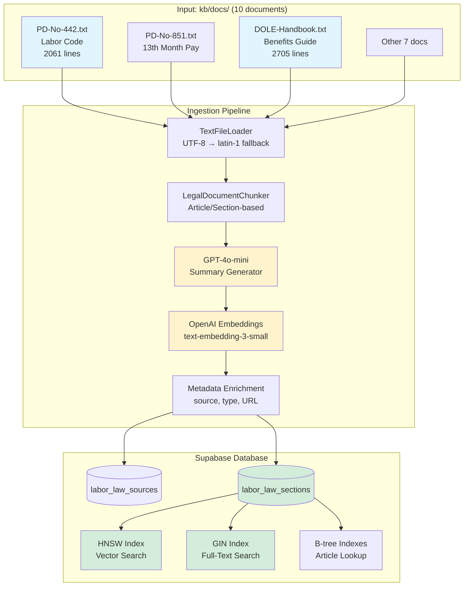
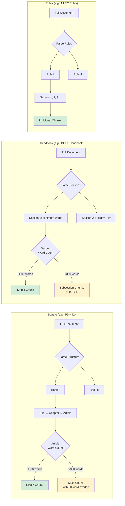
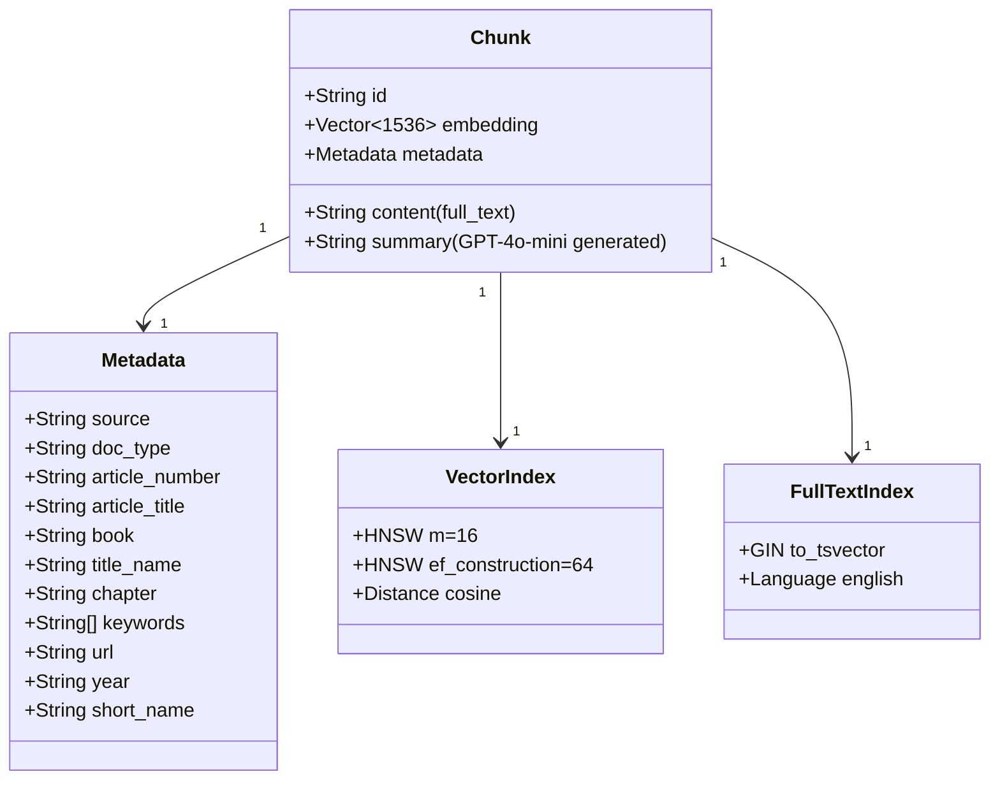
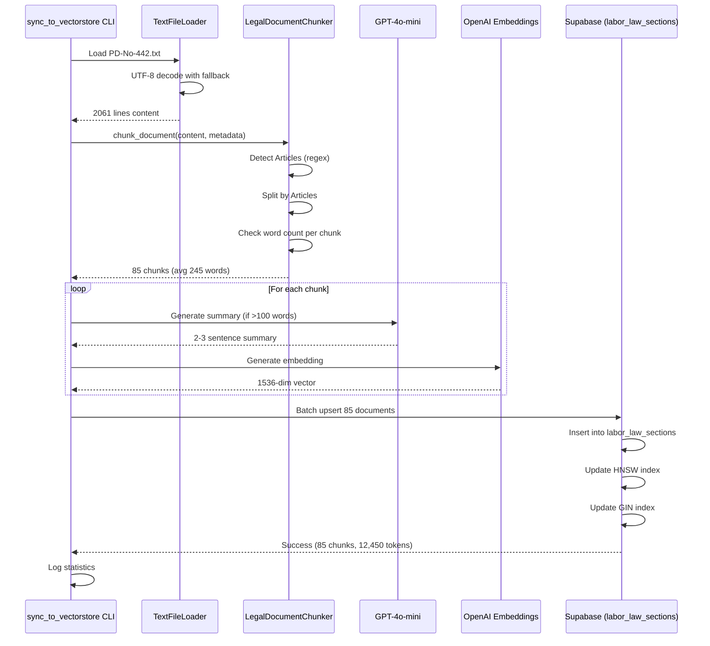
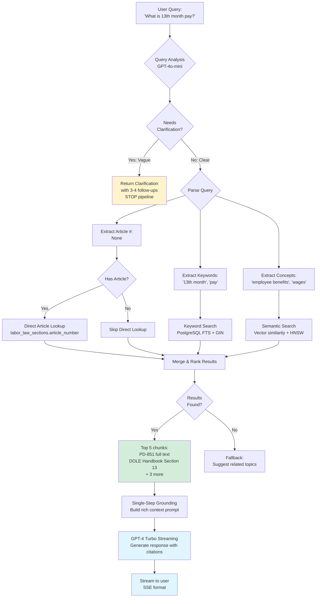
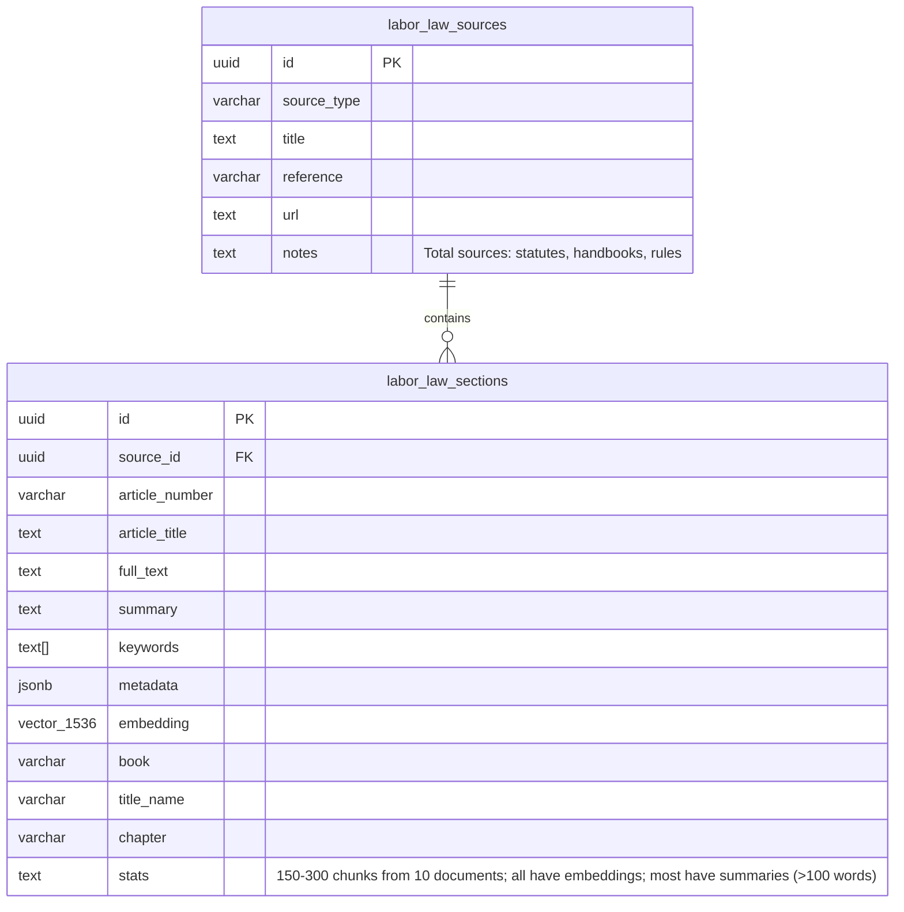
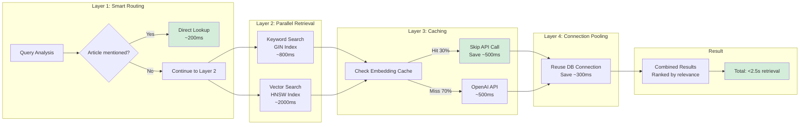

# Day 4 KB Enhancement: Automated Ingestion Architecture

## System Overview

## Chunking Strategy by Document Type

## Metadata Structure per Chunk

## Ingestion Workflow

## Multi-Strategy Retrieval

## Expected Database State After Day 4

## Performance Optimization Stack

---

**Key Insights**:

1. **Automated Chunking**: Adapts to document structure (Article/Section/Rule)
2. **Smart Summarization**: Only for chunks >100 words to save costs
3. **Multi-Index Strategy**: HNSW (semantic) + GIN (keyword) + B-tree (direct)
4. **Performance Stack**: Caching + pooling + parallel queries = <2.5s retrieval
5. **Scalable**: Can easily add more documents by updating `DOCUMENT_REGISTRY`

---

**Last Updated**: November 13, 2025
