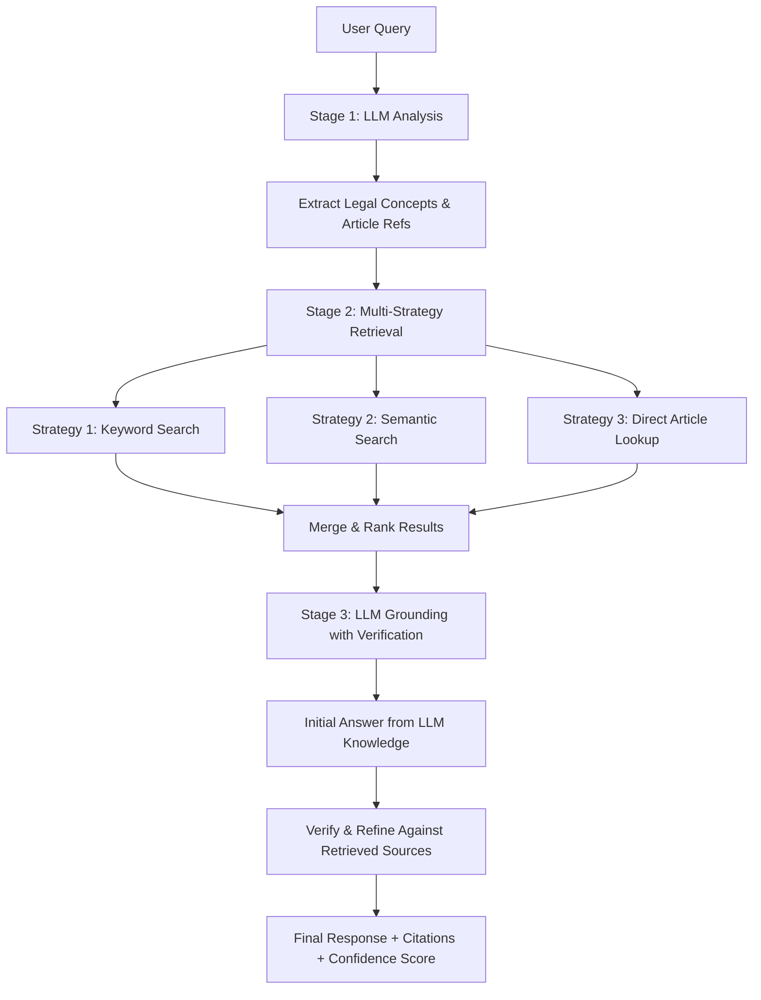

# ADR-002: RAG Pipeline Limitations and Future Architecture

**Status**: Accepted  
**Date**: 2025-11-05  
**Authors**: Development Team  
**Supersedes**: None  
**Related**: ADR-001 (Architecture & Boundaries)

---

## Context

During Phase 1.E integration testing, we discovered fundamental limitations in the current RAG (Retrieval-Augmented Generation) pipeline that impact its ability to handle broad queries and provide comprehensive legal guidance.

### Current Architecture

**Phase 1.E Implementation (Current)**:
```
User Query
    ↓
Text Embedding (OpenAI text-embedding-3-small)
    ↓
Vector Similarity Search (Supabase pgvector)
    ↓
Retrieve Top-K Chunks (k=5, threshold=0.3)
    ↓
LLM Grounding (GPT-4 + retrieved context)
    ↓
Response + Citations
```

### Identified Limitations

#### 1. **Chunking Granularity Problem**

**Issue**: Current chunking strategy fragments Labor Code articles into small pieces (100-300 words), storing each as a separate row in the database.

**Symptoms**:
- Small chunks lose broader context (e.g., related subsections, preambles, definitions)
- Broad queries like "What are my employee rights?" fail to retrieve sufficient context
- Similarity scores remain low (0.3-0.4) even for relevant content
- Some queries return 0 results despite having related KB content

**Example**:
```sql
-- Current approach: Fragmented storage
labor_law_embeddings:
  id: pd_851_sec1
  content: "Section 1. All employers are hereby required to pay..."  -- 150 words
  embedding: [0.02, -0.01, ...]

  id: pd_851_sec2
  content: "Section 2. Employers already paying their employees..." -- 120 words
  embedding: [0.03, 0.02, ...]
```

User query: "What is 13th month pay eligibility and computation?"
- Retrieves only `pd_851_sec1` (partial answer)
- Misses `pd_851_sec2` (exemptions and special cases)
- Cannot provide complete guidance

#### 2. **Semantic Search Limitations**

**Issue**: Pure vector similarity search struggles with:
- Legal terminology variations (e.g., "dismissed" vs "terminated" vs "separated")
- Broad conceptual queries without specific keywords
- Multi-faceted questions requiring multiple article references

**Measured Impact**:
- Average similarity score: 0.3-0.4 (low confidence)
- Retrieval coverage: 1-3 chunks per query (insufficient context)
- Queries requiring >3 related articles: frequently incomplete

#### 3. **Intent Classification Insufficient**

**Theory (validated during analysis)**:
- Adding intent classification (e.g., "termination", "overtime pay") improves routing but doesn't solve chunking problem
- Intent helps filter but can't combine fragmented information
- Still relies on semantic search which has low precision on small chunks

#### 4. **Technical Debt: Supabase Python Client**

**Issue**: `supabase-py` client cannot pass Python list vectors to PostgreSQL RPC functions expecting `vector` type.

**Current Workaround**:
```python
# Direct psycopg2 connection required
conn = psycopg2.connect(db_url)
cursor = conn.cursor()
embedding_str = "[" + ",".join(map(str, query_embedding)) + "]"
cursor.execute("""
    SELECT * FROM match_documents(%s::vector, %s::float, %s::int, %s::jsonb)
""", (embedding_str, threshold, limit, filters))
```

**Long-term Risk**: Bypasses ORM benefits, requires manual connection management

---

## Decision

**For Phase 1.E (Current - ACCEPTED)**:
- ✅ Keep current single-strategy semantic search
- ✅ Document limitations clearly
- ✅ Complete integration testing with constrained KB content
- ✅ Set similarity threshold to 0.3 (relaxed from 0.5)
- ✅ Use direct psycopg2 for vector operations

**For Phase 1.1+ (PLANNED - Before Frontend Integration)**:
Implement **Multi-Strategy Hybrid RAG Pipeline** with the following architecture:

### Proposed Architecture



### Stage 1: LLM Query Analysis

**Purpose**: Use LLM's legal knowledge to enhance retrieval strategy

**Implementation**:
```python
async def analyze_query(query: str) -> QueryAnalysis:
    """
    Extract:
    - Legal concepts (e.g., "overtime pay", "illegal dismissal")
    - Specific laws/articles mentioned (e.g., "Article 87", "PD 851")
    - Query type: definition | procedure | rights | calculation | comparison
    - Query breadth: specific | moderate | broad
    """
    prompt = f"""
    Analyze this Philippine labor law query:
    "{query}"
    
    Extract:
    1. Legal concepts mentioned
    2. Specific law/article references (if any)
    3. Query type and breadth
    4. Keywords for search
    """
    return await llm.generate(prompt)
```

**Benefits**:
- Identifies relevant legal domains before retrieval
- Extracts article numbers for direct lookup
- Determines query complexity for retrieval strategy selection

### Stage 2: Multi-Strategy Retrieval

#### Strategy 1: Full-Text Keyword Search (PostgreSQL)

**Best for**: Broad queries, specific terminology

```sql
-- Use PostgreSQL full-text search for keyword matching
SELECT *, ts_rank(to_tsvector('english', content), query) as rank
FROM labor_code_articles
WHERE to_tsvector('english', content) @@ plainto_tsquery('english', $keywords)
ORDER BY rank DESC
LIMIT 10;
```

**Advantages**:
- Fast keyword matching
- Works well with legal terminology
- Complements semantic search

#### Strategy 2: Semantic Vector Search (Current Approach)

**Best for**: Nuanced queries, conceptual matching

```sql
-- Current pgvector approach
SELECT * FROM match_documents($embedding, 0.3, 10, $filters);
```

**Keeps**: Existing semantic capabilities for concept matching

#### Strategy 3: Direct Article/Law Lookup

**Best for**: Queries mentioning specific articles

```sql
-- When LLM identifies "Article 87" or "PD 851"
SELECT * FROM labor_code_articles 
WHERE article_number = ANY($identified_articles)
   OR source_reference ILIKE ANY($identified_laws);
```

**Advantages**:
- Perfect precision when article is known
- Bypasses similarity scoring
- Guaranteed retrieval of referenced laws

### Stage 3: LLM Grounding with Verification

**Two-step process**:

1. **Initial Response**: LLM generates answer from its knowledge
2. **Verification**: Cross-check against retrieved authoritative sources

```python
async def ground_with_verification(
    query: str,
    retrieval_results: List[Document]
) -> GroundedResponse:
    # Step 1: Initial answer
    initial_response = await llm.generate(f"""
        As a Philippine labor law expert, answer: {query}
        Mention specific laws/articles you're referencing.
    """)
    
    # Step 2: Verification
    final_response = await llm.generate(f"""
        Your initial answer: {initial_response}
        
        Verify against these authoritative sources:
        {format_documents(retrieval_results)}
        
        Tasks:
        1. Confirm accuracy
        2. Add specific citations
        3. Correct inaccuracies
        4. Flag contradictions
    """)
    
    return GroundedResponse(
        content=final_response,
        citations=extract_citations(retrieval_results),
        confidence=calculate_confidence(initial_response, final_response)
    )
```

**Benefits**:
- Leverages LLM's broad legal knowledge
- Grounds answers in authoritative sources
- Provides confidence scoring based on source agreement
- Handles queries even when retrieval is incomplete

---

## Improved Database Schema

### Current Schema (Phase 1.E)

```sql
CREATE TABLE labor_law_embeddings (
    id TEXT PRIMARY KEY,
    content TEXT,
    metadata JSONB,
    embedding vector(1536)
);
```

**Problems**:
- Content is chunked fragments
- No hierarchical structure
- No keyword indexing

### Proposed Schema (Phase 1.1+)

```sql
-- Source registry
CREATE TABLE labor_law_sources (
    id UUID PRIMARY KEY,
    source_type TEXT, -- 'labor_code' | 'presidential_decree' | 'RA' | 'IRR'
    source_name TEXT,
    official_url TEXT,
    created_at TIMESTAMPTZ DEFAULT NOW()
);

-- Article-level storage (full text + summary)
CREATE TABLE labor_law_sections (
    id UUID PRIMARY KEY,
    source_id UUID REFERENCES labor_law_sources(id),
    
    -- Hierarchical metadata
    book_number INT,
    title_number INT,
    chapter_number INT,
    section_number INT,
    article_number TEXT, -- 'Article 87', 'Section 1'
    article_title TEXT,
    
    -- Content
    full_text TEXT,           -- FULL article text (not chunked)
    summary TEXT,             -- LLM-generated summary for semantic search
    keywords TEXT[],          -- Extracted key terms
    
    -- Vector embedding (of summary, not full text)
    embedding vector(1536),
    
    created_at TIMESTAMPTZ DEFAULT NOW(),
    updated_at TIMESTAMPTZ DEFAULT NOW()
);

-- Chunk only when article is very long (>1000 words)
CREATE TABLE labor_law_chunks (
    id UUID PRIMARY KEY,
    section_id UUID REFERENCES labor_law_sections(id),
    chunk_index INT,
    chunk_text TEXT,
    embedding vector(1536),
    created_at TIMESTAMPTZ DEFAULT NOW()
);

-- Indexes
CREATE INDEX idx_sections_fts ON labor_law_sections 
    USING GIN(to_tsvector('english', full_text || ' ' || article_title));
CREATE INDEX idx_sections_article ON labor_law_sections(article_number);
CREATE INDEX idx_sections_source ON labor_law_sections(source_id);
CREATE INDEX idx_sections_embedding ON labor_law_sections 
    USING ivfflat (embedding vector_cosine_ops);
```

**Key Improvements**:

1. **Full Text Preservation**: Entire articles stored intact, no fragmentation
2. **Summary Embeddings**: Semantic search on LLM-generated summaries (better semantic representation than raw legal text)
3. **Keyword Extraction**: For hybrid full-text + semantic search
4. **Hierarchical Metadata**: Book/Title/Chapter structure for contextual retrieval
5. **Conditional Chunking**: Only chunk articles >1000 words
6. **Multiple Indexes**: Full-text search, article lookup, vector similarity

---

## Implementation Plan

### Phase 1.E (Current - COMPLETE)
- ✅ Single-strategy semantic search
- ✅ Basic chunking (100-300 words)
- ✅ Direct psycopg2 workaround
- ✅ Integration tests passing
- ✅ Known limitations documented

### Phase 1.1 (Before Frontend Integration - 1-2 days)

#### Day 1: Multi-Strategy Retrieval
- [ ] Implement LLM query analysis module
- [ ] Add PostgreSQL full-text search alongside vector search
- [ ] Implement article number direct lookup
- [ ] Create result merging and ranking algorithm
- [ ] Test on 10+ broad queries

#### Day 2: Schema Migration & KB Enhancement
- [ ] Create new schema with full-text + summary approach
- [ ] Generate LLM summaries for existing 5 KB entries
- [ ] Ingest 30-50 additional Labor Code articles with full text
- [ ] Extract keywords for hybrid search
- [ ] Migrate vector embeddings to summary-based approach

#### Day 3: LLM Verification & Testing
- [ ] Implement two-step grounding (initial → verification)
- [ ] Add confidence scoring based on source agreement
- [ ] Test edge cases (contradictory sources, missing content)
- [ ] Benchmark performance vs Phase 1.E baseline
- [ ] Update integration tests for enhanced pipeline

---

## Consequences

### Positive

1. **Improved Retrieval Quality**
   - Handles broad queries effectively
   - Combines multiple retrieval strategies
   - Higher precision and recall

2. **Better Context Preservation**
   - Full articles stored intact
   - Hierarchical navigation possible
   - Related sections easily retrievable

3. **Enhanced Answer Quality**
   - LLM verification reduces hallucination
   - Confidence scoring for transparency
   - Better citation grounding

4. **Scalability**
   - Hybrid approach handles growing KB
   - Multiple retrieval paths reduce single-point failure
   - Extensible for future strategies

### Negative

1. **Increased Complexity**
   - More components to maintain
   - Multi-strategy coordination overhead
   - Higher development time

2. **Performance Impact**
   - LLM called 2x per query (analysis + verification)
   - Multiple retrieval strategies increase latency
   - **Mitigation**: Parallel retrieval, caching, async processing

3. **Storage Overhead**
   - Full text + summary + chunks = 3x storage
   - Multiple indexes increase disk usage
   - **Mitigation**: Selective chunking, compressed storage

4. **Migration Cost**
   - Schema migration required
   - KB content re-ingestion needed
   - **Effort**: ~1-2 days before Phase 1.1

---

## Alternatives Considered

### Alternative 1: Just Add More KB Content

**Rejected Reason**: Doesn't solve chunking/retrieval strategy problems. More fragmented content = harder to retrieve relevant pieces.

### Alternative 2: Increase Chunk Size to 500-1000 Words

**Rejected Reason**: Larger chunks introduce noise, lower similarity scores, harder to cite specific passages.

### Alternative 3: Use Only LLM Knowledge (No RAG)

**Rejected Reason**: High hallucination risk, no citation grounding, can't update with new laws/amendments.

### Alternative 4: Hybrid RAG (SELECTED)

**Selected Reason**: Combines strengths of keyword search, semantic search, direct lookup, and LLM verification while maintaining citation grounding.

---

## References

- [Phase 1.E Progress Update](../PHASE_1E_PROGRESS_UPDATE.md)
- [Implementation Sequence](../../ImplementationSequence.md)
- [Supabase pgvector Documentation](https://supabase.com/docs/guides/ai/vector-columns)
- [PostgreSQL Full-Text Search](https://www.postgresql.org/docs/current/textsearch.html)
- [RAG Best Practices (OpenAI)](https://platform.openai.com/docs/guides/prompt-engineering)

---

## Notes

- This ADR was created based on real issues discovered during Phase 1.E integration testing
- The proposed architecture is informed by current RAG best practices in legal/medical domains
- Implementation timeline (1-2 days) is aggressive but achievable given modular codebase
- **Critical**: Must implement before frontend integration to avoid refactoring after frontend is built
