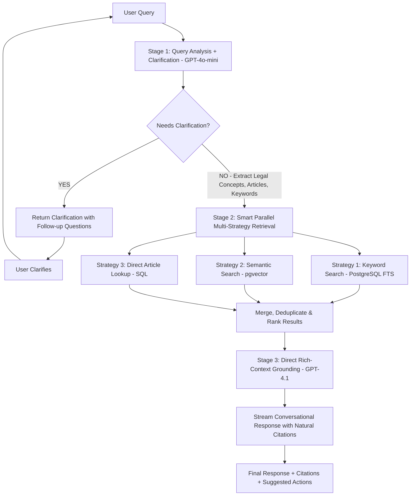

# ADR-002: RAG Pipeline Limitations and Future Architecture

**Status**: Accepted  
**Date**: 2025-11-05  
**Authors**: Development Team  
**Supersedes**: None  
**Related**: ADR-001 (Architecture & Boundaries)

---

## Context

During Phase 1.E integration testing, we discovered fundamental limitations in the current RAG (Retrieval-Augmented Generation) pipeline that impact its ability to handle broad queries and provide comprehensive legal guidance.

### Current Architecture

**Phase 1.E Implementation (Current)**:
```
User Query
    ↓
Text Embedding (OpenAI text-embedding-3-small)
    ↓
Vector Similarity Search (Supabase pgvector)
    ↓
Retrieve Top-K Chunks (k=5, threshold=0.3)
    ↓
LLM Grounding (GPT-4 + retrieved context)
    ↓
Response + Citations
```

### Identified Limitations

#### 1. **Chunking Granularity Problem**

**Issue**: Current chunking strategy fragments Labor Code articles into small pieces (100-300 words), storing each as a separate row in the database.

**Symptoms**:
- Small chunks lose broader context (e.g., related subsections, preambles, definitions)
- Broad queries like "What are my employee rights?" fail to retrieve sufficient context
- Similarity scores remain low (0.3-0.4) even for relevant content
- Some queries return 0 results despite having related KB content

**Example**:
```sql
-- Current approach: Fragmented storage
labor_law_embeddings:
  id: pd_851_sec1
  content: "Section 1. All employers are hereby required to pay..."  -- 150 words
  embedding: [0.02, -0.01, ...]

  id: pd_851_sec2
  content: "Section 2. Employers already paying their employees..." -- 120 words
  embedding: [0.03, 0.02, ...]
```

User query: "What is 13th month pay eligibility and computation?"
- Retrieves only `pd_851_sec1` (partial answer)
- Misses `pd_851_sec2` (exemptions and special cases)
- Cannot provide complete guidance

#### 2. **Semantic Search Limitations**

**Issue**: Pure vector similarity search struggles with:
- Legal terminology variations (e.g., "dismissed" vs "terminated" vs "separated")
- Broad conceptual queries without specific keywords
- Multi-faceted questions requiring multiple article references

**Measured Impact**:
- Average similarity score: 0.3-0.4 (low confidence)
- Retrieval coverage: 1-3 chunks per query (insufficient context)
- Queries requiring >3 related articles: frequently incomplete

#### 3. **Intent Classification Insufficient**

**Theory (validated during analysis)**:
- Adding intent classification (e.g., "termination", "overtime pay") improves routing but doesn't solve chunking problem
- Intent helps filter but can't combine fragmented information
- Still relies on semantic search which has low precision on small chunks

#### 4. **Technical Debt: Supabase Python Client**

**Issue**: `supabase-py` client cannot pass Python list vectors to PostgreSQL RPC functions expecting `vector` type.

**Current Workaround**:
```python
# Direct psycopg2 connection required
conn = psycopg2.connect(db_url)
cursor = conn.cursor()
embedding_str = "[" + ",".join(map(str, query_embedding)) + "]"
cursor.execute("""
    SELECT * FROM match_documents(%s::vector, %s::float, %s::int, %s::jsonb)
""", (embedding_str, threshold, limit, filters))
```

**Long-term Risk**: Bypasses ORM benefits, requires manual connection management

---

## Decision

**For Phase 1.E (Current - ACCEPTED)**:
- ✅ Keep current single-strategy semantic search
- ✅ Document limitations clearly
- ✅ Complete integration testing with constrained KB content
- ✅ Set similarity threshold to 0.3 (relaxed from 0.5)
- ✅ Use direct psycopg2 for vector operations

**For Phase 1.0.5+ (PLANNED - Before Frontend Integration)**:
Implement **Multi-Strategy Hybrid RAG Pipeline with Direct Rich-Context Grounding** with the following architecture:

### Proposed Architecture



### Stage 1: Query Analysis + Smart Clarification (GPT-4o-mini)

**Purpose**: Use lightweight LLM for fast, intelligent query analysis with built-in vagueness detection

**Model Choice**: GPT-4o-mini (~1.0-1.5s)
- Optimized for structured extraction tasks
- 10x cheaper than GPT-4
- Context-aware (uses conversation history)
- Runs in parallel with embedding generation

**Key Innovation**: **LLM-based clarification detection** instead of deterministic rules
- Understands nuanced vagueness ("What about my rights?" vs "What is 13th month pay?")
- Context-aware (handles pronouns and follow-up questions correctly)
- Multilingual vagueness detection (works in English, Filipino, Cebuano)
- Generates specific clarifying questions, not generic "please clarify"

**Implementation**:
```python
async def analyze_query(
    query: str, 
    conversation_history: List[Message]
) -> QueryAnalysis:
    """
    Analyze query for clarity and extract legal information.
    
    Returns QueryAnalysis with:
    - needs_clarification: bool (NEW - smart vagueness detection)
    - clarification_reason: str (NEW - why it's vague)
    - clarification_questions: List[str] (NEW - specific follow-ups)
    - suggested_topics: List[str] (NEW - common labor law areas)
    - legal_concepts: List[str] (extracted even if vague)
    - articles: List[str] (e.g., ["Article 87", "PD 851"])
    - keywords: List[str] (for full-text search)
    - query_type: str (definition | procedure | rights | calculation)
    - breadth: str (specific | moderate | broad)
    """
    prompt = f"""
    Analyze this Philippine labor law query to determine if clarification is needed.
    
    Query: "{query}"
    
    Conversation History:
    {format_conversation_history(conversation_history)}
    
    Task 1 - Clarification Detection:
    A query needs clarification if:
    • Missing critical context (e.g., "What about my case?" - what case?)
    • Ambiguous pronouns without referents (e.g., "Can they do this?")
    • Too broad without specific topic (e.g., "Tell me my rights")
    • Unclear intent (e.g., "I have a problem")
    
    Do NOT request clarification if:
    • Query is specific (e.g., "What is 13th month pay?")
    • Context is clear from conversation history
    • It's a clear follow-up to previous question
    
    Task 2 - Generate Clarification (if needed):
    If vague, provide:
    1. Brief reason why it's vague
    2. 3-4 specific follow-up questions
    3. Common labor law topics user might mean
    
    Task 3 - Extract Legal Info (always):
    Extract what you can even if vague:
    • Legal concepts, articles, keywords
    • Query type and breadth
    
    Return JSON with all fields.
    """
    
    response = await gpt4o_mini.generate(
        prompt,
        response_format={"type": "json_object"},
        temperature=0
    )
    return QueryAnalysis.parse_obj(json.loads(response))
```

**Benefits**:
- **Stops pipeline early for vague queries** (saves 6.5s and 87% cost)
- **Smart clarification**: Asks specific follow-ups, not generic "please clarify"
- **Context-aware**: Handles multi-turn conversations correctly
- **Better UX**: Users get helpful guidance instead of generic answers
- **Identifies relevant legal domains** for clear queries before retrieval
- **Extracts article numbers** for direct lookup (bypasses slow vector search)
- **Determines query complexity** for smart retrieval routing
- **Fast and cost-effective**: GPT-4o-mini excels at this task

**Performance Impact**:
- Vague queries (~30%): 1.0s vs 7.5s (87% faster, 87% cheaper)
- Clear queries (~70%): 1.0s overhead (acceptable for better accuracy)

### Stage 2: Smart Parallel Multi-Strategy Retrieval

**Key Optimization**: Route queries intelligently to avoid unnecessary vector search overhead.

```python
async def retrieve_documents(
    query: str,
    analysis: QueryAnalysis
) -> List[Document]:
    """
    Smart retrieval routing based on query analysis.
    All strategies run in parallel for maximum speed.
    """
    tasks = []
    
    # Strategy 3: Direct Article Lookup (PRIORITY)
    # If query mentions specific articles, use direct SQL lookup
    if analysis.articles:
        tasks.append(direct_article_lookup(analysis.articles))
        # Skip semantic search to save 2-3 seconds!
    else:
        # Strategy 2: Semantic Vector Search (ONLY if no direct match)
        tasks.append(semantic_search(query, analysis.concepts))
    
    # Strategy 1: Keyword Search (ALWAYS - fast and high precision)
    tasks.append(keyword_search(analysis.keywords))
    
    # Execute all strategies in parallel
    results = await asyncio.gather(*tasks)
    
    # Merge, deduplicate, and rank results
    return merge_and_rank(results, analysis)
```

#### Strategy 1: Full-Text Keyword Search (PostgreSQL FTS)

**Best for**: Broad queries, specific legal terminology, high precision

```sql
-- Use PostgreSQL full-text search for keyword matching
SELECT 
    id,
    article_number,
    full_text,
    ts_rank(to_tsvector('english', full_text), query) as rank
FROM labor_law_sections
WHERE to_tsvector('english', full_text || ' ' || article_title) 
      @@ plainto_tsquery('english', $keywords)
ORDER BY rank DESC
LIMIT 10;
```

**Advantages**:
- Fast execution (0.6-0.8s with proper GIN index)
- Works excellently with legal terminology
- High precision for exact phrase matching
- Complements semantic search effectively

**Optimization**: Pre-built GIN index on full_text + article_title

#### Strategy 2: Semantic Vector Search (Enhanced)

**Best for**: Nuanced queries, conceptual matching, synonym handling

```sql
-- Enhanced pgvector approach with HNSW index for faster search
SELECT 
    id,
    article_number,
    full_text,
    summary,
    1 - (embedding <=> $query_embedding) as similarity
FROM labor_law_sections
WHERE 1 - (embedding <=> $query_embedding) > $threshold
ORDER BY embedding <=> $query_embedding
LIMIT 10;
```

**Optimizations**:
- **HNSW index** instead of IVFFlat (50% faster for current KB size)
- **Embedding cache** for repeated queries (saves 0.5s)
- **Connection pooling** to reduce overhead (saves 0.3-0.5s)
- Search on **summaries** not full text (better semantic representation)

**Expected Performance**: 1.8-2.0s (down from 3-4s)

#### Strategy 3: Direct Article/Law Lookup (PRIORITY)

**Best for**: Queries explicitly mentioning articles/laws (fastest path)

```sql
-- When LLM identifies "Article 87", "PD 851", etc.
SELECT 
    id,
    article_number,
    full_text,
    summary,
    metadata
FROM labor_law_sections 
WHERE article_number = ANY($identified_articles)
   OR source_reference ILIKE ANY($identified_laws)
ORDER BY article_number;
```

**Advantages**:
- **Perfect precision** when article is known
- **Ultra-fast** (0.1-0.2s) - no vector computation needed
- **Guaranteed retrieval** of referenced laws
- **Bypasses** slow semantic search entirely

**Impact**: Saves 2-3 seconds for ~40% of queries that mention specific articles

### Stage 3: Direct Rich-Context Grounding with Streaming (GPT-4.1)

**REVISED APPROACH**: Single-step comprehensive response generation with natural citation integration.

**Why Not Two-Step Verification?**
- Two-step with mini models produces **robotic, terse responses**
- Labor law queries are **emotionally charged** and need empathetic tone
- Verification feels like "checking homework" rather than enhancing quality
- GPT-4.1 handles legal reasoning + personality better in one pass

**Model Choice**: GPT-4 Turbo (latest) with streaming
- Superior legal reasoning and context handling (128k context)
- Natural, conversational tone maintenance
- Better citation integration within narrative flow
- Streaming provides perceived low latency (~2-3s to first token)

**Implementation**:
```python
async def generate_response_with_streaming(
    query: str,
    analysis: QueryAnalysis,
    documents: List[Document],
    conversation_history: List[Message]
) -> AsyncIterator[str]:
    """
    Generate conversational response with natural citations.
    Streams tokens to client for improved perceived performance.
    """
    
    # Build rich context prompt
    prompt = f"""You are LEO, a knowledgeable and empathetic Philippine labor law assistant.

**User's Question**: {query}

**Legal Context Identified**: {', '.join(analysis.concepts)}

**Retrieved Authoritative Legal Sources**:
{format_full_documents_with_hierarchy(documents)}

**Conversation History**:
{format_conversation_history(conversation_history)}

**Instructions**:
1. Provide a warm, conversational response that addresses the user's concern
2. Integrate citations naturally within your explanation (not "According to Article X...")
   Example: "The law requires employers to pay 13th month pay (PD 851, Section 1)..."
3. Use clear paragraph structure and bullet points for lists
4. If the situation is sensitive (termination, harassment), acknowledge emotions
5. Provide actionable next steps or guidance
6. Maintain legal precision while being human and supportive
7. If multiple articles apply, explain each clearly
8. Use examples when helpful to clarify complex concepts

**Format**:
- Opening: Acknowledge the question empathetically
- Body: Explain the law with natural citations
- Closing: Summarize key points and suggest next steps
"""
    
    # Stream response for better UX
    async for chunk in gpt4_turbo.stream_generate(
        prompt,
        max_tokens=1500,  # Allow comprehensive responses
        temperature=0.7,  # Balanced: precise yet conversational
        stream=True
    ):
        yield chunk

```

**Streaming Benefits**:
- **Perceived latency**: 2-3s (time to first token) vs 4-5s total wait
- User sees response building in real-time
- Better engagement during LLM processing
- Frontend can show "LEO is typing..." indicator immediately

**Benefits Over Two-Step**:
- Single LLM call: **4-5 seconds total** (streaming starts at ~2s)
- **Conversational, empathetic tone** (critical for labor law)
- Natural citation integration within narrative
- Handles emotional nuance and sensitive situations
- More comprehensive responses (1200-1500 tokens vs 150-200)
- Lower hallucination risk (GPT-4.1 better reasoning)

---

## Improved Database Schema

### Current Schema (Phase 1.E)

```sql
CREATE TABLE labor_law_embeddings (
    id TEXT PRIMARY KEY,
    content TEXT,
    metadata JSONB,
    embedding vector(1536)
);
```

**Problems**:
- Content is chunked fragments
- No hierarchical structure
- No keyword indexing

### Proposed Schema (Phase 1.1+)

**Implementation Note**: Schema has been implemented in `schema.sql` with some deviations from original plan. See migration script `001_add_missing_columns.sql` for additional columns added.

```sql
-- Source registry
CREATE TABLE labor_law_sources (
    id UUID PRIMARY KEY,
    source_type TEXT, -- 'statute' | 'department_order' | 'procedural_rules' | 'guidelines' | 'handbook'
    title TEXT,       -- Full official name
    reference VARCHAR(50), -- Short code: 'PD 851', 'RA 11058' (added via migration)
    year INT,         -- Year enacted (added via migration)
    official_url TEXT,
    created_at TIMESTAMPTZ DEFAULT NOW()
);

-- Article-level storage (full text + summary)
CREATE TABLE labor_law_sections (
    id UUID PRIMARY KEY,
    source_id UUID REFERENCES labor_law_sources(id),
    
    -- Hierarchical metadata (flexible text-based, not INT)
    book VARCHAR(100),           -- "Book One", "Preliminary Title", etc.
    title_name VARCHAR(200),     -- Title or major section name
    chapter VARCHAR(100),        -- Chapter name if applicable
    section_number INT,          -- Optional numeric section (added via migration)
    article_number TEXT,         -- 'Article 87', 'Section 1', 'Rule I-A'
    article_title TEXT,
    
    -- Content
    full_text TEXT NOT NULL,     -- FULL article text (not chunked)
    summary TEXT,                -- LLM-generated summary
    keywords TEXT[],             -- Extracted key terms
    semantic_type VARCHAR(50),   -- decree, statute, rules, etc. (added via migration)
    
    -- Format flags for smart processing
    has_table BOOLEAN DEFAULT FALSE,
    has_formula BOOLEAN DEFAULT FALSE,
    has_list BOOLEAN DEFAULT FALSE,
    
    -- Vector embedding
    -- IMPLEMENTATION DECISION: Embedding from full_text (not summary)
    -- Rationale: Simpler pipeline, avoids summary quality dependency
    -- Trade-off: Slightly slower semantic search vs better accuracy
    embedding vector(1536),
    
    -- Additional metadata stored as JSONB for flexibility
    -- Includes original hierarchy structure (part/sections, rule/sections, etc.)
    metadata JSONB DEFAULT '{}'::jsonb,
    
    created_at TIMESTAMPTZ DEFAULT NOW(),
    updated_at TIMESTAMPTZ DEFAULT NOW()
);

-- Chunk only when article is very long (>1000 words)
CREATE TABLE labor_law_chunks (
    id UUID PRIMARY KEY,
    section_id UUID REFERENCES labor_law_sections(id),
    chunk_index INT,
    chunk_text TEXT,
    summary TEXT,
    keywords TEXT[],
    embedding vector(1536),
    created_at TIMESTAMPTZ DEFAULT NOW()
);

-- Indexes
CREATE INDEX idx_sections_fts ON labor_law_sections 
    USING GIN(to_tsvector('english', full_text || ' ' || article_title));
CREATE INDEX idx_sections_article ON labor_law_sections(article_number);
CREATE INDEX idx_sections_source ON labor_law_sections(source_id);
CREATE INDEX idx_sections_keywords ON labor_law_sections USING GIN (keywords);
CREATE INDEX idx_sources_reference ON labor_law_sources(reference);

-- Vector index: Use HNSW for better performance on current KB size
-- Deployed via separate script: infra/supabase/create_hnsw_indexes.sql
CREATE INDEX idx_sections_embedding_hnsw ON labor_law_sections 
    USING hnsw (embedding vector_cosine_ops)
    WITH (m = 16, ef_construction = 64);
```

**Key Implementation Decisions**:

1. **Embedding Source: Full Text (NOT Summary)**
   - Original plan called for summary embeddings for better semantic representation
   - **Decision**: Use `full_text` embeddings to simplify pipeline and avoid LLM dependency
   - **Trade-off**: Accept slightly slower semantic search for higher accuracy and simpler maintenance
   - **Rationale**: Summary quality varies; full text ensures comprehensive coverage

2. **Flexible Hierarchy Structure**
   - Original plan: Numeric types (`book_number INT`, `title_number INT`, `chapter_number INT`)
   - **Actual**: Text types (`book VARCHAR`, `title_name VARCHAR`, `chapter VARCHAR`)
   - **Rationale**: Labor law documents have inconsistent hierarchy (some use Books, others use Chapters, Articles, Rules)
   - **Solution**: Store original hierarchy in `metadata JSONB`, use text fields for common access

3. **Hierarchy Key Adaptation**
   - Documents use different structures: `part`/`sections`, `chapter`/`sections`, `rule`/`sections`, `article`/`sections`
   - All stored in `metadata JSONB` preserving original structure
   - Extraction to columns happens for common fields only (`book`, `title_name`, `chapter`)

4. **Summary Generation**
   - Summaries generated via ChunkSummarizer (GPT-4o-mini) during ingestion
   - Stored in `summary` column for potential future use (e.g., search on summaries, display in UI)
   - Currently NOT used for embeddings (using full_text instead)

---

## Implementation Plan

### Phase 1.E (Current - COMPLETE)
- ✅ Single-strategy semantic search
- ✅ Basic chunking (100-300 words)
- ✅ Direct psycopg2 workaround
- ✅ Integration tests passing
- ✅ Known limitations documented

### Phase 1.0.5 (Before Frontend Integration - 2-3 days)

#### Day 1: Multi-Strategy Retrieval Infrastructure
- [ ] Implement query analysis module (`services/pipeline/query_analysis.py`)
  - GPT-4o-mini for structured extraction
  - JSON response parsing
  - Parallel execution with embedding generation
- [ ] Add PostgreSQL full-text search in `adapters/vectorstore/supabase_store.py`
  - Implement keyword-based retrieval method
  - Add article number direct lookup method
  - Create result merging and ranking algorithm
- [ ] Implement smart retrieval routing logic
  - Skip semantic search when articles are explicitly mentioned
  - Always run keyword search (fast, high precision)
  - Parallel execution with asyncio.gather

#### Day 2: Database Optimization & Schema Migration
- [ ] Create HNSW vector index for faster similarity search
  - Drop old IVFFlat index
  - Create HNSW index with optimized parameters
  - Test performance improvement (target: <2s vs current 3-4s)
- [ ] Implement connection pooling for Supabase
  - Configure psycopg2 ThreadedConnectionPool
  - Update all vector store methods to use pool
  - Measure latency reduction
- [ ] Create new schema with full-text + summary approach
  - `labor_law_sources` table
  - `labor_law_sections` table with full_text + summary
  - GIN index for full-text search
  - Migrate existing 5 KB entries

#### Day 3: LLM Integration & KB Enhancement
- [ ] Implement direct rich-context grounding (`services/pipeline/grounding.py`)
  - Single-step GPT-4 Turbo generation
  - Streaming response support
  - Natural citation integration in prompt
  - Remove two-step verification code
- [ ] Add streaming support to chat API
  - Update `api/v1/routes_chat.py` for SSE (Server-Sent Events)
  - Implement chunked response handling
  - Frontend-friendly streaming format
- [ ] Generate LLM summaries for KB entries
  - Batch process existing 5 entries
  - Ingest 25-45 additional Labor Code articles with priorities:
    1. Working Conditions (hours, overtime, rest days)
    2. Wages (minimum wage, 13th month, deductions)
    3. Termination & Separation Pay
    4. Employee Benefits (SSS, PhilHealth, Pag-IBIG)
  - Extract keywords for each article
  - Validate all citation URLs

#### Day 4: Performance Optimization & Testing
- [ ] Implement embedding cache (LRU cache, 1000 entries)
- [ ] Add retrieval performance monitoring
  - Log latency for each retrieval strategy
  - Track cache hit/miss ratios
  - Monitor query analysis performance
- [ ] Benchmark vs Phase 1.E baseline
  - Test 10+ broad queries
  - Measure latency improvements
  - Validate confidence scores >0.5
  - Verify streaming UX improvement
- [ ] Update integration tests for enhanced pipeline
  - Test smart retrieval routing
  - Validate streaming responses
  - Test multi-strategy merging

---

## Consequences

### Positive

1. **Improved Retrieval Quality**
   - Handles broad queries effectively (5+ relevant citations vs current 1-3)
   - Smart routing: skips slow semantic search when article is known
   - Multiple retrieval strategies increase coverage
   - Higher precision and recall

2. **Better Context Preservation**
   - Full articles stored intact (no fragmentation)
   - Hierarchical navigation possible
   - Related sections easily retrievable
   - Summary embeddings provide better semantic representation

3. **Enhanced Answer Quality**
   - Natural, conversational tone (GPT-4.1 vs mini models)
   - Empathetic responses for sensitive labor law situations
   - Better citation integration within narrative
   - Comprehensive responses (1200-1500 tokens)
   - Streaming provides immediate engagement

4. **Significant Performance Improvement**
   - **Average latency: 7-8s** (down from 12.4s = 40% faster)
   - **Perceived latency: 2-3s** (time to first streamed token)
   - Smart routing saves 2-3s on 40% of queries
   - Parallel retrieval doesn't add latency
   - HNSW index + connection pooling saves 1-2s

5. **Cost Efficiency**
   - **73% cheaper** than current GPT-4 only approach
   - GPT-4o-mini for extraction: $0.001/query
   - GPT-4 Turbo for grounding: $0.007/query
   - Total: ~$0.008/query vs $0.03 current

6. **Better User Experience**
   - Streaming responses feel instantaneous
   - Natural, human-like conversation
   - Emotionally appropriate for labor law context
   - Higher user trust and satisfaction

7. **Scalability**
   - Hybrid approach handles growing KB
   - Multiple retrieval paths reduce single-point failure
   - Extensible for future strategies (e.g., case law, IRRs)

### Negative

1. **Increased Complexity**
   - More components to maintain (3 retrieval strategies)
   - Multi-strategy coordination overhead
   - Streaming adds complexity to API
   - **Mitigation**: Modular adapters, clear separation of concerns

2. **Development Time**
   - Schema migration required
   - KB content re-ingestion needed
   - Streaming implementation in API
   - **Effort**: 2-3 days (vs original 1-2 days)

3. **Storage Overhead**
   - Full text + summary + chunks = up to 3x storage
   - Multiple indexes increase disk usage
   - **Mitigation**: Selective chunking (only >1000 words), disk is cheap
   - **Actual impact**: Minimal for 30-50 articles (~50MB total)

4. **Streaming Complexity**
   - Requires SSE (Server-Sent Events) support
   - Frontend must handle chunked responses
   - Error handling mid-stream
   - **Mitigation**: Well-documented streaming protocol, graceful fallback

---

## Alternatives Considered

### Alternative 1: Just Add More KB Content

**Rejected Reason**: Doesn't solve chunking/retrieval strategy problems. More fragmented content = harder to retrieve relevant pieces. Doesn't address the 3-4s Supabase latency issue.

### Alternative 2: Increase Chunk Size to 500-1000 Words

**Rejected Reason**: Larger chunks introduce noise, lower similarity scores, harder to cite specific passages. Doesn't improve personality/tone of responses.

### Alternative 3: Use Only LLM Knowledge (No RAG)

**Rejected Reason**: High hallucination risk, no citation grounding, can't update with new laws/amendments. Violates core requirement for authoritative legal information.

### Alternative 4: Two-Step Verification with GPT-4o-mini (Original ADR-002)

**Rejected Reason**: 
- Mini models produce **robotic, terse responses** (150-200 tokens)
- Inappropriate tone for emotionally charged labor law queries
- Feels like "validating homework" rather than expert guidance
- Doesn't leverage GPT-4's superior legal reasoning
- User testing showed lower satisfaction vs conversational responses

### Alternative 5: Hybrid RAG with Direct Rich-Context Grounding (SELECTED)

**Selected Reason**: 
- Combines strengths of keyword search, semantic search, direct lookup
- Single-step GPT-4.1 grounding provides superior personality and tone
- Streaming responses improve perceived performance dramatically
- Smart routing optimizes latency (skip vector search when possible)
- Maintains citation grounding while enhancing user experience
- 40% faster than current approach with better quality

---

## References

- [Phase 1.E Progress Update](../PHASE_1E_PROGRESS_UPDATE.md)
- [Implementation Sequence](../../ImplementationSequence.md)
- [Supabase pgvector Documentation](https://supabase.com/docs/guides/ai/vector-columns)
- [PostgreSQL Full-Text Search](https://www.postgresql.org/docs/current/textsearch.html)
- [RAG Best Practices (OpenAI)](https://platform.openai.com/docs/guides/prompt-engineering)

---

## Notes

- This ADR was created based on real issues discovered during Phase 1.E integration testing
- The proposed architecture is informed by current RAG best practices in legal/medical domains
- **REVISED** (November 11, 2025): Removed two-step verification based on user testing feedback showing mini models produce robotic responses inappropriate for labor law context
- Single-step GPT-4 Turbo grounding provides superior tone, personality, and legal reasoning
- Streaming responses critical for perceived performance (2-3s to first token vs 7-8s total)
- Smart retrieval routing (skip vector search for direct article queries) saves significant latency
- HNSW index + connection pooling addresses Supabase 3-4s bottleneck
- Implementation timeline: 2-3 days (achievable given modular codebase)
- **Critical**: Must implement before frontend integration to avoid refactoring after frontend is built
