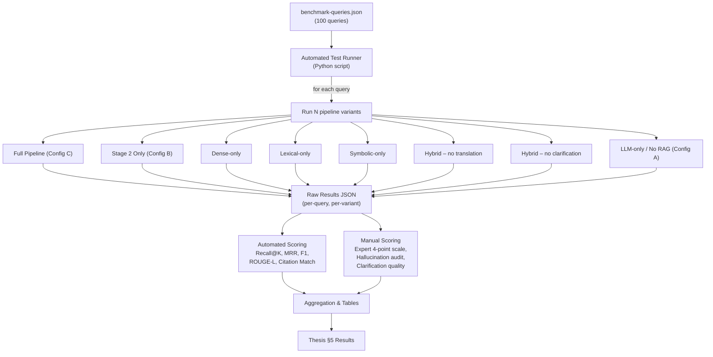
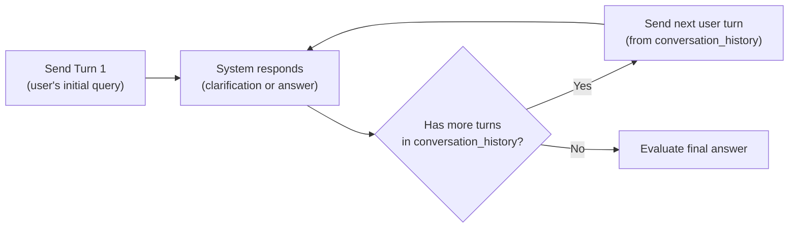

# Experiment Execution Guide

> How the 100-query benchmark is turned into numbers for the thesis.

---

## 1. End-to-End Experiment Flow



Each query in `benchmark-queries.json` is sent through **every pipeline variant** listed in the experiment matrix. The raw output (retrieved chunks, generated answer, clarification decisions) is logged. Automated metrics are computed first, then human evaluators score the subset that requires judgment.

---

## 2. How benchmark-queries.json Maps to Each Evaluation Section

The JSON fields are **not arbitrary** — every field directly feeds a specific metric or experiment. The table below traces each field to where it is consumed.

| JSON Field | Used By | Purpose |
|---|---|---|
| `query_text` | Test runner | Input to the pipeline |
| `language` | Translation ablation (§5.3) | Slice results by `en` / `fil` / `ceb` to measure translation pivot impact |
| `query_type` | Multi-turn evaluation (§5.4) | Route `multi_turn` queries through conversation replay; `single_turn` go straight |
| `is_ambiguous` | Clarification ablation (§5.3, §5.4) | Partition queries into “should-clarify” vs “should-answer” groups |
| `topic` | Coverage analysis | Ensures no legal topic is un-tested; enables per-topic breakdowns |
| `retrieval_target` | Retrieval ablation (§5.2) | Predicts which strategy *should* win for this query; enables “who wins where” analysis |
| `gold_chunks` | **Recall@K, Hit Rate@K, MRR** | Ground-truth relevant documents — compared against actual retrieved chunks |
| `gold_article_refs` | **Citation Fidelity** | Check if the generated answer cites the correct statutes |
| `reference_answer` | **F1, ROUGE-L, Exact Match** | Token-overlap scoring of system answer vs gold answer |
| `expected_clarification` | **Clarification quality** (manual) | Gold standard for what the system *should* ask when ambiguous |
| `conversation_history` | Multi-turn replay | Fed to Stage 1 as prior context; tests summarization quality |
| `notes` | Debugging only | Not used in scoring; helps you interpret failures |

### Schema Completeness Check

The current schema is **sufficient for all planned automated metrics**. Two items to verify before locking it:

1. **`gold_chunks` paths must exactly match your KB directory structure.** For example, `"DOLE-Handbook/02-minimum-wage-coverage-rates.md"` must resolve to `kb/chunks/DOLE-Handbook/02-minimum-wage-coverage-rates.md`. Run a validation script (see §6) to confirm no broken paths.
2. **Multi-turn queries with `is_ambiguous: false` but `query_type: multi_turn`** — the current set has 24 multi-turn queries, some ambiguous and some not. For non-ambiguous multi-turn queries, `conversation_history` is still needed (follow-up that adds context, not clarification). Confirm each has the history populated.
3. **`gold_article_refs` format consistency** — you use varied formats (`"Labor Code Art. 99"`, `"RA 6727"`, `"Wage Order NCR-24"`). Decide on a canonical format and normalize, because citation fidelity scoring will do substring matching.

---

## 3. Metric-by-Metric Breakdown

### 3.1 Retrieval Metrics (Automated)

These evaluate **Stage 2 only** — does the retriever find the right chunks?

| Metric | Formula | Inputs from JSON | Automated? |
|---|---|---|---|
| **Recall@K** | $\frac{\|retrieved_K \cap gold\_chunks\|}{\|gold\_chunks\|}$ | `gold_chunks` vs system output | ✅ Yes |
| **Hit Rate@K** | $1$ if $\|retrieved_K \cap gold\_chunks\| \geq 1$, else $0$ | Same | ✅ Yes |
| **MRR** | $\frac{1}{rank_{first\_relevant}}$ (0 if no relevant in top-K) | Same | ✅ Yes |

**K values to report:** K = 3, 5, 10 (standard in RAG literature). Report all three.

**How to compute:** After running the pipeline, the retrieval module returns a ranked list of chunk IDs. Strip the list to the chunk file paths (matching the format in `gold_chunks`), then compute set overlaps.

### 3.2 Answer Quality Metrics (Automated)

These evaluate **Stage 3 output** — is the generated text correct?

| Metric | Formula | Inputs from JSON | Automated? |
|---|---|---|---|
| **Token-level F1** | Precision/Recall of overlapping tokens between system answer and `reference_answer` | `reference_answer` | ✅ Yes |
| **ROUGE-L** | Longest Common Subsequence F-measure | `reference_answer` | ✅ Yes |
| **Exact Match** | Binary: does system answer match `reference_answer` after normalization? | `reference_answer` | ✅ Yes |

**Important caveat:** These overlap metrics are necessary but **not sufficient** for legal QA. A system could produce a semantically correct answer using different words and score poorly on F1. This is why human evaluation is mandatory (see §3.5).

### 3.3 Citation Fidelity (Semi-Automated)

Checks whether the system cites the correct legal provisions.

| Metric | Description | Automated? |
|---|---|---|
| **Citation Precision** | Of citations the system mentions, how many are in `gold_article_refs`? | ⚠️ Partially — requires regex extraction of citations from answer text |
| **Citation Recall** | Of `gold_article_refs`, how many did the system cite? | ⚠️ Partially — same extraction step |
| **Fabrication Rate** | Did the system cite a law/article that does not exist at all? | ❌ Manual verification needed |

**Automation approach:** Build a regex-based citation extractor that finds patterns like `Art. \d+`, `RA \d+`, `PD \d+`, `Section \d+`, etc. Compare extracted set against `gold_article_refs`. The fabrication check (non-existent laws) requires a master list of all valid article references in your corpus.

### 3.4 Clarification Quality (Semi-Automated + Manual)

Applies only to the 30 queries where `is_ambiguous: true`.

| Metric | Description | Automated? |
|---|---|---|
| **Clarification Detection Precision** | Of queries where system asks for clarification, how many truly needed it? (Compare system's `needs_clarification` against `is_ambiguous` label) | ✅ Yes |
| **Clarification Detection Recall** | Of 30 ambiguous queries, how many did the system correctly flag? | ✅ Yes |
| **Clarification Relevance** | Is the system's clarification question useful and on-topic? | ❌ Manual (expert rates against `expected_clarification`) |

### 3.5 Human Expert Evaluation (Manual)

Two labor-law experts independently score each system answer on the following rubric.

| Score | Label | Criteria |
|---|---|---|
| 4 | Fully correct | Answer is legally accurate, complete, and supported by cited provisions |
| 3 | Mostly correct | Correct core answer, minor omission or imprecision |
| 2 | Partially correct | Contains some correct information but missing key elements or has errors |
| 1 | Incorrect / Irrelevant | Wrong answer, irrelevant, or fabricated information |

**What experts evaluate:**
- Legal accuracy of the substantive answer
- Completeness (did it address all aspects of the query?)
- Citation correctness (do cited articles actually say what the answer claims?)
- Hallucination detection (any fabricated laws, cases, or facts?)
- Clarification quality (for ambiguous queries: was the follow-up question helpful?)

**Inter-rater reliability:** Compute Cohen's κ between the two experts. Report in the paper. Disagreements resolved by discussion or a third adjudicator.

### 3.6 RAG Triad Metrics (LLM-as-Judge, Automated)

Following the TruLens RAG Triad framework, use an LLM evaluator (e.g., GPT-4.1 with a rubric prompt) to score:

| Metric | What it measures | Input |
|---|---|---|
| **Context Relevance** | Are the retrieved passages relevant to the query? | Query + retrieved chunks |
| **Groundedness** | Is every claim in the answer supported by retrieved context? | Answer + retrieved chunks |
| **Answer Relevance** | Does the answer actually address the user's question? | Query + answer |

Each is scored 0–1 by the LLM evaluator. These are **automated but not deterministic** — run 3 times and average if needed. Report alongside human scores for validation.

---

## 4. Automated vs. Manual — Summary Matrix

| Evaluation Component | Automated | Manual (Expert) | Notes |
|---|---|---|---|
| Recall@K / Hit Rate@K / MRR | ✅ | | Fully deterministic |
| F1 / ROUGE-L / Exact Match | ✅ | | Standard NLP scoring |
| Citation extraction + matching | ⚠️ Partial | Spot-check | Regex extraction automated; fabrication check manual |
| Clarification detection accuracy | ✅ | | Binary comparison against `is_ambiguous` label |
| Clarification relevance | | ✅ | Expert judgment |
| Answer legal accuracy (4-pt scale) | | ✅ | Two independent raters |
| Hallucination audit | | ✅ | Expert verifies each claim against retrieved context |
| RAG Triad (context/ground/answer) | ✅ (LLM judge) | | GPT-4.1 as evaluator |
| Error typology classification | | ✅ | Categorize failure modes |

**Effort estimate:** ~70% of metric computation is automated. The manual portion (3 configurations × 100 queries × 2 experts = **600 individual ratings**) is the bottleneck. Expert evaluation is limited to Configs A (LLM-only), B (Stage 2 Only), and C (Full Pipeline) — the three layered configurations that together support all three research claims. The remaining five variants (Dense-only, Lexical-only, Symbolic-only, Hybrid – no translation, Hybrid – no clarification) rely on automated retrieval metrics only, since they measure deltas within Stage 2.

---

## 5. Experiment Runs — Step-by-Step Protocol

### Step 1: Validate benchmark-queries.json

Before any experiment, confirm data integrity:

```python
# validate_benchmark.py
import json, os

with open("benchmark-queries.json") as f:
    data = json.load(f)

KB_ROOT = "path/to/kb/chunks"
errors = []

for q in data["queries"]:
    # Check gold_chunks paths exist
    for chunk in q["gold_chunks"]:
        if not os.path.exists(os.path.join(KB_ROOT, chunk)):
            errors.append(f"{q['query_id']}: missing chunk {chunk}")
    
    # Check multi-turn queries have conversation_history
    if q["query_type"] == "multi_turn" and "conversation_history" not in q:
        errors.append(f"{q['query_id']}: multi_turn but no conversation_history")
    
    # Check ambiguous queries have expected_clarification
    if q["is_ambiguous"] and "expected_clarification" not in q:
        errors.append(f"{q['query_id']}: ambiguous but no expected_clarification")

print(f"Validation: {len(errors)} errors found")
for e in errors:
    print(f"  - {e}")
```

### Step 2: Configure Pipeline Variants

Each variant is a config dict that enables/disables specific pipeline components:

```python
VARIANTS = {
    "full_pipeline": {              # Config C: Full Pipeline (proposed system)
        "retrieval": ["symbolic", "lexical", "dense"],
        "translation": True,
        "clarification": True,
        "generation": True,         # Stage 3 with RAG context
    },
    "stage_2_only": {               # Config B: Hybrid retrieval, Stage 1 disabled
        "retrieval": ["symbolic", "lexical", "dense"],
        "translation": False,       # <-- Stage 1 disabled
        "clarification": False,     # <-- Stage 1 disabled
        "generation": True,
    },
    "dense_only": {
        "retrieval": ["dense"],
        "translation": True,
        "clarification": True,
        "generation": True,
    },
    "lexical_only": {
        "retrieval": ["lexical"],
        "translation": True,
        "clarification": True,
        "generation": True,
    },
    "symbolic_only": {
        "retrieval": ["symbolic"],
        "translation": True,
        "clarification": True,
        "generation": True,
    },
    "hybrid_no_translation": {      # Scoped to non-English queries only (n=50).
                                    # For English queries, translating English to English
                                    # is a no-op — Stage 1 produces identical output.
        "retrieval": ["symbolic", "lexical", "dense"],
        "translation": False,      # <-- disabled
        "clarification": True,
        "generation": True,
    },
    "hybrid_no_clarification": {   # Scoped to is_ambiguous=True queries only (n=30).
                                    # For non-ambiguous queries, disabling clarification
                                    # is a no-op — Stage 1 never invokes it anyway.
        "retrieval": ["symbolic", "lexical", "dense"],
        "translation": True,
        "clarification": False,     # <-- disabled
        "generation": True,
    },
    "llm_only_no_rag": {
        "retrieval": [],            # <-- no retrieval at all
        "translation": True,
        "clarification": False,
        "generation": True,         # LLM answers with no context
    },
}
```

### Step 3: Run All Queries Through All Variants

```python
# run_experiments.py (pseudocode structure)
import json, time

results = []

# Some variants only need to run on a subset of queries.
# For non-ambiguous queries, disabling clarification is a no-op, so
# hybrid_no_clarification only runs on the 30 ambiguous queries.
VARIANT_QUERY_FILTERS = {
    "hybrid_no_clarification": lambda q: q["is_ambiguous"],          # n=30
    "hybrid_no_translation":   lambda q: q["language"] != "en",      # n=50
}

with open("benchmark-queries.json") as f:
    benchmark = json.load(f)

for variant_name, config in VARIANTS.items():
    query_filter = VARIANT_QUERY_FILTERS.get(variant_name, lambda q: True)
    query_subset = [q for q in benchmark["queries"] if query_filter(q)]
    for query in query_subset:
        # Build input
        input_text = query["query_text"]
        history = query.get("conversation_history", [])
        
        # Run pipeline with this config
        output = pipeline.run(
            query_text=input_text,
            language=query["language"],
            conversation_history=history,
            enable_translation=config["translation"],
            enable_clarification=config["clarification"],
            active_retrievers=config["retrieval"],
            enable_generation=config["generation"],
        )
        
        # Log everything
        results.append({
            "variant": variant_name,
            "query_id": query["query_id"],
            "language": query["language"],
            "query_type": query["query_type"],
            "is_ambiguous": query["is_ambiguous"],
            "retrieval_target": query["retrieval_target"],
            "topic": query["topic"],
            # Stage 1 outputs
            "system_normalized_query": output.normalized_query,
            "system_needs_clarification": output.needs_clarification,
            "system_clarification_question": output.clarification_question,
            # Stage 2 outputs
            "retrieved_chunks": output.retrieved_chunks,   # ranked list of chunk IDs
            "retrieval_scores": output.retrieval_scores,   # per-chunk scores
            "retrieval_strategy_sources": output.strategy_sources,  # which retriever found each
            # Stage 3 outputs
            "system_answer": output.answer,
            "system_citations": output.extracted_citations,
            # Gold labels (copy from benchmark for easy scoring)
            "gold_chunks": query["gold_chunks"],
            "gold_article_refs": query["gold_article_refs"],
            "reference_answer": query["reference_answer"],
            # Timing
            "latency_ms": output.latency_ms,
            "timestamp": time.isoformat(),
        })

# Save raw results
with open(f"results/raw_results.json", "w") as f:
    json.dump(results, f, indent=2)
```

### Step 4: Compute Automated Metrics

```python
# score_results.py (pseudocode structure)
from collections import defaultdict
import rouge_scorer  # from google-research/rouge-score

def recall_at_k(retrieved, gold, k):
    top_k = set(retrieved[:k])
    gold_set = set(gold)
    if not gold_set:
        return 1.0  # no gold = vacuously correct
    return len(top_k & gold_set) / len(gold_set)

def hit_rate_at_k(retrieved, gold, k):
    top_k = set(retrieved[:k])
    return 1.0 if top_k & set(gold) else 0.0

def mrr(retrieved, gold):
    gold_set = set(gold)
    for i, chunk in enumerate(retrieved):
        if chunk in gold_set:
            return 1.0 / (i + 1)
    return 0.0

def token_f1(prediction, reference):
    pred_tokens = prediction.lower().split()
    ref_tokens = reference.lower().split()
    common = set(pred_tokens) & set(ref_tokens)
    if not common:
        return 0.0
    precision = len(common) / len(pred_tokens)
    recall = len(common) / len(ref_tokens)
    return 2 * precision * recall / (precision + recall)

def citation_match(system_citations, gold_refs):
    """Substring matching of extracted citations against gold refs."""
    matched = 0
    for gold in gold_refs:
        for sys_cite in system_citations:
            if gold.lower() in sys_cite.lower() or sys_cite.lower() in gold.lower():
                matched += 1
                break
    precision = matched / len(system_citations) if system_citations else 0
    recall = matched / len(gold_refs) if gold_refs else 1.0
    return {"precision": precision, "recall": recall}

# Score each result row
for row in results:
    row["recall_at_3"]  = recall_at_k(row["retrieved_chunks"], row["gold_chunks"], 3)
    row["recall_at_5"]  = recall_at_k(row["retrieved_chunks"], row["gold_chunks"], 5)
    row["recall_at_10"] = recall_at_k(row["retrieved_chunks"], row["gold_chunks"], 10)
    row["hit_rate_at_5"] = hit_rate_at_k(row["retrieved_chunks"], row["gold_chunks"], 5)
    row["mrr"] = mrr(row["retrieved_chunks"], row["gold_chunks"])
    row["token_f1"] = token_f1(row["system_answer"], row["reference_answer"])
    row["citation_scores"] = citation_match(
        row["system_citations"], row["gold_article_refs"]
    )
    # Clarification detection accuracy (binary)
    row["clarification_correct"] = (
        row["system_needs_clarification"] == row["is_ambiguous"]
    )
```

### Step 5: Generate Aggregation Tables

Group by variant and by slicing dimensions (`language`, `retrieval_target`, `is_ambiguous`) to produce the tables needed for each thesis section:

| Table for Thesis Section | Group By | Key Metrics |
|---|---|---|
| §5.2 Hybrid vs single retriever | `variant` (4 retrieval strategies) | Recall@K, MRR, Hit Rate@K |
| §5.2 Per-strategy winners | `retrieval_target` × `variant` | Recall@5 (shows symbolic beats dense on symbolic queries, etc.) |
| §5.3 Translation impact | `variant` × `language` | Hit Rate@5, Recall@5 (compare `en` vs `fil`/`ceb`) |
| §5.4 Answer quality | `variant` | F1, ROUGE-L, human score mean |
| §5.4 Clarification impact | `variant` × `is_ambiguous` | Answer accuracy (ambiguous subset only) |
| §5.5 Ablation summary | all variants | All metrics side by side |

### Step 6: Human Evaluation

Prepare a spreadsheet or annotation tool with these columns for each expert:

| Column | Source |
|---|---|
| Query ID | `query_id` |
| Query Text | `query_text` |
| System Answer | `system_answer` (from the variant being evaluated) |
| Retrieved Context | `retrieved_chunks` content (show the actual text) |
| Gold Answer | `reference_answer` (shown *after* scoring, or hidden during blind eval) |
| **Legal Accuracy Score (1–4)** | Expert fills in |
| **Completeness Score (1–4)** | Expert fills in |
| **Hallucination Found? (Y/N)** | Expert fills in |
| **Hallucination Description** | Free text if Y |
| **Citation Correct? (Y/N)** | Expert verifies cited articles |
| **Clarification Quality (1–4)** | Only for ambiguous queries |

**Blinding:** Experts should not know which variant produced the answer. Randomize the order and strip variant labels.

---

## 6. Handling Multi-Turn Queries in Automation

Multi-turn queries (24 of 100) require special handling because they simulate a conversation:



**Implementation:** For multi-turn queries, iterate through `conversation_history`:

```python
def run_multi_turn(pipeline, query, config):
    history = query["conversation_history"]
    context = []
    
    for turn in history:
        if turn["role"] == "user":
            output = pipeline.run(
                query_text=turn["text"],
                conversation_history=context,
                **config
            )
            context.append({"role": "user", "text": turn["text"]})
            context.append({"role": "assistant", "text": output.answer or output.clarification_question})
        # Skip assistant turns in history — system generates its own
    
    # The final output is what we evaluate
    return output
```

**Key decision:** Do you replay the exact `conversation_history` (feeding the gold assistant responses), or let the system generate its own responses at each turn?

- **Option A (Replay gold):** Feed the gold assistant turns from JSON. This isolates the *final answer* quality from intermediate clarification quality. Simpler, more reproducible.
- **Option B (Live conversation):** Let the system generate each response. Tests the full dialog flow end-to-end, but introduces variance (if the system's clarification differs from gold, the user's next turn may not make sense).

**Recommendation:** Use **Option A for automated scoring** (reproducibility) and **Option B for a smaller qualitative analysis** (e.g., 5 sample conversations shown in the paper).

---

## 7. What the "No-RAG LLM Baseline" Looks Like

This baseline is critical for Claim 1 (RAG value) and hallucination analysis:

- Send `query_text` directly to GPT-4.1 with a generic system prompt (no retrieved context)
- The answer is evaluated on the same metrics, **except retrieval metrics** (N/A — no retrieval)
- **Primary purpose:** Measure hallucination rate and answer accuracy *without* grounding
- Log the same output schema (answer, extracted citations if any)

---

## 8. Costs and Practical Considerations

| Item | Estimate |
|---|---|
| **Total pipeline runs** | 6 variants × 100 queries + Hybrid – no translation × 50 + Hybrid – no clarification × 30 = **680 runs** |
| **Stage 1 calls** (GPT-4o-mini) | 680 (cheap, ~$0.15/1M input tokens) |
| **Stage 3 calls** (GPT-4.1) | 680 (more expensive; estimate ~$2–5/1M input tokens depending on context length) |
| **Embedding calls** | Only for queries (680 × 1 embedding each); corpus embeddings already stored |
| **Human evaluation** | 3 configurations × 100 queries × 2 experts = 600 individual ratings |
| **Time for human eval** | ~2–3 min per answer × 300 = ~10–15 hours per expert |

**Cost mitigation:**
- Cache Stage 2 retrieval results — if the same query + same retriever config is run twice, reuse the cached chunks
- For the no-RAG baseline, there is no retrieval step (only one LLM call per query)
- Use `temperature=0` for deterministic outputs across runs

---

## 9. Reporting Checklist (What Goes in the Paper)

For each claim, the minimum set of tables/figures:

### Claim 1: Hybrid > Single Retriever
- **Table:** Recall@5, Recall@10, MRR for dense-only / lexical-only / symbolic-only / hybrid (across all 100 queries)
- **Table:** Same metrics broken down by `retrieval_target` (shows *where* each strategy wins)
- **Figure (optional):** Bar chart of Recall@5 by retriever variant

### Claim 2: Translation Pivot Improves Non-English
- **Table:** Hit Rate@5 and Recall@5 for `fil` and `ceb` queries: Full Pipeline (with translation) vs Hybrid – no translation
- **Show English queries as control** (should be unaffected by the ablation)

### Claim 3: Clarification Reduces Errors
- **Table:** Answer accuracy on the 30 ambiguous queries: with-clarification vs without-clarification
- **Report:** Clarification detection precision/recall (automated)
- **Qualitative examples:** 2–3 sample dialogs showing effective clarification (from expert evaluation)

### Overall System Performance
- **Table:** Full experiment matrix (Table 3 from Methodology, now filled with numbers)
- **Hallucination rate:** Full system vs no-RAG baseline
- **Citation fidelity:** Precision/recall on gold_article_refs
- **Human evaluation:** Mean expert score (4-point scale) with inter-rater κ

---

## 10. Gap Analysis — What benchmark-queries.json Still Needs

| Issue | Status | Action Needed |
|---|---|---|
| `gold_chunks` path validation | ⚠️ Not verified | Run the validation script in §5 Step 1 |
| `gold_article_refs` normalization | ⚠️ Mixed formats | Standardize to a canonical format (e.g., always `"Labor Code Art. 99"`, `"RA 6727"`) |
| Empty `gold_article_refs` arrays | ✅ Acceptable | Some queries (e.g., Q009 on EEMR formula) legitimately have no article refs — handbook-only |
| `expected_clarification` for non-ambiguous queries | ✅ Correct | Only ambiguous queries should have this field |
| Multi-turn `conversation_history` completeness | ⚠️ Verify | Ensure all 24 multi-turn queries have history populated and turns alternate user/assistant |
| Duplicate `gold_chunks` across queries | ✅ Expected | Same chunks can be gold for multiple queries (e.g., `02-minimum-wage-coverage-rates.md` appears in Q001, Q004, Q005, Q006, Q007) |
| Missing `retrieval_target: "symbolic"` queries for non-English | ⚠️ Check | Symbolic queries need an article reference in the query text; verify Filipino/Cebuano symbolic queries include one |
