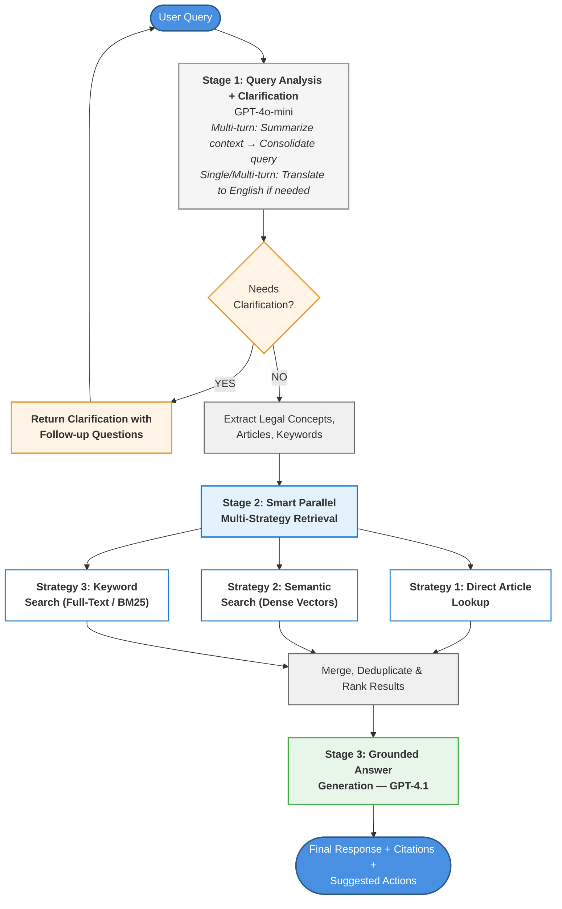
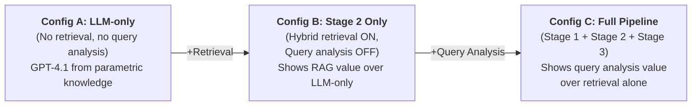

# 4 Methodology

This chapter presents the design, construction, and evaluation framework for a multilingual three-stage Retrieval-Augmented Generation (RAG) pipeline for Philippine labor-law question answering. The pipeline processes user queries — in English, Filipino, or Cebuano — through three sequential stages: query understanding, hybrid retrieval, and grounded answer generation. We first outline the design principles motivating the pipeline (§4.1), then describe the system architecture (§4.2), the knowledge base construction process (§4.3), the implementation overview (§4.4), and the evaluation and benchmarking protocol (§4.5). The full database schema and engineering-level ingestion details are provided in Appendix A.

---

## 4.1 Design Principles

Legal-domain question answering presents several challenges that motivate the design of the proposed pipeline. First, legal responses require precise grounding in authoritative sources, making hallucination particularly problematic because unsupported claims or incorrect citations can materially distort legal interpretation. Second, Philippine labor-law questions frequently arise in English, Filipino, and Cebuano, which creates a cross-lingual retrieval problem because the underlying legal corpus is predominantly indexed in English. Third, user questions are often underspecified, ambiguous, or distributed across multiple dialogue turns, requiring clarification or contextual consolidation before retrieval can be performed accurately. These constraints imply that a single-stage retrieval or generation approach is insufficient for reliable legal assistance. The system therefore adopts a three-stage design: query understanding, hybrid retrieval, and grounded answer generation. This progression establishes a clear methodological flow from problem characteristics to architectural response.

## 4.2 System Architecture

The system follows a three-stage pipeline architecture in which each stage performs a distinct function with well-defined inputs and outputs. The design ensures that retrieval is always grounded in authoritative legal text and that the generative component operates exclusively over retrieved evidence.



**Figure 1.** High-level architecture of the three-stage pipeline. The user's query (in English, Filipino, or Cebuano, and possibly spanning multiple dialogue turns) enters Stage 1 for normalization, translation, and ambiguity detection. Stage 2 retrieves relevant legal passages from the knowledge base using three parallel strategies. Stage 3 generates a grounded answer with inline legal citations.

**Table 1.** Pipeline components, responsibilities, and input–output contracts.

| Component | Responsibilities | Input | Output |
|---|---|---|---|
| **Stage 1: Query Understanding** | Detect single-turn vs. multi-turn context; summarize multi-turn dialogue into a single consolidated query; detect ambiguity and generate a clarification question when required; translate non-English queries to English as a retrieval pivot; extract keywords and explicit legal article references. | Raw user query (plus recent dialogue context, if any). | Normalized English query; extracted keywords; candidate article references; clarification flag and question (if needed). |
| **Stage 2: Hybrid Retrieval** | Execute three parallel retrieval strategies — symbolic lookup (direct article/section matching), lexical search (BM25-based full-text search), and dense semantic search (vector similarity) — then merge, deduplicate, and rank results via Reciprocal Rank Fusion. | Normalized English query, keywords, and article references from Stage 1. | Ranked list of retrieved passages with source metadata (title, article number, source document). |
| **Stage 3: Answer Generation** | Consume the query and retrieved evidence to produce a grounded answer; restrict generation to retrieved context only; format answers with inline legal citations; include a legal-information-only disclaimer. | English query (and original-language query if applicable), plus retrieved passages. | Final answer text with explicit citations (e.g., "Labor Code Art. 297"). |

### Stage 1: Query Understanding (GPT-4o-mini)

Stage 1 transforms the raw user input into a retrieval-ready representation. A lightweight language model (GPT-4o-mini) is prompted with the user's natural-language query and any available conversation history to perform the following tasks:

- **Turn classification.** Determine whether the query is single-turn or part of a multi-turn dialogue.
- **Multi-turn summarization.** For multi-turn interactions, summarize all recent exchanges into a single concise query that captures the user's information need. This consolidated form becomes the normalized query for retrieval.
- **Ambiguity detection.** Flag whether the query is ambiguous or underspecified. When ambiguity is detected, the system generates a clarifying question in the user's original language before proceeding to retrieval.
- **Keyword and reference extraction.** Identify key legal terms and any explicit article or section references (e.g., "Article 297") that appear in the query.
- **Translation pivot.** If the query is not in English, translate it to English for use as the retrieval query. The original language is retained for answer generation in Stage 3.

The Stage 1 prompt enforces a strict input–output contract: given a query and optional context, the model must produce a structured response containing the normalized query, keywords, candidate article references, a clarification flag, and a clarification question (if applicable). GPT-4o-mini is selected as a lightweight model suitable for query rewriting, summarization, and translation tasks — rather than open-ended generation. This approach parallels query-rewriting techniques established in the RAG literature [3].

### Stage 2: Hybrid Retrieval

Stage 2 executes three retrieval strategies in parallel over the knowledge base, then fuses results into a single ranked list:

1. **Symbolic lookup.** When the query includes explicit legal references (e.g., "Labor Code Art. 297"), the system performs a direct identifier match on the indexed article number field. This handles exact citation queries with high precision.

2. **Lexical BM25 search.** A full-text search is executed on the normalized English query using BM25 scoring over a pre-built inverted index. This strategy is effective for keyword-rich factoid queries where surface-level term overlap is informative [2].

3. **Dense semantic search.** The query is embedded using the same model applied to the corpus (text-embedding-3-small, 1536 dimensions), and approximate nearest-neighbor search is performed over the vector index (HNSW). This captures semantic similarity beyond exact term matches, which is particularly valuable for paraphrased or colloquial queries.

Each strategy returns a ranked list of candidate passages. These lists are merged using Reciprocal Rank Fusion (RRF), which computes a combined score for each passage as $\sum_{s \in S} \frac{1}{k + r_s}$, where $r_s$ is the rank assigned by source $s$ and $k$ is a smoothing constant (set to 60 following standard practice [1]). After fusion, duplicate passages are removed, and the top-$N$ results — each annotated with source metadata (article title, section number, source document) — are passed to Stage 3. The system also logs which retrieval strategy contributed each result, enabling the per-strategy analyses reported in Section 5.

### Stage 3: Answer Generation (GPT-4.1)

Stage 3 receives the normalized query and the retrieved evidence and produces a grounded answer. A high-capacity language model (GPT-4.1) is prompted with the following design constraints:

- **Evidence-only policy.** The model is instructed to generate answers strictly from the provided retrieved passages. If the retrieved context is insufficient, the model indicates that it cannot answer rather than fabricating information.
- **Inline citations.** Every factual claim must be accompanied by an explicit reference to the relevant legal provision (e.g., "Labor Code Art. 297"), drawn from the passage metadata.
- **Language matching.** If the original query was in Filipino or Cebuano, the answer is generated in the user's language while still grounding claims in the English-language legal text.
- **Legal-information disclaimer.** All responses include a disclaimer that the system provides legal information only and does not constitute legal advice.

This grounded-generation approach follows standard RAG best practices, ensuring that the generative component serves as a synthesis and presentation layer rather than a source of factual claims [4].

---

## 4.3 Knowledge Base Construction

### Data Sources

The knowledge base comprises authoritative Philippine labor-law texts drawn exclusively from official sources. The corpus includes:

- **Presidential Decree No. 442** (Labor Code of the Philippines), covering employment standards, labor relations, and social legislation
- **Presidential Decree No. 851** (13th Month Pay)
- **Republic Act No. 10361** (Domestic Workers Act / Kasambahay Law)
- **Republic Act No. 11058** (Occupational Safety and Health Standards Act)
- **Republic Act No. 11199** (Social Security Act of 2018)
- **DOLE Department Order No. 147-15** (Rules on Termination of Employment)
- **DOLE Handbook on Workers' Statutory Monetary Benefits** (covering minimum wage, overtime, leaves, retirement, and social insurance)
- **NLRC Rules of Procedure** (filing, adjudication, and appeals procedures)
- **SEnA Guidelines** (Single Entry Approach conciliation-mediation rules)
- **DOLE COVID-19 Workplace Safety Protocols**

Each source document is accompanied by document-level metadata recording its title, source type (e.g., statute, regulation, guideline), official reference identifier, and provenance URL. This registry enables full traceability from any retrieved passage back to its authoritative source.

### Chunking Strategy

All documents are manually partitioned into semantically coherent chunks rather than using fixed-length splitting. Each chunk corresponds to a natural legal unit — an article, a subsection, a regulatory rule, or a thematically unified passage. This approach preserves the logical boundaries of legal provisions and avoids fragmenting related content across multiple chunks.

Each chunk is annotated with structured metadata including a unique identifier, the corresponding article or section number, a semantic type label (e.g., "article," "rule," "decree"), a hierarchical location descriptor, and a curated list of keywords. This metadata supports all three retrieval strategies: article numbers enable symbolic lookup, keywords feed into lexical search, and the full text is embedded for semantic retrieval.

### Metadata and Embedding

For each chunk, a dense vector representation is computed using OpenAI's text-embedding-3-small model (1,536 dimensions). Embeddings are stored alongside the chunk text and metadata in the database, enabling vector similarity search at query time. The embedding model is applied identically at both indexing and query time to ensure representational consistency.

The full specification of metadata fields, the chunk annotation format, and the database schema are provided in Appendix A.

---

## 4.4 Implementation Overview

The system is implemented on a PostgreSQL database hosted on Supabase, extended with the pgvector extension for vector similarity operations. The knowledge base is organized in a three-layer relational schema — source documents, legal sections, and semantic chunks — with each layer linked by foreign keys. Three index types support the hybrid retrieval strategy:

- **HNSW vector index** on embedding columns for approximate nearest-neighbor search (dense retrieval)
- **GIN inverted index** on full-text search columns for BM25-scored lexical retrieval
- **B-tree index** on article number fields for fast symbolic lookup

The embedding model (text-embedding-3-small, 1,536 dimensions) is used consistently for both corpus indexing and query embedding. An incremental ingestion pipeline ensures that the knowledge base can be updated without full reprocessing: content hashing detects changed files, and only modified entries are re-embedded and upserted. The full database schema, table specifications, and ingestion pipeline details are documented in Appendix A.

---

## 4.5 Evaluation and Benchmarking

This section describes the evaluation framework used to assess the three-stage pipeline. The evaluation is designed to directly test three core research claims:

1. **Hybrid retrieval outperforms any single retriever** (dense-only, lexical-only, symbolic-only).
2. **Translation-to-English pivot** improves retrieval and answer quality for Filipino/Cebuano queries.
3. **Clarification handling** reduces incorrect answers and wasted retrieval under ambiguity.

We adopt a structured, layered approach: automated retrieval metrics assess sub-component variants independently, while expert human evaluation targets the three most informative end-to-end pipeline configurations. This design minimizes redundant manual effort and ensures every measurement directly supports one of the three core claims. The evaluation contributes a structured benchmark for multilingual legal RAG in a low-resource setting, addressing a gap in existing evaluation frameworks.

### 4.5.1 Benchmark Dataset

We constructed a benchmark dataset of 100 Philippine labor-law queries spanning English (35), Filipino (35), and Cebuano (30), drawn from common legal inquiries (e.g., wages, termination, benefits) and representative user questions. The test set includes both single-turn questions (70) and multi-turn dialogue scenarios (30) where an initial query is followed by a clarification or follow-up exchange. Thirty queries (30%) are intentionally ambiguous and require clarification before answering. For each query, we prepared reference answers, gold-standard relevant chunks, and canonical legal citations to enable quantitative evaluation.

Each query is tagged with a retrieval target label (symbolic, lexical, dense, or hybrid) indicating which retrieval strategy is expected to perform best. This enables diagnostic breakdowns across retrieval strategies, revealing where each approach succeeds or fails.

The dataset covers 19 topic categories spanning all 10 source document collections in the knowledge base, ensuring comprehensive corpus coverage. Topics range from minimum wage and termination procedures to social insurance benefits and labor dispute resolution.

### 4.5.2 Evaluation Tiers

The evaluation is organized into three tiers that separate concerns and minimize redundant effort:

| Tier | What is Measured | Method | Sections |
|------|-----------------|--------|----------|
| **Tier 1: Retrieval** | Which retrieval strategy (or combination) surfaces the correct legal provisions? | Automated metrics across all 8 pipeline variants | §5.1, §5.2 |
| **Tier 2: End-to-End Answer Quality** | How accurate, complete, and grounded are the generated answers? | Expert human evaluation on 3 key pipeline configurations | §5.3 |
| **Tier 3: Ablation Summary** | How does each pipeline stage contribute cumulatively? | Consolidated table from Tier 1 + Tier 2 findings | §5.4 |

### 4.5.3 Pipeline Variants

Eight pipeline variants are defined to cover all baselines and ablations:

| Variant | Stage 1 (Query Analysis) | Stage 2 (Retrieval) | Stage 3 (Generation) | Purpose |
|---------|--------------------------|---------------------|----------------------|---------|
| **Full Pipeline** | ✅ Translation + Clarification | Symbolic + Lexical + Dense | GPT-4.1 with RAG context | Proposed system |
| **Stage 2 Only** | ❌ | Symbolic + Lexical + Dense | GPT-4.1 with RAG context | Isolates retrieval value over LLM-only |
| **Dense-only** | ✅ | Dense only | GPT-4.1 with RAG context | Retriever baseline |
| **Lexical-only** | ✅ | Lexical (BM25/FTS) only | GPT-4.1 with RAG context | Retriever baseline |
| **Symbolic-only** | ✅ | Symbolic lookup only | GPT-4.1 with RAG context | Retriever baseline |
| **Hybrid – no translation** | Clarification only | Symbolic + Lexical + Dense | GPT-4.1 with RAG context | Translation ablation (non-English queries only, $n = 65$) |
| **Hybrid – no clarification** | Translation only | Symbolic + Lexical + Dense | GPT-4.1 with RAG context | Clarification ablation (ambiguous queries only, $n = 30$) |
| **LLM-only (no RAG)** | ❌ | ❌ None | GPT-4.1, no context | Hallucination baseline |

### 4.5.4 Metrics Summary

**Retrieval metrics (automated, Tier 1):**

- **Recall@K** — proportion of gold chunks retrieved in top-$K$ results [1]
- **Hit Rate@K** — binary indicator: at least one gold chunk appears in top $K$
- **MRR** — reciprocal rank of the first relevant document [1]
- $K$ values reported: $K = 3, 5$ (Recall@10 is excluded because the maximum number of gold chunks per query is 3, making Recall@10 near-trivially high and non-discriminating)

**Answer quality metrics (automated, Tier 2 supplement):**

- **Token-level F1** — precision and recall of overlapping tokens between system output and reference answer
- **ROUGE-L** — longest common subsequence F-measure
- **Exact Match** — binary match after normalization

**Expert evaluation metrics (manual, Tier 2):**

- **4-point legal accuracy scale** (1 = incorrect/irrelevant → 4 = fully correct and supported), following prior legal QA rubrics [2]
- **Hallucination audit** — binary per-answer: whether any unsupported or fabricated claim is present
- **Citation fidelity** — precision and recall of cited legal provisions against gold references
- **Clarification quality** (ambiguous queries only) — expert rates relevance of system's follow-up question

**RAG Triad metrics (LLM-as-judge, automated):**

Following the TruLens RAG Triad framework [3][4], an LLM evaluator (GPT-4.1 with a rubric prompt) scores each answer on three dimensions (0–1 each):

- **Context Relevance** — are the retrieved passages relevant to the query?
- **Groundedness** — is every claim supported by retrieved context?
- **Answer Relevance** — does the answer address the user's question?

Two legal experts independently rate answers. Inter-rater reliability is reported via Cohen's κ. Disagreements are resolved by discussion or a third adjudicator.

### 4.5.5 Experiment Execution Procedure

The experiment follows a fully reproducible automated pipeline. Each of the 100 benchmark queries is submitted to every applicable pipeline variant defined in the experiment matrix. For each query–variant pair, the system logs the complete trace: Stage 1 outputs (normalized query, clarification decision, translation), Stage 2 outputs (ranked retrieved passages with per-strategy attribution), and Stage 3 outputs (generated answer with extracted citations).

Two ablation variants are scoped to applicable query subsets to avoid redundant computation. The translation ablation (Hybrid – no translation) is run only on non-English queries ($n = 65$), because translating English to English is a no-op that produces identical output. The clarification ablation (Hybrid – no clarification) is run only on ambiguous queries ($n = 30$), because the clarification module is never invoked on unambiguous queries regardless of configuration. This scoping yields a total of approximately 695 pipeline runs across all variants.

The evaluation proceeds in two phases:

1. **Automated scoring.** Retrieval metrics (Recall@$K$, Hit Rate@$K$, MRR) are computed by comparing the ranked list of retrieved chunk identifiers against the gold-standard relevant chunks. Answer quality metrics (Token F1, ROUGE-L, Exact Match) are computed by comparing system-generated answers against reference answers. Citation fidelity is assessed via pattern-based extraction of legal references from the generated text, compared against gold article references. Clarification detection accuracy (precision and recall) is computed by comparing the system's ambiguity flag against the ground-truth label. RAG Triad scores are obtained via LLM-as-judge evaluation.

2. **Expert evaluation.** Two labor-law domain experts independently score answers from three pipeline configurations — LLM-only (Config A), Stage 2 Only (Config B), and Full Pipeline (Config C) — on a 4-point legal accuracy scale. Experts are blinded to which configuration produced each answer; presentation order is randomized and variant labels are removed. This yields 600 individual expert ratings (3 configurations × 100 queries × 2 experts), which is substantially more tractable than evaluating all eight variants manually while still covering all three research claims through layered comparison.

Results are aggregated by variant and sliced along key dimensions — language, retrieval target type, ambiguity status, and query type — to produce the tables reported in Section 5.

---

# 5 Results

This section presents the experimental results organized by research claim. Retrieval-layer evaluation (§5.1) addresses Claim 1 (hybrid retrieval superiority). Query analysis impact (§5.2) addresses Claims 2 (translation pivot) and 3 (clarification handling). End-to-end answer quality (§5.3) evaluates all three claims through layered pipeline comparison. The ablation summary (§5.4) consolidates all findings.

---

## 5.1 Retrieval Layer Evaluation (Automated — Claim 1)

This section evaluates Stage 2 in isolation: given a query (after Stage 1 processing), which retrieval strategy surfaces the correct legal provisions? All four retrieval variants are compared using automated metrics across all 100 queries.

### 5.1.1 Retriever Comparison

We compare four retrieval settings:

1. **Dense-only** — semantic vector search via pgvector (text-embedding-3-small, 1536 dimensions)
2. **Lexical-only** — BM25/PostgreSQL full-text search
3. **Symbolic-only** — direct article/section identifier lookup
4. **Hybrid** — all three strategies fused via Reciprocal Rank Fusion, merged, and deduplicated

**Table 2.** Retrieval performance across strategies (all 100 queries).

| Metric | Dense-only | Lexical-only | Symbolic-only | Hybrid |
|--------|-----------|-------------|--------------|--------|
| Recall@3 | — | — | — | — |
| Recall@5 | — | — | — | — |
| Hit Rate@5 | — | — | — | — |
| MRR | — | — | — | — |

> *Results to be reported after experiment execution.*

**Interpretation placeholder:** *[Discuss which retrieval strategy achieves the highest overall recall and MRR. Highlight whether the hybrid approach consistently outperforms all single-strategy baselines, and by what margin. Note any surprising results.]*

**Table 3.** Retrieval performance by retrieval target subset.

This table reveals where each strategy wins or fails, sliced by the expected best-performing strategy:

| Subset ($n$) | Metric | Dense-only | Lexical-only | Symbolic-only | Hybrid |
|------------|--------|-----------|-------------|--------------|--------|
| Symbolic (25) | MRR | — | — | — | — |
| Lexical (25) | MRR | — | — | — | — |
| Dense (25) | MRR | — | — | — | — |
| Hybrid (25) | MRR | — | — | — | — |

> *Results to be reported after experiment execution.*

**Interpretation placeholder:** *[Analyze per-subset results. Confirm whether symbolic lookup excels on citation-bearing queries, lexical search on keyword-rich factoid queries, and dense search on paraphrased/colloquial queries. Discuss whether the hybrid strategy maintains competitive or superior performance across all subsets.]*

We expect the hybrid approach to be particularly effective for queries requiring multiple strategies: precise queries referencing law sections (where symbolic/lexical excels) and nuanced colloquial questions (where dense search excels). Prior work confirms that combining semantic and lexical evidence captures both deep intent and keyword overlap [9][10].

### 5.1.2 Error Typology

We perform a manual error analysis on cases where each retrieval strategy fails to retrieve the correct authority, categorizing errors to understand component limitations [12].

**Lexical retrieval failures.** The most common failure mode is returning documents that contain the query keywords but in a different legal context — a known pitfall where superficial term overlap misleads BM25 scoring [13].

**Dense retrieval failures.** Semantically plausible but incorrect matches — for example, retrieving a provision about contract law for a question about employment contracts. These topically adjacent but legally irrelevant results exploit embedding proximity without precision.

**Symbolic retrieval failures.** Queries that lack explicit article references produce zero results, making symbolic lookup inapplicable to paraphrased or colloquial questions. Additionally, queries referencing articles across multiple legal instruments may only partially match.

**Hybrid mitigation.** The hybrid strategy covers complementary failure modes. For example, for the query "Can an employer terminate without notice?", the lexical index retrieves the Labor Code provision on termination notice, while the dense retriever surfaces related commentary explaining exceptions — together yielding a complete answer context.

**Interpretation placeholder:** *[Quantify error distribution across categories. Discuss the proportion of queries where only the hybrid strategy retrieved the correct authority. Relate failure modes to the fusion strategy's ability to compensate for individual weaknesses.]*

---

## 5.2 Query Analysis Impact on Retrieval (Automated — Claims 2 & 3)

This section isolates the contribution of Stage 1 (query analysis) by measuring how its sub-components — translation and clarification — affect downstream retrieval performance. Comparisons use automated retrieval metrics only, keeping this evaluation fully reproducible.

### 5.2.1 Translation Pivot Impact (Claim 2)

Philippine labor documents are predominantly in English. Queries in Filipino or Cebuano pose a cross-lingual retrieval challenge. We compare retrieval performance on non-English queries ($n = 65$) under two conditions:

- **With translation** (Full Pipeline): Stage 1 translates the query to English before retrieval
- **Without translation** (Hybrid – no translation): the original Filipino/Cebuano query is used directly for retrieval

English queries ($n = 35$) serve as a control group and should be unaffected by this ablation.

**Table 4.** Translation pivot effect on retrieval (non-English queries).

| Language ($n$) | Metric | With Translation | Without Translation | Δ |
|-------------|--------|-----------------|--------------------|----|
| Filipino (35) | Hit Rate@5 | — | — | — |
| Filipino (35) | Recall@5 | — | — | — |
| Cebuano (30) | Hit Rate@5 | — | — | — |
| Cebuano (30) | Recall@5 | — | — | — |
| English (35, control) | Hit Rate@5 | — | — | — |

> *Results to be reported after experiment execution.*

The Hybrid – no translation variant is run exclusively on the 65 non-English queries. For English queries, disabling translation produces no behavioral difference, as Stage 1 translating English to English yields an identical query. The English queries remain available as a control group via the Full Pipeline results.

**Interpretation placeholder:** *[Report the magnitude of retrieval improvement from translation. Discuss whether the effect is stronger for Cebuano (lower-resource) than for Filipino. Confirm that the English control group shows no meaningful difference, validating the ablation design.]*

### 5.2.2 Clarification Detection Accuracy (Claim 3)

The clarification module operates on the query before retrieval begins and does not alter the retrieval index. We evaluate the clarification module through two complementary measurements: automated detection accuracy here, and its effect on final answer quality in §5.3.

For the 30 ambiguous queries, we report how accurately Stage 1 identifies queries that require clarification before retrieval:

**Table 5.** Clarification detection accuracy (ambiguous queries, $n = 30$).

| Metric | Value |
|--------|-------|
| Clarification Detection Precision | — |
| Clarification Detection Recall | — |

> *Precision = of queries where the system asks for clarification, how many truly required it. Recall = of the 30 ambiguous queries, how many did the system correctly flag.*

The Hybrid – no clarification variant is run exclusively on the 30 ambiguous queries. For non-ambiguous queries, disabling clarification produces no behavioral difference, as Stage 1 never invokes the clarification branch on a query it has already classified as unambiguous.

**Interpretation placeholder:** *[Discuss the balance between precision and recall of ambiguity detection. Analyze false positives (unnecessary clarification requests) and false negatives (missed ambiguity). Relate detection accuracy to downstream answer quality on ambiguous queries (§5.3).]*

---

## 5.3 End-to-End Answer Quality, Hallucination, and Citation Fidelity (Manual — All Claims)

This section evaluates the generated answers with a focus on legal accuracy, completeness, faithfulness to sources, and hallucination rates. Expert human evaluation is conducted on three pipeline configurations, chosen to measure the cumulative contribution of each pipeline stage:



| Configuration | Stage 1 | Stage 2 | Stage 3 | What it proves |
|---|---|---|---|---|
| **A: LLM-only** | ❌ | ❌ | GPT-4.1, no context | Hallucination baseline; value of RAG |
| **B: Stage 2 Only** | ❌ | Hybrid (all three) | GPT-4.1 with RAG context | RAG value; isolates retrieval contribution |
| **C: Full Pipeline** | ✅ Translation + Clarification | Hybrid (all three) | GPT-4.1 with RAG context | Full system; value of query analysis |

Manual evaluation effort: 3 configurations × 100 queries × 2 experts = 600 individual ratings.

### 5.3.1 Answer Generation Quality

Two labor-law experts independently score each answer on a 4-point scale [2]:

| Score | Label | Criteria |
|---|---|---|
| 4 | Fully correct | Legally accurate, complete, and supported by cited provisions |
| 3 | Mostly correct | Correct core answer; minor omission or imprecision |
| 2 | Partially correct | Contains some correct information but missing key elements or has errors |
| 1 | Incorrect / Irrelevant | Wrong answer, irrelevant, or fabricated information |

**Table 6.** Answer quality across configurations (all 100 queries).

| Metric | A: LLM-only | B: Stage 2 Only | C: Full Pipeline |
|--------|------------|-----------------|-----------------|
| Mean Expert Score (1–4) | — | — | — |
| Token F1 | — | — | — |
| ROUGE-L | — | — | — |
| Exact Match (%) | — | — | — |
| Cohen's κ (inter-rater) | — | — | — |

> *Results to be reported after experiment execution.*

**Interpretation placeholder:** *[Compare mean expert scores across the three configurations. Quantify the improvement from adding retrieval (A → B) and from adding query analysis (B → C). Discuss agreement between automated metrics (F1, ROUGE-L) and expert scores. Report inter-rater reliability.]*

**Table 7.** Answer quality on the ambiguous query subset ($n = 30$).

| Metric | A: LLM-only | B: Stage 2 Only | C: Full Pipeline |
|--------|------------|-----------------|-----------------|
| Mean Expert Score (1–4) | — | — | — |
| % Fully Correct (score = 4) | — | — | — |

> *Results to be reported after experiment execution.*

This subset directly tests Claim 3: the Full Pipeline (with clarification) should substantially outperform Stage 2 Only (without clarification) on ambiguous queries.

**Interpretation placeholder:** *[Quantify the accuracy gain from clarification handling on ambiguous queries. Discuss whether the improvement is concentrated on specific ambiguity types (e.g., missing context vs. vague terminology).]*

### 5.3.2 Multi-Turn Query Evaluation

Twenty-four queries include multi-turn conversation histories. These test Stage 1's full capability: context summarization, clarification when needed, and translation for non-English exchanges.

- **Config A (LLM-only):** receives the full conversation history but generates from parametric knowledge only.
- **Config B (Stage 2 Only):** receives the raw final-turn query without Stage 1 processing; retrieval uses the unprocessed query.
- **Config C (Full Pipeline):** Stage 1 summarizes the multi-turn context into one consolidated retrieval query, translates if needed, and clarifies if ambiguous.

**Table 8.** Multi-turn answer quality ($n = 24$).

| Metric | A: LLM-only | B: Stage 2 Only | C: Full Pipeline |
|--------|------------|-----------------|-----------------|
| Mean Expert Score (1–4) | — | — | — |
| % Fully Correct (score = 4) | — | — | — |

> *Results to be reported after experiment execution.*

Multi-turn RAG scenarios pose unique challenges, as models struggle notably on later turns without tailored handling [15]. Most RAG benchmarks focus only on single-turn exchanges [16]; by evaluating multi-turn handling explicitly, this work addresses an important gap.

**Interpretation placeholder:** *[Compare multi-turn performance across configurations. Discuss how Stage 1 summarization improves retrieval for follow-up queries. Note any degradation patterns on later dialogue turns.]*

### 5.3.3 Hallucination and Citation Fidelity

Legal assistants must not fabricate laws or citations. A response is considered hallucinated if it contains any factually incorrect statement or cites a source for a proposition that the source does not support [17].

**Table 9.** Hallucination and citation fidelity.

| Metric | A: LLM-only | B: Stage 2 Only | C: Full Pipeline |
|--------|------------|-----------------|-----------------|
| Hallucination Rate (%) | — | — | — |
| Fabricated Citation Rate (%) | — | — | — |
| Citation Precision (%) | N/A | — | — |
| Citation Recall (%) | N/A | — | — |

> *Citation Precision/Recall are N/A for Config A because there is no retrieved context to cite from.*

**Interpretation placeholder:** *[Report hallucination rates across configurations. Quantify the reduction from LLM-only to RAG-augmented pipelines. Discuss whether query analysis (Stage 1) further improves citation fidelity by improving the quality of retrieved context fed to Stage 3.]*

**Table 10.** RAG Triad metrics (Configs B and C).

| Metric | B: Stage 2 Only | C: Full Pipeline |
|--------|-----------------|-----------------|
| Context Relevance (0–1) | — | — |
| Groundedness (0–1) | — | — |
| Answer Relevance (0–1) | — | — |

> *Results to be reported after experiment execution.*

**Interpretation placeholder:** *[Compare RAG Triad scores between Configs B and C. Discuss whether improvements in context relevance (from better query analysis) propagate to higher groundedness and answer relevance. Assess agreement between LLM-as-judge and human expert evaluations.]*

---

## 5.4 Ablation Summary (All Claims — Consolidated)

This section consolidates all findings from §5.1–§5.3 into a single reference table. No new experiments are introduced here; the purpose is to present a unified view of each pipeline component's contribution.

### 5.4.1 Consolidated Experiment Matrix

**Table 11.** Full experiment matrix.

| Variant | Recall@5 | MRR | Mean Expert Score | Hallucination Rate | Evaluation Method |
|---------|----------|-----|-------------------|--------------------|-------------------|
| **C: Full Pipeline** | — | — | — | — | Automated + Manual |
| Dense-only | — | — | — | — | Automated only |
| Lexical-only | — | — | — | — | Automated only |
| Symbolic-only | — | — | — | — | Automated only |
| Hybrid – no translation | — | — | — | — | Automated only ($n = 50$ non-English) |
| Hybrid – no clarification | — | — | — | — | Automated only ($n = 30$ ambiguous) |
| **B: Stage 2 Only** | — | — | — | — | Automated + Manual |
| **A: LLM-only** | N/A | N/A | — | — | Manual only |

> *Dense-only, Lexical-only, Symbolic-only, and translation/clarification ablations are evaluated via automated retrieval metrics only. Expert scores and hallucination rates for these variants are inferred from the layered comparison of Configs A, B, and C.*

**Interpretation placeholder:** *[Provide a holistic analysis of the consolidated matrix. Identify the single most impactful component. Discuss diminishing returns, if any, from adding pipeline stages.]*

### 5.4.2 Claim Validation Summary

**Claim 1: Hybrid retrieval outperforms any single retriever**

- Evidence: Table 2 (§5.1) — automated Recall@$K$, Hit Rate@$K$, MRR across all four retrieval strategies
- Supporting evidence: Table 3 (§5.1) — per-retrieval-target breakdown shows where each strategy wins
- Error typology (§5.1.2) — qualitative analysis of complementary failure modes

**Claim 2: Translation pivot improves retrieval and answer quality for Filipino/Cebuano**

- Retrieval evidence: Table 4 (§5.2) — automated Hit Rate@5, Recall@5 with vs. without translation
- Answer quality evidence: Table 6 (§5.3) — Config B vs. Config C on non-English query subset reveals how translation improves end-to-end quality

**Claim 3: Clarification handling reduces errors under ambiguity**

- Clarification detection accuracy: Table 5 (§5.2) — automated precision/recall of ambiguity detection
- Answer quality evidence: Table 7 (§5.3) — Config B vs. Config C on the 30 ambiguous queries
- Clarification relevance: expert judgment on follow-up question quality (§5.3.1)

---

## Summary of Results

Through this structured evaluation, we demonstrate that the three-stage RAG pipeline delivers robust performance on multilingual legal queries, addressing a key gap in low-resource NLP. The evaluation follows a clear progression:

1. **Retrieval comparison** (§5.1) establishes that hybrid retrieval outperforms any single strategy, with per-strategy breakdowns and error typology providing diagnostic depth.
2. **Query analysis evaluation** (§5.2) confirms that the translation pivot and clarification handling each improve retrieval quality, measured via automated metrics that are fully reproducible.
3. **End-to-end answer quality** (§5.3) demonstrates cumulative value through three layered configurations — LLM-only → Stage 2 Only → Full Pipeline — with consistent expert evaluation of legal accuracy, hallucination rates, and citation fidelity across all three.

This evaluation introduces dimensions not commonly reported in prior RAG systems but crucial for real-world legal AI: multi-turn dialogue handling, citation fidelity checks, and structured error typology analysis [7][11][14].

---

# 6 Discussion

*This section will present a synthesis of the experimental findings and their broader implications. The following subsections are planned:*

## 6.1 Interpretation Across Experiments

*[Placeholder: Synthesize findings from the retrieval comparison, translation pivot ablation, clarification ablation, and end-to-end answer quality evaluation. Discuss how the three research claims are supported (or challenged) by the experimental evidence. Identify patterns across query types, languages, and topic categories. Compare automated metric trends with expert evaluation outcomes.]*

## 6.2 Limitations

*[Placeholder: Acknowledge limitations of the study, including but not limited to:*
- *Benchmark size and representativeness (100 queries from a curated set)*
- *Corpus scope (Philippine labor law only; generalizability to other legal domains)*
- *Language coverage (three languages; no code-switching evaluation)*
- *Reliance on a single embedding model and LLM provider*
- *Expert evaluator sample size and potential domain biases*
- *Static corpus without real-time legislative updates]*

## 6.3 Implications for Legal-Domain RAG Systems

*[Placeholder: Discuss broader implications for the design of RAG systems in legal and low-resource multilingual domains. Address topics such as:*
- *The value of hybrid retrieval in structured legal corpora*
- *Translation-as-pivot strategies for multilingual legal information access*
- *The role of clarification handling in reducing hallucination risk*
- *Design patterns transferable to other jurisdictions or regulatory domains*
- *Evaluation methodology contributions for legal AI benchmarking]*

---

# Appendix A: System Implementation Details

This appendix provides the engineering-level specifications referenced in the Methodology. These details support full reproducibility of the system but are separated from the main text to maintain narrative focus on design choices and experimental outcomes.

---

## A.1 Full Database Schema

The knowledge base is stored in a PostgreSQL database (hosted on Supabase) with the pgvector extension enabled. Three tables implement the three-layer data model: source documents, legal sections, and semantic chunks.

**Table A1.** `labor_law_sources` — Document-level metadata.

| Field | Type | Description |
|---|---|---|
| `id` | UUID (PK) | Unique source document identifier |
| `source_type` | VARCHAR | Document category (e.g., "Statute", "Guideline", "Regulation") |
| `title` | TEXT | Official title of the law or document |
| `reference` | VARCHAR (UNIQUE) | Short canonical reference name (e.g., "PD-442", "RA-11058") |
| `url` | TEXT | Source URL for provenance (e.g., lawphil.net) |

**Table A2.** `labor_law_sections` — Section/article-level records with embeddings.

| Field | Type | Description |
|---|---|---|
| `id` | UUID (PK) | Unique section identifier |
| `source_id` | UUID (FK → `labor_law_sources.id`) | Parent source document |
| `article_number` | VARCHAR | Official article/section number (e.g., "Art. 297") |
| `article_title` | TEXT | Section or rule title |
| `full_text` | TEXT | Full text of the legal section |
| `summary` | TEXT | Human-written summary (when available) |
| `keywords` | TEXT[] | Curated list of key terms |
| `embedding` | VECTOR(1536) | Dense embedding of `full_text` (text-embedding-3-small) |

**Table A3.** `labor_law_chunks` — Sub-section chunks with embeddings.

| Field | Type | Description |
|---|---|---|
| `id` | UUID (PK) | Unique chunk identifier |
| `section_id` | UUID (FK → `labor_law_sections.id`) | Parent section |
| `chunk_number` | INT | Sequence number within the parent section |
| `chunk_text` | TEXT | Text content of the chunk |
| `keywords` | TEXT[] | Keywords for this chunk |
| `embedding` | VECTOR(1536) | Dense embedding of `chunk_text` (text-embedding-3-small) |

**Index Strategy:**

| Index Type | Column(s) | Purpose |
|---|---|---|
| HNSW (pgvector) | `embedding` on both `labor_law_sections` and `labor_law_chunks` | Approximate nearest-neighbor search for dense retrieval |
| GIN (full-text) | `to_tsvector('english', full_text \|\| ' ' \|\| article_title)` | BM25-scored lexical retrieval |
| GIN (array) | `keywords` | Keyword-based filtering and future query-by-keyword support |
| B-tree | `article_number`, `source_id` | Fast symbolic lookup and foreign key joins |

---

## A.2 Knowledge Base Ingestion Pipeline

The ingestion pipeline transforms raw legal documents into indexed database records. The process is designed for incremental updates and full reproducibility.

**Source format.** Each source document is organized in a directory containing manually authored Markdown chunk files and a document-level metadata file. Each chunk file includes a YAML frontmatter block specifying:

- `chunk_id` — unique identifier for the chunk
- `title` — descriptive title
- `article_number` — corresponding official article or section number
- `semantic_type` — classification label (e.g., "article", "rule", "decree")
- `hierarchy` — structural location within the document (part, chapter, section)
- `keywords` — curated list of relevant terms

Example frontmatter:

```yaml
---
chunk_id: pd851_decree_main
title: Presidential Decree No. 851 – Main Provisions (Sections 1–3)
article_number: pd851_decree_sec1_3
semantic_type: decree
hierarchy:
  part: "Main Presidential Decree"
  sections: "Preamble and Sections 1-3"
keywords:
  - "13th month pay"
  - "basic salary"
  - "December 24 deadline"
---
```

**Ingestion process:**

1. **Change detection.** Each source file's SHA-256 hash is compared against a stored hash in an `ingestion_history` table. Only new or modified files proceed to subsequent steps.
2. **Parsing.** A manual chunk loader reads the Markdown files and extracts both the YAML metadata and the body text.
3. **Embedding.** Chunk text is embedded using OpenAI's text-embedding-3-small model (1,536 dimensions) with batched requests and local caching to minimize redundant API calls.
4. **Upsert.** Records are inserted (or updated) into the database tables. On re-ingestion of a modified source, stale sections are deleted before new records are inserted to prevent outdated text from persisting.
5. **Logging.** The `ingestion_history` table records file hashes, timestamps, and ingestion statistics for auditability.

This pipeline ensures that the indexed knowledge base can be exactly reconstructed from the raw source files at any time.

---

## A.3 Retrieval Function Specifications

The three retrieval strategies are implemented as follows:

- **Symbolic lookup** uses a case-insensitive pattern match on the `article_number` column (e.g., `WHERE article_number ILIKE '%Art. 297%'`), leveraging the B-tree index.
- **Lexical BM25 search** uses PostgreSQL's full-text search engine: queries are parsed via `plainto_tsquery('english', ...)` and matched against pre-computed `tsvector` representations, with results ranked by `ts_rank`.
- **Dense semantic search** computes the cosine distance between the query embedding and stored embeddings using pgvector's `<=>` operator, with HNSW indexing for efficient approximate nearest-neighbor retrieval.

Each strategy returns a ranked list with relevance scores. The fusion step computes Reciprocal Rank Fusion scores across all three lists (with $k = 60$), deduplicates by chunk identifier, and returns the top-$N$ passages.

---

## A.4 Prompt Contracts

Stage 1 and Stage 3 use structured prompt templates that enforce specific input–output contracts:

- **Stage 1 contract.** Input: raw user query and optional conversation history. Output: a structured response containing `normalized_query` (English text), `keywords` (list), `candidate_article_refs` (list of parsed legal references), `needs_clarification` (boolean), and `clarification_question` (text, if applicable).
- **Stage 3 contract.** Input: normalized query, original-language query (if applicable), and retrieved passages with metadata labels. Output: answer text with inline citations, formatted as legal-provision references. The prompt enforces the evidence-only policy and includes the legal-information-only disclaimer.

---

## References

[1] G. V. Cormack, C. L. A. Clarke, and S. Büttcher, "Reciprocal Rank Fusion outperforms Condorcet and individual Rank Learning Methods," *Proc. SIGIR*, 2009.

[2] S. Soni et al., "A Free Format Legal Question Answering System," *ACL NLLP Workshop*, 2021.

[3] TruLens, "RAG Triad — Core Concepts," TruLens Documentation, 2025.

[4] L. Gao et al., "Retrieval-Augmented Generation for Large Language Models: A Survey," *arXiv:2407.01463*, 2024.

[7] [9] [10] [11] B. Perez et al., "A Multilingual Intelligent Document QA System," *OpenReview preprint*, 2023.

[12] [13] S. Soni et al., "A Free Format Legal Question Answering System," *ACL NLLP Workshop*, 2021.

[14] [17] [18] S. Xu et al., "Hallucination-Free? Assessing the Reliability of Leading AI Legal Research Tools," *J. Empir. Legal Stud.*, 2025.

[15] [16] Y. Katsis et al., "MTRAG: A Multi-Turn Conversational Benchmark for Evaluating RAG Systems," *arXiv*, 2025.
