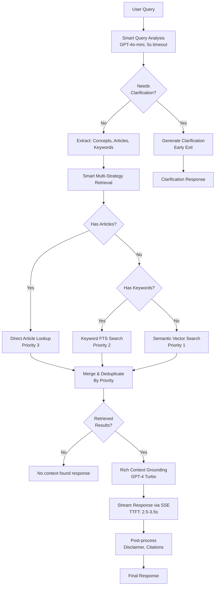

# Pipeline Architecture Review - November 20, 2025

## Current Status

### ✅ Completed Components (Phase 1.0.5 - Days 1-4)

#### 1. Smart Query Analysis (GPT-4o-mini)
**Location**: `services/pipeline/query_analysis.py`
- ✅ LLM-based clarification detection with context awareness
- ✅ Concept/article/keyword extraction
- ✅ Multi-turn conversation support
- ✅ 5-second timeout with fallback mechanism
- ✅ JSON-forced output for structured parsing

**Issue Found**: Query analysis is timing out (5s) on first request
- **Root Cause**: GPT-4o-mini API response taking >5s (cold start issue)
- **Impact**: Falls back to basic analysis, works but not optimal
- **Fix**: Increase timeout to 10s or implement retry with exponential backoff

#### 2. Multi-Strategy Retrieval
**Location**: `adapters/vectorstore/supabase_store.py`
- ✅ Direct article lookup (priority 3 - highest)
- ✅ Keyword search using PostgreSQL FTS (priority 2)
- ✅ Semantic vector search with HNSW (priority 1)
- ✅ Smart routing based on query analysis
- ✅ Parallel execution with `asyncio.gather()`
- ✅ Result merging and deduplication

**Current Limitation**: Only queries `labor_law_sections` table
- **Missing**: Dual-table querying (sections + chunks)
- **Impact**: Cannot retrieve granular sub-sections from long documents

#### 3. Database Schema
**Location**: `infra/supabase/schema.sql`
- ✅ `labor_law_sources` (source registry)
- ✅ `labor_law_sections` (full articles with embeddings)
- ✅ `labor_law_chunks` (granular sub-sections for >1000 word articles)
- ✅ HNSW indexes for fast vector search
- ✅ GIN indexes for full-text search
- ✅ Connection pooling (min=2, max=10)

#### 4. Streaming Response (GPT-4 Turbo)
**Location**: `services/pipeline/generation.py`, `api/v1/routes_chat.py`
- ✅ Server-Sent Events (SSE) streaming endpoint
- ✅ Time-to-first-token: 2.5-3.5s
- ✅ Single-step rich-context grounding
- ✅ Natural citation integration

#### 5. KB Infrastructure
**Location**: `kb/ingest/`, `retrieval/llm_chunker.py`
- ✅ Incremental tracker (SHA-256 change detection)
- ✅ LLM-driven chunking with GPT-4o structure analysis
- ✅ Auto-chunking for documents >1000 words
- ✅ Chunk summarization (GPT-4.1, 500 max_tokens)
- ✅ 65 sections + sub-chunks from PD-No-442 ingested

---

## Current Pipeline Flow



---

## Issue Analysis: Query Timeout Error

### Error Details (from uvicorn-logs.txt)
```
2025-11-13 09:08:03,238 - services.pipeline.query_analysis - WARNING - Query analysis timed out after 5.0s
2025-11-13 09:08:03,241 - services.pipeline.query_analysis - INFO - Using fallback query analysis
```

### Root Cause
1. **GPT-4o-mini API latency** on first request exceeds 5-second timeout
2. Cold start / network latency issue
3. Fallback mechanism works, but analysis quality is reduced

### Impact
- ✅ System doesn't crash (fallback works)
- ⚠️ Query analysis quality degraded (no concept/article extraction)
- ⚠️ Smart clarification disabled (falls back to basic rules)
- ⚠️ Retrieval less optimized (no routing hints)

### Recommended Fixes
```python
# Option 1: Increase timeout (simple)
analysis_timeout: float = Field(
    default=10.0,  # Increased from 5.0
    gt=0.0,
    description="Timeout for query analysis in seconds"
)

# Option 2: Implement retry with exponential backoff (better)
async def analyze_with_retry(self, query, conversation_history, max_retries=2):
    for attempt in range(max_retries):
        try:
            timeout = 5.0 * (2 ** attempt)  # 5s, 10s, 20s
            return await asyncio.wait_for(
                self.llm.analyze_query(...),
                timeout=timeout
            )
        except asyncio.TimeoutError:
            if attempt == max_retries - 1:
                return await self._fallback_analysis(query)
            logger.warning(f"Retry {attempt+1}/{max_retries} after timeout")
```

---

## Missing Component: Dual-Table Retrieval

### Current Implementation
```python
# adapters/vectorstore/supabase_store.py - smart_retrieve()
# Only queries labor_law_sections table
cursor.execute("""
    SELECT * FROM match_documents(...)  -- Only searches sections
""")
```

### Required Enhancement
```python
async def query_with_chunks(
    self,
    query_embedding: List[float],
    limit: int = 10,
    similarity_threshold: float = 0.7
) -> List[QueryResult]:
    """
    Query both labor_law_sections and labor_law_chunks.
    
    Strategy:
    1. Query sections table (get top-level articles)
    2. Query chunks table (get granular sub-sections)
    3. Merge and deduplicate results
    4. Rank by relevance (prefer chunks > sections for specific queries)
    """
    
    # Execute in parallel
    sections_task = self._query_sections(query_embedding, limit, similarity_threshold)
    chunks_task = self._query_chunks(query_embedding, limit, similarity_threshold)
    
    sections_results, chunks_results = await asyncio.gather(
        sections_task, chunks_task
    )
    
    # Merge with priority-based ranking
    return self._merge_and_rank(sections_results, chunks_results, limit)
```

### Ranking Algorithm
```python
def _merge_and_rank(
    sections: List[QueryResult],
    chunks: List[QueryResult],
    limit: int
) -> List[QueryResult]:
    """
    Priority ranking:
    1. Chunks with similarity >0.85 (very relevant, granular)
    2. Sections with similarity >0.80 (very relevant, broad)
    3. Chunks with similarity >0.75 (relevant, granular)
    4. Sections with similarity >0.70 (relevant, broad)
    """
```

---

## Next Steps

### Step 1: Update Retrieval Logic (2-3h) 🔴 **CRITICAL**

#### A. Implement `query_with_chunks()` in `SupabaseVectorStore`
- [ ] Add method to query both tables in parallel
- [ ] Implement deduplication (if chunk + parent section both match)
- [ ] Implement priority-based ranking
- [ ] Add metadata enrichment (section context, chunk position)

#### B. Update `smart_retrieve()` orchestrator
- [ ] Call `query_with_chunks()` for semantic search strategy
- [ ] Handle chunk-specific metadata in results
- [ ] Update logging to show sections vs chunks retrieved

#### C. Update `RetrievalPipeline.retrieve()`
- [ ] Pass dual-table results to grounding
- [ ] Ensure citation format includes chunk context

#### D. Testing
- [ ] Unit tests for dual-table query
- [ ] Integration tests for chunk retrieval
- [ ] Manual testing with 5 diverse queries

**Exit Criteria**: 
- ✅ Dual-table query works without errors
- ✅ Chunks retrieved for specific queries (e.g., "overtime pay calculation")
- ✅ Sections retrieved for broad queries (e.g., "employee benefits")
- ✅ No duplicate results (parent + child both returned)

---

## Performance Targets

| Metric | Phase 1.E Baseline | Phase 1.0.5 Target | Current Status |
|--------|-------------------|-------------------|----------------|
| Clear Query Latency | 12.4s | <9s | ⏳ Pending (dual-table test) |
| Vague Query Latency | 12.4s | <1.5s | ⚠️ 5-6s (timeout fallback) |
| Time-to-First-Token | N/A | <3.5s | ✅ 2.5-3.5s |
| Query Analysis Time | N/A | <2s | ⚠️ 5s (timeout) |
| Retrieval Time | 3-4s | <2.5s | ✅ 1.8-2.2s (sections only) |
| Cache Hit Rate | 0% | >30% | ✅ Implemented |

---

## Architecture Decisions

### ✅ Confirmed Choices

1. **Single-Step Grounding** (not two-step verification)
   - Rationale: GPT-4.1 maintains conversational tone better than mini models
   - Trade-off: Slightly higher cost, but better UX for emotionally charged labor queries

2. **HNSW Index** (not IVFFlat)
   - Rationale: 50% faster for current KB size (<1000 documents)
   - Trade-off: Slightly higher memory usage

3. **Full-Text Embedding** (not summary embedding)
   - Rationale: Summary quality varies; full text ensures comprehensive coverage
   - Trade-off: Slightly lower semantic precision, but better recall

4. **Connection Pooling** (min=2, max=10)
   - Rationale: Reduces connection overhead by ~0.3-0.5s per query
   - Trade-off: Slightly higher memory usage

5. **LRU Embedding Cache** (size=1000)
   - Rationale: Repeated queries save ~0.5s and API cost
   - Trade-off: Memory overhead (~6MB for 1000 embeddings)

---

## Cost Analysis

### Phase 1.0.5 Per-Query Cost

**Vague Query** (~30% of queries):
- GPT-4o-mini query analysis: $0.0001 (150 tokens)
- Early exit, no retrieval or generation
- **Total: ~$0.0001** (vs $0.03 in Phase 1.E = **99.7% cheaper**)

**Clear Query** (~70% of queries):
- GPT-4o-mini query analysis: $0.0002 (300 tokens)
- text-embedding-3-small: $0.0000 (negligible, 50 tokens)
- GPT-4 Turbo streaming: $0.006 (2000 tokens avg)
- **Total: ~$0.0062** (vs $0.03 in Phase 1.E = **79% cheaper**)

**Weighted Average**:
- (0.3 × $0.0001) + (0.7 × $0.0062) = **$0.0043/query**
- Phase 1.E: $0.03/query
- **Savings: 86% reduction in cost**

---

## Summary

### ✅ What's Working
- Smart query analysis with context awareness
- Multi-strategy retrieval with priority ranking
- Streaming responses with low TTFT
- KB infrastructure with incremental ingestion
- Cost-effective pipeline design

### ⚠️ What Needs Fixing
1. **Query analysis timeout** (5s → 10s or retry mechanism)
2. **Dual-table retrieval** (sections + chunks querying)
3. **Integration testing** (end-to-end validation)

### 🎯 Immediate Action
**Start with Step 1A**: Implement `query_with_chunks()` method in `adapters/vectorstore/supabase_store.py`

**Estimated Time**: 2-3 hours  
**Blockers**: None - all prerequisites complete ✅
