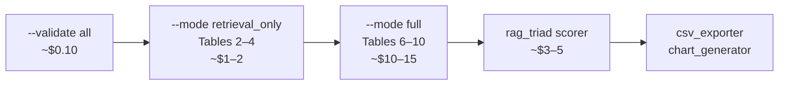

# LEO Benchmark — Automated Evaluation Framework

Standalone benchmark suite for the LEO Philippine Labor Law RAG pipeline.
Evaluates 8 pipeline variants across 100 queries (695 total runs) and produces
all retrieval metrics, answer-quality scores, and thesis figures documented in
§4.5 of the methodology chapter.

> **No HTTP server required.** The runner imports the pipeline in-process via
> `app.containers` — identical code paths as production, zero network overhead.

---

## Directory Structure

```
tests/benchmark/
├── runner.py            # Orchestrator + CLI entry point
├── config.py            # 8 VariantConfig definitions + apply_variant / reset_singletons
├── collector.py         # QueryTrace dataclass + ResultCollector (SSE → trace)
├── scorers/
│   ├── retrieval.py     # Recall@K, Hit Rate@K, MRR
│   ├── answer_quality.py# Token F1, ROUGE-L, Exact Match
│   ├── citation.py      # Citation extraction, precision / recall
│   ├── clarification.py # Clarification detection TP / FP / FN
│   └── rag_triad.py     # GPT-4.1 LLM-as-judge (Context Relevance, Groundedness, Answer Relevance)
├── exporters/
│   ├── csv_exporter.py  # Raw results CSV + blinded expert evaluation CSV
│   └── chart_generator.py  # 8 thesis figures (PDF + PNG)
├── data/
│   └── benchmark-queries.json   # 100 queries with gold labels
└── results/             # gitignored — runner output lives here
```

---

## Pipeline Variants

| # | Name | Retrieval | Query Analysis | Translation | Clarification | Scope |
|---|------|-----------|----------------|-------------|---------------|-------|
| 1 | `full_pipeline` | hybrid | ✓ | ✓ | ✓ | all (100) |
| 2 | `stage2_only` | hybrid | ✗ | ✗ | ✗ | all (100) |
| 3 | `dense_only` | dense | ✓ | ✓ | ✓ | all (100) |
| 4 | `lexical_only` | lexical | ✓ | ✓ | ✓ | all (100) |
| 5 | `symbolic_only` | symbolic | ✓ | ✓ | ✓ | all (100) |
| 6 | `hybrid_no_translation` | hybrid | ✓ | ✗ | ✓ | non-English (65) |
| 7 | `hybrid_no_clarification` | hybrid | ✓ | ✓ | ✗ | ambiguous (30) |
| 8 | `llm_only` | none | ✗ | ✗ | ✗ | all (100) |

**Total runs: 695**

---

## Quick Start

```bash
# Install benchmark dependencies (once)
pip install rouge-score matplotlib seaborn pandas

# Validate before spending API budget (~$0.10, GPT-4o-mini only)
python -m tests.benchmark.runner --validate all --sample-size 1
python -m tests.benchmark.runner --smoke

# Targeted smoke: inspect a single query's JSON output (cheapest debug path)
python -m tests.benchmark.runner --smoke --query-ids Q005
```

---

## Execution Flow



### Phase 0 — Validation

```bash
# Step 1: cheap logic check (GPT-4o-mini only, ~$0.10)
python -m tests.benchmark.runner --validate all --sample-size 1

# Step 2: full-pipeline sanity check (4 representative queries)
python -m tests.benchmark.runner --smoke

# Step 2 (targeted): inspect a specific query before committing to a full smoke run
python -m tests.benchmark.runner --smoke --query-ids Q005
```

### Phase 1 — Retrieval Evaluation (Tables 2–4)

```bash
# Retrieval strategy comparison at K = 3, 5, 10
python -m tests.benchmark.runner --mode retrieval_only --top-k 3 5 10 \
  --variant full_pipeline dense_only lexical_only symbolic_only \
  --output-dir results/run_001

# Translation ablation
python -m tests.benchmark.runner --mode retrieval_only --top-k 5 \
  --variant full_pipeline hybrid_no_translation \
  --output-dir results/run_001
```

### Phase 2 — Full Pipeline (Tables 6–10)

```bash
python -m tests.benchmark.runner --mode full \
  --variant llm_only stage2_only full_pipeline \
  --output-dir results/run_001
```

### Phase 3 — RAG Triad Scoring

```bash
python -m tests.benchmark.scorers.rag_triad \
  --input results/run_001 --output results/run_001/rag_triad --concurrency 5
```

### Export Results

```bash
# Raw CSV + blinded expert evaluation CSV
python -m tests.benchmark.exporters.csv_exporter \
  --input results/run_001 --output results/exports --expert-blind --multiturn

# All 8 thesis figures
python -m tests.benchmark.exporters.chart_generator \
  --input results/run_001 --output results/figures
```

---

## CLI Reference

### `runner.py`

| Argument | Default | Description |
|----------|---------|-------------|
| `--mode` | `full` | `analysis_only` · `retrieval_only` · `full` |
| `--variant` | *(required)* | One or more variant names |
| `--top-k` | `5` | K values for retrieval metrics (e.g. `3 5 10`) |
| `--query-ids` | all | Restrict to specific query IDs (e.g. `Q007 Q015`); applies to all modes including `--smoke` |
| `--output-dir` | `results/run_<ts>` | Output directory |
| `--resume` | off | Skip already-completed query–variant pairs |
| `--smoke` | — | Run 4 representative queries (EN/FIL/CEB/multi-turn) as a full-pipeline sanity check; combine with `--query-ids` to run a single query instead |
| `--validate` | — | `clarification` · `multiturn` · `all` |
| `--log-level` | `INFO` | `DEBUG` · `INFO` · `WARNING` |
| `--log-file` | — | Tee logs to file |
| `--log-per-variant` | off | Split logs into per-variant files |
| `--quiet` | off | Suppress console output |
| `--api-delay-ms` | `200` | Delay between OpenAI API calls |

### `csv_exporter.py`

| Argument | Description |
|----------|-------------|
| `--input` | Run output directory |
| `--output` | Destination for CSV files |
| `--expert-blind` | Write blinded expert CSV + mapping JSON |
| `--multiturn` | Write multi-turn conversation history CSV |
| `--seed` | RNG seed for blinding (default: 42) |

### `chart_generator.py`

| Argument | Description |
|----------|-------------|
| `--input` | Run output directory |
| `--output` | Destination for figure files |

---

## Automated Metrics

| Scorer | Metrics |
|--------|---------|
| `retrieval.py` | Recall@3/5/10, Hit Rate@3/5/10, MRR |
| `answer_quality.py` | Token F1, ROUGE-L, Exact Match |
| `citation.py` | Citation Precision, Recall, F1 |
| `clarification.py` | Detection Precision, Recall, F1 (TP/FP/FN) |
| `rag_triad.py` | Context Relevance, Groundedness, Answer Relevance (1–5) |

Metric scores are written back into each trace's `scores` dict and included in the raw results CSV.

---

## Resume Support

Every query–variant pair is written to `results/<run>/partial/<query_id>__<variant>.json`
immediately after completion. Interrupted runs can be resumed without re-processing
completed pairs:

```bash
python -m tests.benchmark.runner --mode full --variant full_pipeline \
  --resume --output-dir results/run_001
```

---

## Estimated Cost

| Phase | Mode | Est. Cost |
|-------|------|-----------|
| Validation | `analysis_only` | < $0.20 |
| Retrieval (Tables 2–4) | `retrieval_only` | ~$1–2 |
| Full pipeline (Tables 6–10) | `full` | ~$10–15 |
| RAG Triad | LLM-as-judge | ~$3–5 |
| **Total** | | **~$15–22** |
